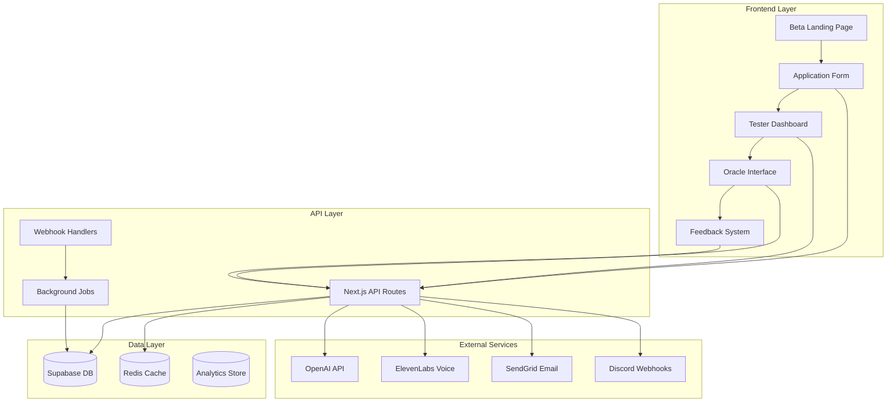

# 🔧 BETA TESTING TECHNICAL IMPLEMENTATION GUIDE
## Complete Backend Architecture & Integration

---

## 🏗️ SYSTEM ARCHITECTURE OVERVIEW



---

## 📦 CORE IMPLEMENTATION COMPONENTS

### 1. Beta Testing Manager Service
```typescript
// services/BetaTestingManager.ts

import { supabase } from '@/lib/supabase-admin'
import { redis } from '@/lib/redis'
import { analytics } from '@/lib/analytics'
import { email } from '@/lib/email'

export class BetaTestingManager {
  private static instance: BetaTestingManager
  private metricsCache: Map<string, any> = new Map()

  private constructor() {
    this.initializeMonitoring()
  }

  static getInstance(): BetaTestingManager {
    if (!this.instance) {
      this.instance = new BetaTestingManager()
    }
    return this.instance
  }

  // Application Management
  async processApplication(data: BetaApplication): Promise<ApplicationResult> {
    try {
      // Validate application
      const validation = await this.validateApplication(data)
      if (!validation.valid) {
        return { success: false, errors: validation.errors }
      }

      // Check capacity
      const capacity = await this.checkCapacity()
      if (!capacity.available) {
        return { success: false, status: 'waitlist' }
      }

      // Save application
      const application = await this.saveApplication(data)

      // Auto-approve if enabled
      if (process.env.BETA_AUTO_APPROVE === 'true') {
        await this.approveApplication(application.id)
      }

      // Send notifications
      await this.sendApplicationNotifications(application)

      // Track analytics
      await this.trackApplicationMetrics(application)

      return { success: true, applicationId: application.id }
    } catch (error) {
      console.error('Application processing error:', error)
      throw error
    }
  }

  // Tester Session Management
  async createTestSession(testerId: string): Promise<TestSession> {
    const session = {
      id: generateSessionId(),
      testerId,
      startTime: new Date(),
      elementTests: {},
      metrics: {
        testsCompleted: 0,
        bugsFound: 0,
        wordCountViolations: 0,
        mirrorViolations: 0
      }
    }

    await redis.setex(
      `session:${session.id}`,
      3600, // 1 hour TTL
      JSON.stringify(session)
    )

    return session
  }

  // Response Validation
  async validateOracleResponse(
    response: string,
    element: ElementType,
    question: string
  ): Promise<ValidationResult> {
    const validations = {
      wordCount: this.validateWordCount(response),
      mirrorPrinciple: await this.validateMirrorPrinciple(response, question),
      elementPersonality: await this.validateElementPersonality(response, element)
    }

    const violations = Object.entries(validations)
      .filter(([_, result]) => !result.valid)
      .map(([type, result]) => ({
        type,
        message: result.message,
        severity: result.severity
      }))

    if (violations.length > 0) {
      await this.recordViolations(violations)
    }

    return {
      valid: violations.length === 0,
      violations,
      metrics: {
        wordCount: response.split(' ').length,
        mirrorScore: validations.mirrorPrinciple.score,
        personalityScore: validations.elementPersonality.score
      }
    }
  }

  // Word Count Validation
  private validateWordCount(response: string): ValidationResult {
    const words = response.trim().split(/\s+/)
    const count = words.length

    if (count > 15) {
      return {
        valid: false,
        message: `Response has ${count} words (limit: 15)`,
        severity: count > 20 ? 'critical' : 'major'
      }
    }

    return { valid: true, wordCount: count }
  }

  // Mirror Principle Validation
  private async validateMirrorPrinciple(
    response: string,
    question: string
  ): Promise<ValidationResult> {
    // Use AI to check if response is advice vs reflection
    const prompt = `
      Analyze if this response reflects the user's question or gives advice.
      Question: "${question}"
      Response: "${response}"

      Return JSON: { isReflection: boolean, score: 0-100, explanation: string }
    `

    const analysis = await this.analyzeWithAI(prompt)

    if (!analysis.isReflection) {
      return {
        valid: false,
        message: `Advice detected: ${analysis.explanation}`,
        severity: 'major',
        score: analysis.score
      }
    }

    return { valid: true, score: analysis.score }
  }

  // Element Personality Validation
  private async validateElementPersonality(
    response: string,
    element: ElementType
  ): Promise<ValidationResult> {
    const personalities = {
      fire: ['bold', 'transformative', 'passionate', 'direct'],
      water: ['flowing', 'emotional', 'intuitive', 'adaptable'],
      earth: ['grounded', 'practical', 'stable', 'nurturing'],
      air: ['clear', 'intellectual', 'expansive', 'communicative'],
      aether: ['unified', 'transcendent', 'mystical', 'holistic']
    }

    const expectedTraits = personalities[element]
    const prompt = `
      Analyze if this response matches ${element} element personality.
      Expected traits: ${expectedTraits.join(', ')}
      Response: "${response}"

      Return JSON: { matchScore: 0-100, missingTraits: [], explanation: string }
    `

    const analysis = await this.analyzeWithAI(prompt)

    if (analysis.matchScore < 70) {
      return {
        valid: false,
        message: `Personality mismatch: ${analysis.explanation}`,
        severity: 'minor',
        score: analysis.matchScore
      }
    }

    return { valid: true, score: analysis.matchScore }
  }

  // Feedback Processing
  async processFeedback(feedback: BetaFeedback): Promise<void> {
    // Store feedback
    await supabase.from('beta_feedback').insert(feedback)

    // Update metrics
    await this.updateTesterMetrics(feedback.testerId, {
      totalFeedback: '+1',
      lastActive: new Date()
    })

    // Check for patterns
    await this.detectFeedbackPatterns(feedback)

    // Trigger alerts if needed
    if (feedback.severity === 'critical') {
      await this.alertTeam(feedback)
    }

    // Update cache
    await this.refreshMetricsCache()
  }

  // Real-time Metrics
  async getRealtimeMetrics(): Promise<BetaMetrics> {
    const cacheKey = 'beta:metrics:realtime'
    const cached = await redis.get(cacheKey)

    if (cached) {
      return JSON.parse(cached)
    }

    const metrics = await this.calculateMetrics()
    await redis.setex(cacheKey, 60, JSON.stringify(metrics))

    return metrics
  }

  private async calculateMetrics(): Promise<BetaMetrics> {
    const [testers, feedback, bugs, sessions] = await Promise.all([
      this.getTesterMetrics(),
      this.getFeedbackMetrics(),
      this.getBugMetrics(),
      this.getSessionMetrics()
    ])

    return {
      testers: {
        total: testers.total,
        active: testers.active,
        daily: testers.daily,
        retention: {
          day1: testers.retention.day1,
          day7: testers.retention.day7,
          day30: testers.retention.day30
        }
      },
      quality: {
        mirrorCompliance: feedback.mirrorCompliance,
        wordCountCompliance: feedback.wordCountCompliance,
        elementAccuracy: feedback.elementAccuracy,
        userSatisfaction: feedback.satisfaction
      },
      bugs: {
        total: bugs.total,
        critical: bugs.critical,
        major: bugs.major,
        minor: bugs.minor,
        resolved: bugs.resolved,
        avgResolutionTime: bugs.avgResolutionTime
      },
      engagement: {
        testsPerDay: sessions.testsPerDay,
        avgSessionLength: sessions.avgLength,
        elementsUsed: sessions.elementsUsed,
        voiceUsage: sessions.voiceUsage
      }
    }
  }

  // Pattern Detection
  private async detectFeedbackPatterns(feedback: BetaFeedback): Promise<void> {
    const recentFeedback = await this.getRecentFeedback(30) // Last 30 minutes

    // Check for repeated issues
    const patterns = this.analyzePatterns(recentFeedback)

    if (patterns.length > 0) {
      for (const pattern of patterns) {
        if (pattern.frequency > 5) {
          await this.createPatternAlert(pattern)
        }
      }
    }
  }

  // Alert System
  private async alertTeam(alert: Alert): Promise<void> {
    // Discord webhook
    await this.sendDiscordAlert(alert)

    // Email critical alerts
    if (alert.severity === 'critical') {
      await this.sendEmailAlert(alert)
    }

    // Update dashboard
    await this.updateAlertDashboard(alert)

    // Log for audit
    await this.logAlert(alert)
  }

  // Gamification System
  async updateGamification(testerId: string, action: GameAction): Promise<void> {
    const points = this.calculatePoints(action)
    const badges = await this.checkBadges(testerId, action)
    const streak = await this.updateStreak(testerId)

    await supabase
      .from('beta_gamification')
      .upsert({
        tester_id: testerId,
        total_points: points,
        badges: badges,
        streak: streak,
        level: this.calculateLevel(points),
        updated_at: new Date()
      })

    // Send notifications for achievements
    if (badges.new.length > 0) {
      await this.notifyAchievements(testerId, badges.new)
    }
  }

  // Automated Reporting
  async generateReport(type: ReportType): Promise<Report> {
    const metrics = await this.getRealtimeMetrics()
    const insights = await this.generateInsights(metrics)
    const recommendations = await this.generateRecommendations(metrics, insights)

    const report = {
      id: generateReportId(),
      type,
      period: this.getReportPeriod(type),
      metrics,
      insights,
      recommendations,
      visualizations: await this.generateVisualizations(metrics),
      generatedAt: new Date()
    }

    // Store report
    await supabase.from('beta_reports').insert(report)

    // Send to stakeholders
    await this.distributeReport(report)

    return report
  }
}
```

---

## 🔄 API ENDPOINTS IMPLEMENTATION

### Core Beta API Routes
```typescript
// pages/api/beta/[...path].ts
import { NextApiRequest, NextApiResponse } from 'next'
import { BetaTestingManager } from '@/services/BetaTestingManager'
import { authMiddleware } from '@/middleware/auth'
import { rateLimiter } from '@/middleware/rateLimit'
import { validate } from '@/middleware/validation'

const manager = BetaTestingManager.getInstance()

export default async function handler(
  req: NextApiRequest,
  res: NextApiResponse
) {
  const { path } = req.query
  const endpoint = Array.isArray(path) ? path.join('/') : path

  // Apply middleware
  await rateLimiter(req, res)

  try {
    switch (endpoint) {
      case 'apply':
        return handleApplication(req, res)

      case 'feedback':
        return handleFeedback(req, res)

      case 'metrics':
        return handleMetrics(req, res)

      case 'session/start':
        return handleSessionStart(req, res)

      case 'session/end':
        return handleSessionEnd(req, res)

      case 'validate':
        return handleValidation(req, res)

      case 'bug':
        return handleBugReport(req, res)

      case 'leaderboard':
        return handleLeaderboard(req, res)

      default:
        return res.status(404).json({ error: 'Endpoint not found' })
    }
  } catch (error) {
    console.error(`Beta API error: ${endpoint}`, error)
    return res.status(500).json({ error: 'Internal server error' })
  }
}

// Individual handlers
async function handleApplication(req: NextApiRequest, res: NextApiResponse) {
  if (req.method !== 'POST') {
    return res.status(405).json({ error: 'Method not allowed' })
  }

  const validation = validate(req.body, applicationSchema)
  if (!validation.valid) {
    return res.status(400).json({ errors: validation.errors })
  }

  const result = await manager.processApplication(req.body)

  return res.status(result.success ? 200 : 400).json(result)
}

async function handleFeedback(req: NextApiRequest, res: NextApiResponse) {
  if (req.method !== 'POST') {
    return res.status(405).json({ error: 'Method not allowed' })
  }

  const { testerId } = await authMiddleware(req, res)
  if (!testerId) return

  await manager.processFeedback({
    ...req.body,
    testerId,
    timestamp: new Date()
  })

  return res.status(200).json({ success: true })
}

async function handleMetrics(req: NextApiRequest, res: NextApiResponse) {
  if (req.method !== 'GET') {
    return res.status(405).json({ error: 'Method not allowed' })
  }

  const metrics = await manager.getRealtimeMetrics()

  // Set cache headers
  res.setHeader('Cache-Control', 's-maxage=60, stale-while-revalidate')

  return res.status(200).json(metrics)
}

async function handleValidation(req: NextApiRequest, res: NextApiResponse) {
  if (req.method !== 'POST') {
    return res.status(405).json({ error: 'Method not allowed' })
  }

  const { response, element, question } = req.body

  const validation = await manager.validateOracleResponse(
    response,
    element,
    question
  )

  return res.status(200).json(validation)
}
```

---

## 🗄️ DATABASE SCHEMA

### Complete Beta Testing Schema
```sql
-- Beta Applications
CREATE TABLE beta_applications (
  id UUID PRIMARY KEY DEFAULT uuid_generate_v4(),
  email TEXT UNIQUE NOT NULL,
  name TEXT NOT NULL,
  why TEXT NOT NULL,
  commitment TEXT NOT NULL,
  agreement BOOLEAN NOT NULL,
  status TEXT DEFAULT 'pending',
  access_code TEXT UNIQUE,
  applied_at TIMESTAMPTZ DEFAULT NOW(),
  approved_at TIMESTAMPTZ,
  rejected_at TIMESTAMPTZ,
  rejection_reason TEXT,
  notes TEXT,
  metadata JSONB DEFAULT '{}'
);

-- Beta Testers (approved applications)
CREATE TABLE beta_testers (
  id UUID PRIMARY KEY DEFAULT uuid_generate_v4(),
  application_id UUID REFERENCES beta_applications(id),
  email TEXT UNIQUE NOT NULL,
  name TEXT NOT NULL,
  access_code TEXT UNIQUE NOT NULL,
  status TEXT DEFAULT 'active',
  onboarded_at TIMESTAMPTZ,
  last_active TIMESTAMPTZ,
  total_tests INTEGER DEFAULT 0,
  total_feedback INTEGER DEFAULT 0,
  total_bugs INTEGER DEFAULT 0,
  streak_days INTEGER DEFAULT 0,
  badges JSONB DEFAULT '[]',
  preferences JSONB DEFAULT '{}',
  created_at TIMESTAMPTZ DEFAULT NOW()
);

-- Test Sessions
CREATE TABLE beta_sessions (
  id UUID PRIMARY KEY DEFAULT uuid_generate_v4(),
  tester_id UUID REFERENCES beta_testers(id),
  started_at TIMESTAMPTZ DEFAULT NOW(),
  ended_at TIMESTAMPTZ,
  duration_seconds INTEGER,
  tests_completed INTEGER DEFAULT 0,
  elements_tested TEXT[] DEFAULT '{}',
  bugs_found INTEGER DEFAULT 0,
  feedback_submitted INTEGER DEFAULT 0,
  metrics JSONB DEFAULT '{}'
);

-- Test Interactions
CREATE TABLE beta_interactions (
  id UUID PRIMARY KEY DEFAULT uuid_generate_v4(),
  session_id UUID REFERENCES beta_sessions(id),
  tester_id UUID REFERENCES beta_testers(id),
  element TEXT NOT NULL,
  question TEXT NOT NULL,
  response TEXT NOT NULL,
  word_count INTEGER NOT NULL,
  response_time_ms INTEGER,
  voice_used BOOLEAN DEFAULT FALSE,
  created_at TIMESTAMPTZ DEFAULT NOW()
);

-- Validation Results
CREATE TABLE beta_validations (
  id UUID PRIMARY KEY DEFAULT uuid_generate_v4(),
  interaction_id UUID REFERENCES beta_interactions(id),
  word_count_valid BOOLEAN,
  word_count INTEGER,
  mirror_valid BOOLEAN,
  mirror_score DECIMAL(3,2),
  personality_valid BOOLEAN,
  personality_score DECIMAL(3,2),
  violations JSONB DEFAULT '[]',
  created_at TIMESTAMPTZ DEFAULT NOW()
);

-- Bug Reports
CREATE TABLE beta_bugs (
  id UUID PRIMARY KEY DEFAULT uuid_generate_v4(),
  tester_id UUID REFERENCES beta_testers(id),
  session_id UUID REFERENCES beta_sessions(id),
  severity TEXT NOT NULL,
  category TEXT NOT NULL,
  element TEXT,
  title TEXT NOT NULL,
  description TEXT NOT NULL,
  steps_to_reproduce TEXT,
  expected_behavior TEXT,
  actual_behavior TEXT,
  screenshots TEXT[],
  status TEXT DEFAULT 'open',
  assigned_to TEXT,
  fixed_at TIMESTAMPTZ,
  verified_at TIMESTAMPTZ,
  created_at TIMESTAMPTZ DEFAULT NOW()
);

-- Feedback
CREATE TABLE beta_feedback (
  id UUID PRIMARY KEY DEFAULT uuid_generate_v4(),
  tester_id UUID REFERENCES beta_testers(id),
  session_id UUID REFERENCES beta_sessions(id),
  type TEXT NOT NULL,
  element TEXT,
  rating INTEGER,
  comment TEXT,
  suggestions TEXT,
  sentiment TEXT,
  processed BOOLEAN DEFAULT FALSE,
  created_at TIMESTAMPTZ DEFAULT NOW()
);

-- Gamification
CREATE TABLE beta_gamification (
  id UUID PRIMARY KEY DEFAULT uuid_generate_v4(),
  tester_id UUID REFERENCES beta_testers(id) UNIQUE,
  total_points INTEGER DEFAULT 0,
  level INTEGER DEFAULT 1,
  badges JSONB DEFAULT '[]',
  achievements JSONB DEFAULT '[]',
  streak_current INTEGER DEFAULT 0,
  streak_longest INTEGER DEFAULT 0,
  leaderboard_rank INTEGER,
  last_updated TIMESTAMPTZ DEFAULT NOW()
);

-- Analytics Events
CREATE TABLE beta_analytics (
  id UUID PRIMARY KEY DEFAULT uuid_generate_v4(),
  tester_id UUID REFERENCES beta_testers(id),
  event_type TEXT NOT NULL,
  event_data JSONB DEFAULT '{}',
  page_path TEXT,
  user_agent TEXT,
  ip_hash TEXT,
  created_at TIMESTAMPTZ DEFAULT NOW()
);

-- Reports
CREATE TABLE beta_reports (
  id UUID PRIMARY KEY DEFAULT uuid_generate_v4(),
  type TEXT NOT NULL,
  period_start TIMESTAMPTZ NOT NULL,
  period_end TIMESTAMPTZ NOT NULL,
  metrics JSONB NOT NULL,
  insights JSONB,
  recommendations JSONB,
  generated_by TEXT,
  distributed_to TEXT[],
  created_at TIMESTAMPTZ DEFAULT NOW()
);

-- Create indexes for performance
CREATE INDEX idx_beta_testers_email ON beta_testers(email);
CREATE INDEX idx_beta_sessions_tester ON beta_sessions(tester_id);
CREATE INDEX idx_beta_interactions_session ON beta_interactions(session_id);
CREATE INDEX idx_beta_bugs_status ON beta_bugs(status);
CREATE INDEX idx_beta_feedback_created ON beta_feedback(created_at);
CREATE INDEX idx_beta_analytics_event ON beta_analytics(event_type, created_at);
```

---

## 🔐 AUTHENTICATION & AUTHORIZATION

### Beta Tester Authentication
```typescript
// middleware/betaAuth.ts
import jwt from 'jsonwebtoken'
import { supabase } from '@/lib/supabase-admin'

export interface BetaTesterAuth {
  testerId: string
  email: string
  accessLevel: 'tester' | 'advanced' | 'admin'
}

export async function authenticateBetaTester(
  req: NextApiRequest
): Promise<BetaTesterAuth | null> {
  try {
    // Check for access token
    const token = req.headers.authorization?.replace('Bearer ', '')
    if (!token) return null

    // Verify JWT
    const decoded = jwt.verify(token, process.env.JWT_SECRET) as any

    // Validate against database
    const { data: tester } = await supabase
      .from('beta_testers')
      .select('*')
      .eq('id', decoded.testerId)
      .eq('status', 'active')
      .single()

    if (!tester) return null

    // Update last active
    await supabase
      .from('beta_testers')
      .update({ last_active: new Date() })
      .eq('id', tester.id)

    return {
      testerId: tester.id,
      email: tester.email,
      accessLevel: determineAccessLevel(tester)
    }
  } catch (error) {
    console.error('Beta auth error:', error)
    return null
  }
}

function determineAccessLevel(tester: any): 'tester' | 'advanced' | 'admin' {
  if (tester.email === process.env.ADMIN_EMAIL) return 'admin'
  if (tester.total_tests > 100) return 'advanced'
  return 'tester'
}
```

---

## 📊 ANALYTICS IMPLEMENTATION

### Event Tracking System
```typescript
// services/BetaAnalytics.ts
export class BetaAnalytics {
  private queue: AnalyticsEvent[] = []
  private flushInterval: NodeJS.Timer

  constructor() {
    // Batch events every 5 seconds
    this.flushInterval = setInterval(() => {
      this.flush()
    }, 5000)
  }

  track(event: AnalyticsEvent): void {
    this.queue.push({
      ...event,
      timestamp: new Date(),
      sessionId: this.getSessionId(),
      userId: this.getUserId()
    })

    // Flush immediately for critical events
    if (event.priority === 'critical') {
      this.flush()
    }
  }

  private async flush(): Promise<void> {
    if (this.queue.length === 0) return

    const events = [...this.queue]
    this.queue = []

    try {
      // Send to multiple analytics providers
      await Promise.all([
        this.sendToSupabase(events),
        this.sendToMixpanel(events),
        this.sendToGA(events),
        this.sendToCustomBackend(events)
      ])
    } catch (error) {
      console.error('Analytics flush error:', error)
      // Re-queue failed events
      this.queue.unshift(...events)
    }
  }

  // Track specific beta events
  trackApplication(data: any): void {
    this.track({
      event: 'beta_application_submitted',
      category: 'beta',
      data
    })
  }

  trackTestSession(session: any): void {
    this.track({
      event: 'beta_test_session',
      category: 'testing',
      data: {
        duration: session.duration,
        testsCompleted: session.testsCompleted,
        elementsUsed: session.elementsUsed
      }
    })
  }

  trackBug(bug: any): void {
    this.track({
      event: 'beta_bug_reported',
      category: 'quality',
      priority: bug.severity === 'critical' ? 'critical' : 'normal',
      data: bug
    })
  }

  trackFeedback(feedback: any): void {
    this.track({
      event: 'beta_feedback_submitted',
      category: 'feedback',
      data: {
        type: feedback.type,
        rating: feedback.rating,
        sentiment: this.analyzeSentiment(feedback.comment)
      }
    })
  }

  // Generate analytics reports
  async generateDailyReport(): Promise<DailyReport> {
    const today = new Date()
    const yesterday = new Date(today.setDate(today.getDate() - 1))

    const metrics = await this.aggregateMetrics(yesterday, today)
    const insights = await this.generateInsights(metrics)

    return {
      date: today,
      metrics,
      insights,
      trends: this.calculateTrends(metrics),
      alerts: this.checkAlerts(metrics)
    }
  }
}
```

---

## 🔄 WEBHOOK INTEGRATIONS

### Webhook Handler System
```typescript
// services/WebhookService.ts
export class WebhookService {
  private webhooks: Map<string, WebhookConfig> = new Map()

  constructor() {
    this.registerWebhooks()
  }

  private registerWebhooks(): void {
    // Discord notifications
    this.webhooks.set('discord', {
      url: process.env.DISCORD_WEBHOOK_URL,
      events: ['bug_critical', 'milestone_reached', 'daily_summary'],
      format: 'discord'
    })

    // Slack notifications
    this.webhooks.set('slack', {
      url: process.env.SLACK_WEBHOOK_URL,
      events: ['application_received', 'tester_approved'],
      format: 'slack'
    })

    // Custom backend
    this.webhooks.set('backend', {
      url: process.env.BACKEND_WEBHOOK_URL,
      events: ['*'], // All events
      format: 'json',
      headers: {
        'X-API-Key': process.env.BACKEND_API_KEY
      }
    })
  }

  async trigger(event: string, data: any): Promise<void> {
    const webhooksToTrigger = Array.from(this.webhooks.entries())
      .filter(([_, config]) =>
        config.events.includes('*') || config.events.includes(event)
      )

    await Promise.all(
      webhooksToTrigger.map(([name, config]) =>
        this.sendWebhook(name, config, event, data)
      )
    )
  }

  private async sendWebhook(
    name: string,
    config: WebhookConfig,
    event: string,
    data: any
  ): Promise<void> {
    try {
      const payload = this.formatPayload(config.format, event, data)

      await fetch(config.url, {
        method: 'POST',
        headers: {
          'Content-Type': 'application/json',
          ...config.headers
        },
        body: JSON.stringify(payload)
      })

      console.log(`Webhook sent: ${name} - ${event}`)
    } catch (error) {
      console.error(`Webhook failed: ${name}`, error)
    }
  }

  private formatPayload(format: string, event: string, data: any): any {
    switch (format) {
      case 'discord':
        return this.formatDiscordPayload(event, data)
      case 'slack':
        return this.formatSlackPayload(event, data)
      default:
        return { event, data, timestamp: new Date() }
    }
  }

  private formatDiscordPayload(event: string, data: any): any {
    const embeds = {
      bug_critical: {
        title: '🚨 Critical Bug Found',
        color: 0xff0000,
        fields: [
          { name: 'Title', value: data.title },
          { name: 'Severity', value: data.severity },
          { name: 'Reported by', value: data.tester }
        ]
      },
      milestone_reached: {
        title: '🎉 Milestone Reached!',
        color: 0x00ff00,
        fields: [
          { name: 'Milestone', value: data.milestone },
          { name: 'Achieved by', value: data.tester }
        ]
      }
    }

    return {
      embeds: [embeds[event] || { title: event, description: JSON.stringify(data) }]
    }
  }
}
```

---

## ⚡ PERFORMANCE OPTIMIZATION

### Caching Strategy
```typescript
// lib/cache.ts
import Redis from 'ioredis'
import { LRUCache } from 'lru-cache'

export class BetaCacheManager {
  private redis: Redis
  private memoryCache: LRUCache<string, any>

  constructor() {
    this.redis = new Redis(process.env.REDIS_URL)
    this.memoryCache = new LRUCache({
      max: 500,
      ttl: 1000 * 60 * 5 // 5 minutes
    })
  }

  // Multi-layer caching
  async get(key: string): Promise<any> {
    // Check memory first
    const memCached = this.memoryCache.get(key)
    if (memCached) return memCached

    // Check Redis
    const redisCached = await this.redis.get(key)
    if (redisCached) {
      const parsed = JSON.parse(redisCached)
      this.memoryCache.set(key, parsed)
      return parsed
    }

    return null
  }

  async set(key: string, value: any, ttl = 300): Promise<void> {
    // Set in both caches
    this.memoryCache.set(key, value)
    await this.redis.setex(key, ttl, JSON.stringify(value))
  }

  // Cache patterns for beta
  async cacheMetrics(metrics: any): Promise<void> {
    await this.set('beta:metrics:latest', metrics, 60)
  }

  async cacheLeaderboard(leaderboard: any): Promise<void> {
    await this.set('beta:leaderboard', leaderboard, 300)
  }

  async cacheTesterProfile(testerId: string, profile: any): Promise<void> {
    await this.set(`beta:tester:${testerId}`, profile, 600)
  }
}
```

---

## 🔍 MONITORING & LOGGING

### Comprehensive Monitoring
```typescript
// services/BetaMonitoring.ts
import * as Sentry from '@sentry/node'
import { Logger } from 'winston'

export class BetaMonitoring {
  private logger: Logger
  private metrics: Map<string, number> = new Map()

  constructor() {
    this.initializeSentry()
    this.initializeLogger()
    this.startMetricsCollection()
  }

  private initializeSentry(): void {
    Sentry.init({
      dsn: process.env.SENTRY_DSN,
      environment: process.env.NODE_ENV,
      integrations: [
        new Sentry.Integrations.Http({ tracing: true }),
      ],
      tracesSampleRate: 0.1,
      beforeSend(event) {
        // Filter sensitive data
        if (event.request) {
          delete event.request.cookies
          delete event.request.headers?.authorization
        }
        return event
      }
    })
  }

  // Monitor API endpoints
  monitorEndpoint(endpoint: string, duration: number, status: number): void {
    this.metrics.set(`api.${endpoint}.count`,
      (this.metrics.get(`api.${endpoint}.count`) || 0) + 1
    )

    this.metrics.set(`api.${endpoint}.duration`, duration)

    if (status >= 400) {
      this.metrics.set(`api.${endpoint}.errors`,
        (this.metrics.get(`api.${endpoint}.errors`) || 0) + 1
      )
    }

    // Alert on high error rates
    const errorRate = this.calculateErrorRate(endpoint)
    if (errorRate > 0.05) { // 5% error rate
      this.alert({
        type: 'high_error_rate',
        endpoint,
        errorRate,
        severity: 'warning'
      })
    }
  }

  // Monitor beta-specific metrics
  monitorBetaHealth(): void {
    setInterval(async () => {
      const health = await this.checkBetaHealth()

      if (!health.healthy) {
        this.alert({
          type: 'beta_unhealthy',
          issues: health.issues,
          severity: 'critical'
        })
      }

      // Log metrics
      this.logger.info('Beta health check', health)

      // Send to monitoring service
      await this.sendToDatadog(health)
    }, 60000) // Every minute
  }

  private async checkBetaHealth(): Promise<HealthCheck> {
    const checks = await Promise.all([
      this.checkDatabaseConnection(),
      this.checkAPILatency(),
      this.checkErrorRates(),
      this.checkTesterActivity(),
      this.checkSystemResources()
    ])

    const issues = checks.filter(c => !c.passed)

    return {
      healthy: issues.length === 0,
      timestamp: new Date(),
      checks,
      issues
    }
  }
}
```

---

## 🚀 DEPLOYMENT PIPELINE

### CI/CD Configuration
```yaml
# .github/workflows/beta-deploy.yml
name: Beta Deployment

on:
  push:
    branches: [beta, main]
    paths:
      - 'apps/web/pages/beta/**'
      - 'services/beta/**'
      - 'beta-materials/**'

jobs:
  test:
    runs-on: ubuntu-latest
    steps:
      - uses: actions/checkout@v3

      - name: Setup Node
        uses: actions/setup-node@v3
        with:
          node-version: '18'

      - name: Install dependencies
        run: npm ci

      - name: Run tests
        run: npm run test:beta

      - name: Run E2E tests
        run: npm run test:e2e:beta

  deploy:
    needs: test
    runs-on: ubuntu-latest
    steps:
      - uses: actions/checkout@v3

      - name: Deploy to Vercel
        run: |
          npm i -g vercel
          vercel --prod --token ${{ secrets.VERCEL_TOKEN }}

      - name: Run smoke tests
        run: npm run test:smoke:beta

      - name: Notify team
        uses: 8398a7/action-slack@v3
        with:
          status: ${{ job.status }}
          text: 'Beta deployment completed'
          webhook_url: ${{ secrets.SLACK_WEBHOOK }}
```

---

## 🔒 SECURITY CONSIDERATIONS

### Security Implementation
```typescript
// security/betaSecurity.ts
import helmet from 'helmet'
import rateLimit from 'express-rate-limit'
import { createHash } from 'crypto'

export class BetaSecurity {
  // Input sanitization
  sanitizeInput(input: any): any {
    if (typeof input === 'string') {
      return input
        .replace(/<script\b[^<]*(?:(?!<\/script>)<[^<]*)*<\/script>/gi, '')
        .replace(/on\w+\s*=/gi, '')
        .trim()
    }
    return input
  }

  // PII protection
  hashPII(data: string): string {
    return createHash('sha256')
      .update(data + process.env.SALT)
      .digest('hex')
  }

  // Rate limiting
  createRateLimiter() {
    return rateLimit({
      windowMs: 15 * 60 * 1000, // 15 minutes
      max: 100, // limit each IP to 100 requests
      message: 'Too many requests from this IP',
      standardHeaders: true,
      legacyHeaders: false,
    })
  }

  // Access control
  validateAccess(testerId: string, resource: string): boolean {
    // Implement RBAC
    const permissions = this.getTesterPermissions(testerId)
    return permissions.includes(resource)
  }

  // Data encryption
  encryptSensitiveData(data: any): string {
    // Implement encryption for sensitive beta data
    return this.encrypt(JSON.stringify(data))
  }
}
```

---

## 📋 IMPLEMENTATION CHECKLIST

### Phase 1: Foundation (Week 1)
- [ ] Set up database schema
- [ ] Create API endpoints
- [ ] Implement authentication
- [ ] Set up caching layer
- [ ] Configure monitoring

### Phase 2: Core Features (Week 2)
- [ ] Application processing
- [ ] Session management
- [ ] Validation system
- [ ] Feedback collection
- [ ] Bug tracking

### Phase 3: Analytics & Reporting (Week 3)
- [ ] Analytics implementation
- [ ] Real-time metrics
- [ ] Report generation
- [ ] Dashboard creation
- [ ] Webhook integrations

### Phase 4: Optimization (Week 4)
- [ ] Performance tuning
- [ ] Security hardening
- [ ] Load testing
- [ ] Documentation
- [ ] Team training

---

## 🎯 SUCCESS METRICS

### Technical KPIs
- API response time < 200ms (p95)
- System uptime > 99.9%
- Error rate < 0.1%
- Database query time < 50ms
- Cache hit ratio > 80%

### Beta Program KPIs
- Application conversion > 30%
- Tester retention > 60%
- Daily active testers > 100
- Feedback quality score > 4/5
- Bug discovery rate > 10/day

---

*Technical Implementation Guide v1.0 | Production-Ready Beta Infrastructure*