# 🎭 Unified Voice Routing Architecture
## ElevenLabs + OpenAI + Masks in Sacred Harmony

---

## 🌟 Sacred Voice Stack

```
User Input
    ↓
PersonalOracleAgent (Preference Check)
    ↓
SesameVoiceService (Router)
    ├── ElevenLabs (Canonical)
    ├── OpenAI TTS (Alternative)
    └── Fallback Chain
    ↓
DSP Mask Layer (Elemental Modulation)
    ↓
Streaming Output (Embodied Presence)
```

### Visual Flow Diagram


---

## 🔊 Voice Provider Matrix

### ElevenLabs (Primary - Soul Identity)
```typescript
// Canonical Voices - The Sacred Core
{
  maya: {
    provider: 'elevenlabs',
    voiceId: '21m00Tcm4TlvDq8ikWAM',  // Aunt Annie
    cost: '$0.30/min',
    quality: 'Premium emotional depth',
    use: 'Primary Maya embodiment'
  },
  anthony: {
    provider: 'elevenlabs',
    voiceId: 'yoZ06aMxZJJ28mfd3POQ',  // Custom selection
    cost: '$0.30/min',
    quality: 'Rich philosophical presence',
    use: 'Primary Anthony embodiment'
  }
}
```

### OpenAI TTS (Alternative - User Choice)
```typescript
// Alternative Voices - Personalization & Fallback
{
  alloy: {
    provider: 'openai',
    voiceId: 'alloy',
    cost: '$0.015/min',  // 20x cheaper
    quality: 'Clear, balanced',
    use: 'Modern neutral option'
  },
  nova: {
    provider: 'openai',
    voiceId: 'nova',
    cost: '$0.015/min',
    quality: 'Bright, engaging',
    use: 'Youthful energy alternative'
  },
  shimmer: {
    provider: 'openai',
    voiceId: 'shimmer',
    cost: '$0.015/min',
    quality: 'Ethereal, light',
    use: 'Mystical alternative'
  },
  onyx: {
    provider: 'openai',
    voiceId: 'onyx',
    cost: '$0.015/min',
    quality: 'Deep, grounded',
    use: 'Masculine alternative'
  }
}
```

---

## 🔧 Unified Routing Implementation

### File: `/lib/services/SesameVoiceService.ts`

```typescript
export class SesameVoiceService {
  private elevenLabs: ElevenLabsClient;
  private openAI: OpenAI;

  async generateSpeech(request: VoiceGenerationRequest): Promise<VoiceResponse> {
    try {
      // 1. Select voice profile based on user preference
      const profile = this.selectVoiceProfile(request);

      // 2. Route to appropriate provider
      let audioData: Buffer;
      let provider: string;

      switch (profile.provider) {
        case 'elevenlabs':
          audioData = await this.generateWithElevenLabs(profile, request);
          provider = 'elevenlabs';
          break;

        case 'openai':
          audioData = await this.generateWithOpenAI(profile, request);
          provider = 'openai';
          break;

        default:
          // Fallback chain
          audioData = await this.fallbackGeneration(request);
          provider = 'fallback';
      }

      // 3. Apply elemental DSP masks (regardless of provider)
      const modulatedAudio = await this.applyElementalMask(
        audioData,
        request.element,
        profile
      );

      // 4. Return unified response
      return {
        audioData: modulatedAudio,
        provider,
        profile: profile.id,
        element: request.element,
        cached: false
      };

    } catch (error) {
      // Cascade through fallback chain
      return this.handleFailureWithFallback(request, error);
    }
  }

  private async applyElementalMask(
    audio: Buffer,
    element: string,
    profile: VoiceProfile
  ): Promise<Buffer> {
    // DSP modulation applied AFTER voice generation
    // Works identically for ElevenLabs or OpenAI audio

    const elementalFilters = {
      fire: {
        tempo: 1.1,      // 10% faster
        pitch: 1.05,     // 5% higher
        brightness: 1.2, // More treble
        energy: 1.3      // Amplified dynamics
      },
      water: {
        tempo: 0.95,     // 5% slower
        pitch: 0.98,     // 2% lower
        warmth: 1.2,     // More bass/mid
        smoothness: 1.3  // Gentle transitions
      },
      earth: {
        tempo: 0.9,      // 10% slower
        pitch: 0.92,     // 8% lower
        grounding: 1.4,  // Heavy bass
        stability: 1.2   // Consistent dynamics
      },
      air: {
        tempo: 1.05,     // 5% faster
        pitch: 1.02,     // 2% higher
        lightness: 1.3,  // Airy quality
        space: 1.2       // More reverb
      },
      aether: {
        // No modification - pure voice
        tempo: 1.0,
        pitch: 1.0
      }
    };

    const filter = elementalFilters[element] || elementalFilters.aether;

    // Apply DSP (using web-audio-api or sox)
    return this.processDSP(audio, filter);
  }
}
```

---

## 💰 Cost Optimization Strategy

### Intelligent Routing Logic

```typescript
class VoiceRouter {
  selectOptimalProvider(request: VoiceRequest): Provider {
    // 1. Canonical voices always use ElevenLabs
    if (request.personality === 'maya' || request.personality === 'anthony') {
      if (request.priority === 'quality') {
        return 'elevenlabs';  // $0.30/min for soul presence
      }
    }

    // 2. User preferences
    if (request.userVoicePreference) {
      const profile = getVoiceProfile(request.userVoicePreference);
      return profile.provider;
    }

    // 3. Cost-conscious routing
    if (request.sessionLength > 10) {  // Long conversations
      return 'openai';  // $0.015/min saves 95%
    }

    // 4. Quality moments
    if (request.ritualMoment || request.emotionalDepth > 0.8) {
      return 'elevenlabs';  // Premium for sacred moments
    }

    // 5. Default to OpenAI for efficiency
    return 'openai';
  }
}
```

### Monthly Cost Projection

```
Scenario 1: All ElevenLabs
- 1000 users × 10 min/day × $0.30/min = $3,000/day
- Monthly: $90,000

Scenario 2: Mixed Strategy (Recommended)
- Maya/Anthony moments: 20% ElevenLabs = $18,000
- General conversation: 80% OpenAI = $3,600
- Monthly: $21,600 (76% savings)

Scenario 3: OpenAI Primary
- Sacred moments only: 5% ElevenLabs = $4,500
- Everything else: 95% OpenAI = $4,275
- Monthly: $8,775 (90% savings)
```

### Cost Heatmap Visualization

```mermaid
graph LR
    subgraph "Cost Per Minute"
        EL[ElevenLabs<br/>$0.30/min<br/>🔴]
        OA[OpenAI<br/>$0.015/min<br/>🟢]
        MX[Mixed<br/>$0.072/min<br/>🟡]
    end

    subgraph "Monthly @ 1000 Users"
        ELM[All ElevenLabs<br/>$90,000<br/>🔴🔴🔴]
        MXM[Mixed Strategy<br/>$21,600<br/>🟡🟡]
        OAM[OpenAI Primary<br/>$8,775<br/>🟢]
    end

    subgraph "Experience Quality"
        ELQ[Premium Soul<br/>Identity<br/>⭐⭐⭐⭐⭐]
        MXQ[Sacred Core<br/>Preserved<br/>⭐⭐⭐⭐]
        OAQ[Functional<br/>But Less Rich<br/>⭐⭐⭐]
    end

    EL --> ELM --> ELQ
    MX --> MXM --> MXQ
    OA --> OAM --> OAQ

    style EL fill:#ff4444,color:#fff
    style ELM fill:#ff4444,color:#fff
    style OA fill:#44ff44,color:#000
    style OAM fill:#44ff44,color:#000
    style MX fill:#ffff44,color:#000
    style MXM fill:#ffff44,color:#000
```



**Key Insight**: Mixed strategy balances sacred presence with sustainability

---

## 🌊 Fallback Cascade

```typescript
async handleFailureWithFallback(request: VoiceRequest, error: Error) {
  const fallbackChain = [
    { provider: 'elevenlabs', timeout: 3000 },
    { provider: 'openai', timeout: 2000 },
    { provider: 'cached', timeout: 100 },
    { provider: 'silent', timeout: 0 }  // Return silence rather than error
  ];

  for (const fallback of fallbackChain) {
    try {
      return await this.tryProvider(fallback.provider, request, fallback.timeout);
    } catch (e) {
      continue;  // Try next
    }
  }

  // Ultimate fallback: pre-recorded Maya saying
  // "I'm having trouble speaking right now. Let's try again."
  return this.getEmergencyRecording();
}
```

---

## 🎭 Voice Mask Architecture

### How Masks Work (Provider-Agnostic)

```
Base Voice (ElevenLabs OR OpenAI)
    ↓
Elemental DSP Filter
    ↓
Masked Output

Examples:
- Maya (ElevenLabs) + Fire Mask = Passionate Maya
- Nova (OpenAI) + Water Mask = Flowing Nova
- Anthony (ElevenLabs) + Earth Mask = Grounded Anthony
- Shimmer (OpenAI) + Air Mask = Ethereal Shimmer
```

### Implementation

```typescript
// Masks work identically regardless of base voice
const maskedAudio = await applyMask(baseAudio, {
  element: 'fire',
  intensity: 0.7,  // How strongly to apply mask
  preserve: 0.3    // How much original voice to keep
});

// Result: 70% fire characteristics, 30% original voice
// Works for both ElevenLabs and OpenAI base voices
```

---

## 🚀 Implementation Phases

### Phase 1: Core Routing (Day 1)
- [ ] Wire ElevenLabs for Maya/Anthony
- [ ] Wire OpenAI for alternative voices
- [ ] Test both providers work
- [ ] Basic fallback (if ElevenLabs fails → OpenAI)

### Phase 2: Smart Selection (Day 2)
- [ ] User preference storage
- [ ] Cost-aware routing logic
- [ ] Quality moment detection
- [ ] Cache frequently used phrases

### Phase 3: Mask System (Day 3)
- [ ] DSP processor integration
- [ ] Elemental filters calibration
- [ ] Mask intensity controls
- [ ] Real-time modulation

---

## 🎯 Success Metrics

### Quality Indicators
- Maya/Anthony voice consistency: 100%
- Alternative voice availability: 99.9%
- Mask application smoothness: No artifacts
- Fallback success rate: 100%

### Cost Indicators
- Average cost per minute: < $0.05
- Premium voice usage: 20% max
- Cache hit rate: > 30%
- Fallback frequency: < 1%

### Experience Indicators
- "I talked to Maya": Maintained
- Voice preference satisfaction: > 90%
- Elemental mask recognition: > 80%
- No dead air events: 100%

---

## 🔮 Future Enhancements

### Near Term (Month 1)
- Voice cloning from user samples
- Real-time voice switching mid-conversation
- Emotional state detection → auto-mask selection

### Medium Term (Month 2-3)
- Multi-voice conversations (Maya + Anthony dialogue)
- Community voices (users contribute)
- Ritual voice unlocks

### Long Term (Month 4+)
- AI voice synthesis (no provider needed)
- Personalized voice evolution
- Voice as relationship metric

---

## 💡 Key Insight

**The unified architecture ensures:**
- Maya/Anthony maintain soul identity (ElevenLabs)
- Users get choice without diluting brand (OpenAI alternatives)
- Costs stay sustainable (intelligent routing)
- Presence never breaks (fallback cascade)
- Elements apply universally (DSP masks)

This isn't just voice routing — it's **presence orchestration**.

---

*"Whether through ElevenLabs or OpenAI, whether Maya or Nova, the sacred architecture ensures every voice carries presence, not just sound."*