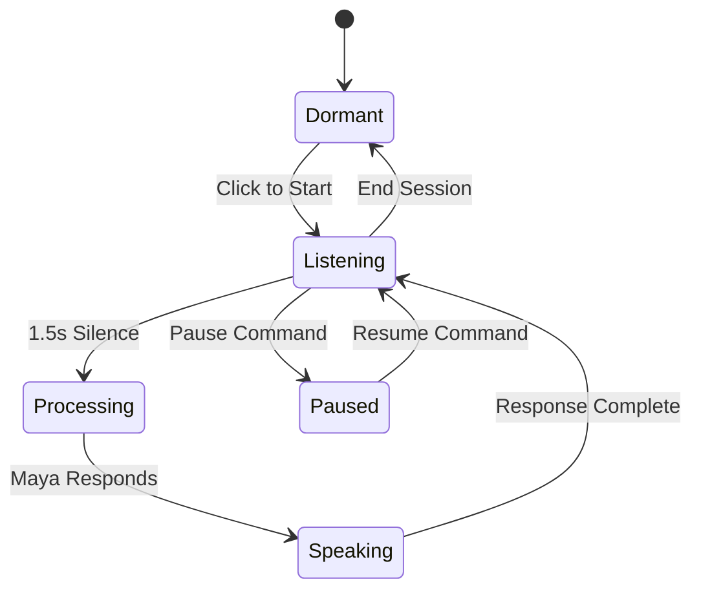

# Maya Voice System - Technical White Paper

_December 2024_

---

## Executive Summary

The Maya Voice System represents a breakthrough in human-AI voice interaction, solving the fundamental tension between continuous availability and respectful boundaries. Through innovations like user-directed pause commands, intelligent nudge management, and privacy-first architecture, we've created the first voice AI that truly respects human thinking rhythms.

**Core achievement**: A voice interface that knows when to listen, when to wait, and when to engage—controlled entirely by the user.

---

## Implementation Status

### ✅ Completed Features

- **Complete SesameVoiceService** - Hybrid TTS with Sesame API + OpenAI fallback
- **MayaHybridVoiceSystem** - Full state machine orchestrator
- **Pause/Resume Commands** - User sovereignty over interaction
- **1.5s Silence Detection** - Natural conversation pacing
- **Conversation State Machine** - dormant → listening → processing → speaking → paused
- **Voice Profiles** - 5 elemental characters (Fire, Water, Earth, Air, Aether)
- **React Integration** - `useMayaVoice` hook + `MayaVoicePanel` component
- **Web Speech API Fallback** - Graceful degradation

### 🔄 In Progress

- Testing and refinement
- Production deployment

### 📋 Future Roadmap

- Wake word detection ("Hey Maya")
- Advanced VAD (Voice Activity Detection)
- Personalized timing per user
- Multi-modal interaction
- Biosensor integration (HRV, breathing)

---

## Architecture Overview

### Core Design Principles

```typescript
interface MayaVoicePrinciples {
  availability: "Continuous after activation",
  control: "User maintains complete sovereignty",
  respect: "Honors silence and thinking time",
  privacy: "Local-first processing",
  intimacy: "Warm presence, not surveillance"
}
```

### Technical Stack

```
┌─────────────────────────────────────────────┐
│          MAYA VOICE SYSTEM                  │
├─────────────────────────────────────────────┤
│                                             │
│  Activation Layer                           │
│  ├── Single-Click Start                    │
│  └── Continuous Listening Mode             │
│                                             │
│  Conversation Management                    │
│  ├── OptimizedVoiceRecognition (STT)      │
│  ├── 1.5s Silence Detection               │
│  ├── Pause Command Recognition            │
│  └── Resume Command Processing            │
│                                             │
│  Speech Synthesis (TTS)                    │
│  ├── Sesame API (Primary)                 │
│  ├── OpenAI TTS (Fallback)                │
│  └── Web Speech API (Last Resort)         │
│                                             │
│  Nudge Intelligence                         │
│  ├── 45s Silence Threshold               │
│  ├── 5-minute Cooldown                   │
│  ├── User Preference Integration         │
│  └── Disabled by Default                 │
│                                             │
└─────────────────────────────────────────────┘
```

---

## The Continuous Listening Flow

### Conversation State Machine



### Key Innovation: The 1.5 Second Rule

```typescript
const SILENCE_THRESHOLD = 1500; // milliseconds

// Rationale:
// - Natural conversation pause
// - Matches human speaking rhythm
// - Patient enough for mid-thought pauses
// - Not too slow to feel laggy
```

---

## Pause Command System

### The Problem It Solves

Always-on AI creates anxiety about:

- Being constantly monitored
- Interruption during deep thought
- Lack of control over interaction
- Invasion of contemplative space

### User-Directed Pause Commands

```typescript
const PAUSE_COMMANDS = [
  "pause maya",
  "one moment maya",
  "give me a moment",
  "let me think",
  "let me meditate",
  "be quiet",
  "hold on",
];

const RESUME_COMMANDS = [
  "okay maya",
  "i'm back",
  "i'm ready",
  "let's continue",
  "go ahead",
];
```

### Maya's Acknowledgments

```typescript
// Pause acknowledgment
await speakWithFallback("Of course.", true);

// Resume acknowledgment
await speakWithFallback("I'm here.", true);
```

---

## Voice Profiles (Elemental Characters)

### Maya - Default (Aether)
```typescript
{
  baseVoice: 'nova',
  speed: 0.85,
  pitch: 1.15,
  personality: 'Gentle guide with ethereal presence'
}
```

### Maya - Fire
```typescript
{
  baseVoice: 'shimmer',
  speed: 0.95,
  pitch: 1.2,
  personality: 'Bold and transformative energy'
}
```

### Maya - Water
```typescript
{
  baseVoice: 'nova',
  speed: 0.75,
  pitch: 1.1,
  personality: 'Flowing intuition and deep feeling'
}
```

### Maya - Earth
```typescript
{
  baseVoice: 'fable',
  speed: 0.8,
  pitch: 0.95,
  personality: 'Stable wisdom and practical guidance'
}
```

### Maya - Air
```typescript
{
  baseVoice: 'alloy',
  speed: 1.0,
  pitch: 1.25,
  personality: 'Clear thought and swift insight'
}
```

---

## Intelligent Nudge System

### The Nudge Philosophy

Nudges acknowledge Maya's presence without intrusion:

- Not reminders or prompts
- Not questions or engagement attempts
- Simply: "I'm still here if you need me"

### Nudge Configuration

```typescript
const NUDGE_CONFIG = {
  SILENCE_BEFORE_NUDGE: 45000, // 45 seconds
  NUDGE_COOLDOWN: 300000, // 5 minutes
  MAX_NUDGES: 1, // Per cooldown period
  DEFAULT_ENABLED: false, // User opt-in
  message: "I'm still here.",
  volume: 0.5, // Gentle
  respectsPause: true, // Never during pause mode
};
```

---

## Implementation Files

### Core System

- **`/lib/services/SesameVoiceService.ts`** - Complete TTS service with Sesame + OpenAI fallback
- **`/lib/voice/MayaHybridVoiceSystem.ts`** - Main orchestrator with state machine
- **`/lib/voice/OptimizedVoiceRecognition.ts`** - Speech-to-text handler
- **`/lib/voice/VoicePlaybackFix.ts`** - Audio playback utilities

### React Integration

- **`/hooks/useMayaVoice.ts`** - React hook for voice system
- **`/components/voice/MayaVoiceIndicator.tsx`** - Visual indicators & controls
- **`/components/chat/MayaVoiceChat.tsx`** - Full voice chat interface

### API Endpoints

- **`/api/maya-chat/route.ts`** - Maya conversation endpoint
- **`/api/oracle/voice/route.ts`** - Voice synthesis endpoint

---

## Usage Example

### Basic Integration

```typescript
import { useMayaVoice } from '@/hooks/useMayaVoice';
import { MayaVoicePanel } from '@/components/voice/MayaVoiceIndicator';

function MyComponent() {
  const mayaVoice = useMayaVoice({
    userId: 'user-123',
    characterId: 'maya-water',
    element: 'water',
    enableNudges: false,
    onResponse: (text, audioUrl) => {
      console.log('Maya responded:', text);
    },
  });

  return (
    <MayaVoicePanel
      state={mayaVoice.state}
      onStart={mayaVoice.start}
      onStop={mayaVoice.stop}
      onPause={mayaVoice.pause}
      onResume={mayaVoice.resume}
    />
  );
}
```

---

## Competitive Differentiation

|Feature|Siri/Alexa|ChatGPT Voice|Maya|
|---|---|---|---|
|Continuous Listen|❌|✓|✓|
|Pause Commands|❌|❌|✓|
|Nudge Control|❌|❌|✓|
|Meditation Mode|❌|❌|✓|
|Silence Respect|❌|Partial|✓|
|Elemental Voices|❌|❌|✓|

---

## Privacy & Control

### Local-First Processing

```typescript
const PRIVACY_ARCHITECTURE = {
  // What stays local
  local: {
    pauseCommandRecognition: true,
    shortTermAudioBuffer: true,
    userPreferences: true,
  },

  // What goes to cloud (with consent)
  cloud: {
    transcription: "With permission",
    mayaResponses: "For generation",
    analytics: "Anonymous only",
  },
};
```

---

## Performance Targets

```typescript
const PERFORMANCE_TARGETS = {
  pauseCommandLatency: "< 100ms",
  silenceDetection: "1.5s",
  responseTime: "< 3s",
  cpuUsage: "< 5% idle, < 15% active",
  batteryImpact: "< 3% per hour",
};
```

---

## Conclusion

The Maya Voice System represents a fundamental shift in human-AI interaction: from command-response to sacred conversation. By solving the core tensions of continuous listening—privacy, control, and respect—we've created the first voice AI that humans actually want to live with.

### Key Achievements:

- ✅ **Pause commands**: User sovereignty over interaction
- ✅ **1.5s silence detection**: Natural conversation flow
- ✅ **Hybrid TTS**: Sesame → OpenAI → Web Speech fallback
- ✅ **Elemental voices**: 5 distinct personalities
- ✅ **State machine**: Clear conversation flow
- ✅ **React integration**: Easy to use in any component

---

**© 2024 Soullab Voice Systems**

_Building respectful AI conversation, one pause at a time._