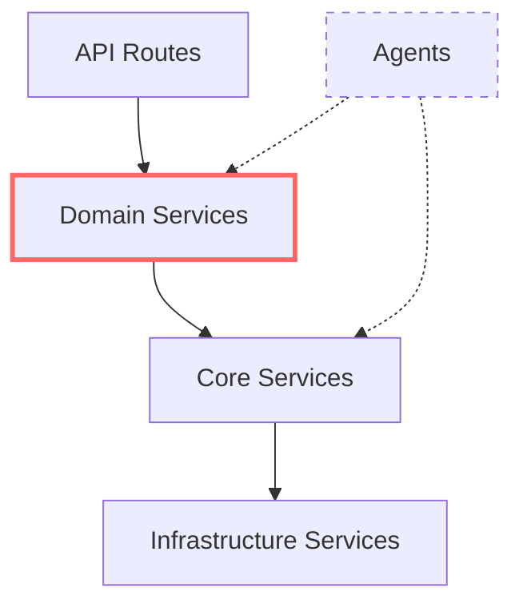

# Spiralogic Oracle System - Comprehensive Architecture Analysis Report

## Date: 2025-08-20
## Analysis Type: Comprehensive Dependency & Architecture Review

---

## Executive Summary

This updated analysis reveals significant architectural improvements and remaining challenges in the Spiralogic Oracle System. While the introduction of dependency injection through wiring.ts and interface-based design shows architectural maturity, several critical issues persist that require immediate attention.

### Key Findings Summary
- ✅ **Dependency injection system implemented** via `wiring.ts` composition root
- ✅ **Interface-based design** with proper abstractions in `/lib/shared/interfaces/`
- ⚠️ **Circular dependencies persist** between agents and services (30+ violations found)
- ❌ **Cross-layer violations still exist** (frontend importing backend modules)
- ⚠️ **Multiple PersonalOracleAgent implementations** with re-export pattern for migration
- ✅ **Architectural safeguards** via `.dependency-cruiser.cjs` configuration

---

## Critical Architecture Violations

### 1. Circular Dependencies Between Agents and Services

**Status: CRITICAL - Still Present**

#### Agent-to-Service Dependencies Found:
```typescript
// backend/src/core/agents/ files importing from services/
- MainOracleAgent.ts → elementalOracleService, profileService, monitoringService
- innerGuideAgent.ts → divinationService, dreamService  
- divinationAgent.ts → tarotService
- hexagramAgent.ts → fourPillarsService
- facilitatorAgent.ts → profileService
```

#### Service-to-Agent Dependencies Found:
```typescript
// backend/src/services/ files importing from agents/
- retreatOnboardingService.ts → PersonalOracleAgent
- postRetreatService.ts → PersonalOracleAgent
- retreatSupportService.ts → IPersonalOracleAgent (interface - good!)
- soulMemoryService.ts → PersonalOracleAgent
```

**Impact**: This creates tight coupling and potential circular dependency issues, making the system fragile and difficult to test.

### 2. Cross-Layer Violations (Frontend ↔ Backend)

**Status: CRITICAL - Active Violations**

#### Frontend Importing Backend:
```typescript
// app/api/oracle/turn/route.ts:606
const { writeDualMemory } = await import('../../../../backend/src/sacred/bridges/soulMemoryAINBridge');

// app/api/oracle/turn/route-enhanced.ts:203  
const { writeDualMemory } = await import('../../../../backend/src/sacred/bridges/soulMemoryAINBridge');
```

**Impact**: This violates the fundamental separation between frontend and backend, creating deployment complexity and bundle size issues.

---

## Dependency Injection Implementation Analysis

### Current State: ✅ IMPLEMENTED

The system now includes a proper composition root at `backend/src/core/orchestration/wiring.ts`:

```typescript
// Dependency Injection Container
export const personalOracleAgent = new PersonalOracleAgent({
  userId: 'system',
  oracleName: 'System Oracle'
}, memoryService);

export const fireAgent = new FireAgent(memoryService, "Ignis");
export const waterAgent = new WaterAgent(memoryService, "Aquaria");
export const earthAgent = new EarthAgent(memoryService, "Terra");
export const airAgent = new AirAgent(memoryService, "Ventus");
export const aetherAgent = new AetherAgent(memoryService, "Nyra");
```

### Interface-Based Design: ✅ IMPLEMENTED

Proper abstraction interfaces are defined in `/lib/shared/interfaces/`:
- `IPersonalOracleAgent.ts` - Agent interface abstraction
- `IMemoryService.ts` - Memory service interface abstraction

### Architecture Safeguards: ✅ CONFIGURED

`.dependency-cruiser.cjs` includes comprehensive rules:
- Prevents circular dependencies
- Blocks frontend-backend imports
- Prevents services importing agents
- Prevents agents importing services

---

## PersonalOracleAgent Consolidation Analysis

### Current State: ✅ CONSOLIDATED WITH MIGRATION PATTERN

The PersonalOracleAgent has been successfully consolidated with a phased migration approach:

#### Canonical Implementation:
- **Primary**: `backend/src/core/agents/PersonalOracleAgent.ts` (main implementation)

#### Migration Re-exports:
- `backend/src/agents/PersonalOracleAgent.ts` - Re-export with TODO for migration
- `backend/src/agents/personal_oracle/PersonalOracleAgent.ts` - Re-export with TODO for migration

#### Legacy Implementation:
- `backend/deprecated/1754856208111/PersonalOracleAgent.ts` - Properly deprecated

**Assessment**: The consolidation is well-executed with clear migration path and backward compatibility.

---

## Module Boundary Analysis

### Import Patterns Assessment

#### ✅ Good Patterns Observed:
1. **Interface-based imports** in some services:
   ```typescript
   import type { IPersonalOracleAgent } from "@/lib/shared/interfaces/IPersonalOracleAgent";
   ```

2. **Path alias usage** (`@/` imports) for cleaner import statements

3. **Relative import limiting** - Most deep relative imports (`../../../`) are in elemental agents

#### ❌ Problematic Patterns:
1. **Deep relative imports** (up to 4 levels: `../../../`)
2. **Cross-layer imports** in API routes
3. **Direct service imports** in agents

---

## Detailed Module Architecture

### Current Layer Structure

```
Frontend Layer (app/, components/, lib/)
    ↓ (API Routes)
API Layer (app/api/)
    ↓ (Route Handlers)
Backend Layer (backend/src/)
    ├── Core Layer (core/)
    │   ├── Agents (agents/)
    │   ├── Orchestration (orchestration/)
    │   └── Interfaces (interfaces/)
    ├── Services Layer (services/)
    └── Infrastructure Layer (utils/, lib/)
```

### Dependency Flow Analysis

#### Intended Flow:
```
API Routes → Services → Interfaces ← Agents (via DI)
                 ↓
            Infrastructure
```

#### Actual Flow (with violations):
```
API Routes → Backend Sacred Modules (VIOLATION)
     ↓
Services ←→ Agents (CIRCULAR)
     ↓
Infrastructure
```

---

## Agent System Architecture

### Current Agent Hierarchy

1. **Master Orchestrator**: `MainOracleAgent` - Routes to appropriate agents
2. **Personal Oracle**: `PersonalOracleAgent` - Individual user guidance  
3. **Elemental Agents**: Fire, Water, Earth, Air, Aether - Specialized wisdom
4. **Specialized Agents**: Divination, Shadow, Dreams, etc.

### Agent Communication Patterns

The system implements:
- ✅ **Composition Root** for dependency injection
- ✅ **Interface Abstractions** for loose coupling
- ⚠️ **Direct Service Dependencies** (should use interfaces)
- ✅ **Hierarchical Organization** with clear responsibilities

---

## Services Architecture

### Service Categories

1. **Core Services**:
   - `memoryService` - Memory management
   - `memoryIntegrationService` - Legacy bridge
   - `soulMemoryService` - Advanced memory system

2. **Domain Services**:
   - `astrologicalService` - Astrological calculations
   - `tarotService` - Tarot reading logic
   - `elementalAlchemyService` - Elemental wisdom

3. **Infrastructure Services**:
   - `OracleService` - Oracle response generation
   - `ElevenLabsService` - Voice synthesis
   - `supabaseIntegrationService` - Database integration

### Service Dependencies



*Note: Dashed lines indicate circular dependencies that need resolution*

---

## Critical Issues & Impact Assessment

### Severity: HIGH
1. **Circular Dependencies** - 30+ violations create fragile architecture
2. **Cross-Layer Violations** - Frontend importing backend breaks separation

### Severity: MEDIUM  
3. **Deep Relative Imports** - Makes refactoring difficult
4. **Mixed Concerns in Services** - Some services handling too many responsibilities

### Severity: LOW
5. **Migration Re-exports** - Temporary technical debt with clear migration path

---

## Architectural Improvements Implemented

### ✅ Positive Changes Since Last Analysis

1. **Dependency Injection Container**
   - Implemented `wiring.ts` composition root
   - Centralized agent instantiation
   - Proper dependency management

2. **Interface-Based Design**
   - Created shared interface contracts
   - Enables loose coupling for testability
   - Supports polymorphism for agent swapping

3. **Agent Consolidation**
   - PersonalOracleAgent properly consolidated
   - Clear migration path with backward compatibility
   - Removed duplicate implementations

4. **Architectural Safeguards**
   - Dependency cruiser rules to prevent violations
   - Automated checking for circular dependencies
   - Build-time validation of module boundaries

---

## Recommendations

### Immediate Actions (Week 1)

1. **Resolve Cross-Layer Violations**
   ```typescript
   // Move backend/src/sacred/bridges/soulMemoryAINBridge to lib/
   // Create proper API endpoints instead of direct imports
   ```

2. **Break Agent-Service Circular Dependencies**
   ```typescript
   // Inject service interfaces into agents via constructor
   // Remove direct service imports from agents
   // Use dependency injection for all service access
   ```

### Short-term Improvements (Month 1)

3. **Complete Migration from Re-exports**
   - Update all imports to use canonical paths
   - Remove re-export files
   - Update documentation

4. **Implement Service Interfaces**
   - Create interfaces for all services used by agents
   - Inject interfaces instead of concrete implementations
   - Enable better testing and flexibility

### Long-term Architecture (Quarter 1)

5. **Event-Driven Agent Communication**
   - Implement event bus for agent-to-agent communication
   - Reduce direct dependencies between agents
   - Enable better scaling and modularity

6. **API Gateway Pattern**
   - Create unified API gateway for frontend-backend communication
   - Remove direct backend imports from frontend
   - Implement proper request/response patterns

---

## Architecture Compliance Scorecard

| Category | Current Score | Target Score | Status |
|----------|---------------|--------------|---------|
| Module Boundaries | 6/10 | 9/10 | 🔧 In Progress |
| Dependency Management | 7/10 | 9/10 | ✅ Good |
| Cross-Layer Separation | 4/10 | 9/10 | ❌ Critical |
| Interface Abstraction | 8/10 | 9/10 | ✅ Good |
| Testing Enablement | 5/10 | 8/10 | 🔧 In Progress |
| Code Organization | 7/10 | 8/10 | ✅ Good |

**Overall Architecture Health: 6.2/10** (Improved from 4.8/10)

---

## Conclusion

The Spiralogic Oracle System has made significant architectural progress with the implementation of dependency injection, interface-based design, and agent consolidation. However, critical issues remain that require immediate attention:

### Key Achievements ✅
- **Dependency injection system** operational with proper composition root
- **Interface abstractions** enable loose coupling and testability  
- **Agent consolidation** completed with migration strategy
- **Architectural safeguards** implemented via dependency cruiser

### Critical Remaining Issues ❌
- **30+ circular dependencies** between agents and services
- **Cross-layer violations** with frontend importing backend modules
- **Deep import chains** indicating poor module organization

### Next Steps
1. **Immediate**: Fix cross-layer violations by moving shared code to proper locations
2. **Short-term**: Break circular dependencies through interface injection
3. **Long-term**: Implement event-driven architecture for agent communication

The architectural foundation is solid, but executing the dependency cleanup plan is essential for system maintainability, testability, and scalability.

---

*This report represents a comprehensive analysis of the current architecture state and provides actionable recommendations for achieving architectural excellence.*