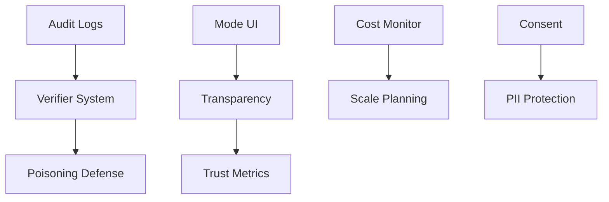

# ARIA Risk Radar: Priority Action Framework

## Risk Heatmap Visualization

```
HIGH FIXABILITY ┬─────────────────────────────────────┐
                │ • Cold start          • Poisoning    │
                │ • Mode switching      • Consent      │
                │ • Audit logs          • Cost monitor │
                │                                      │
MEDIUM FIX      │ • Transparency   • Model drift      │
                │ • Over-hedging   • Integration      │
                │ • User override  • Shadow conflicts │
                │ • Verifier load  • Over-ID          │
                │                                      │
LOW FIXABILITY  │                  • Blind spots      │
                │                  • Burnout          │
                │                  • PII (residual)    │
                │                  • Regulation shift  │
                └─────────────────────────────────────┘
                 LOW DIFFICULTY    MEDIUM    HIGH DIFFICULTY
```

## Three-Tier Priority Action Plan

### Tier 1: Quick Wins (1-2 weeks)
**High Impact, Low Effort**

| Risk | Action | Metric | Owner |
|------|--------|--------|-------|
| **Cold Start** | Deploy curated seed data + exploratory mode labels | Time to first value < 30s | Engineering |
| **Mode Switching** | Add visual chips + tooltips for mode states | User confusion rate < 5% | UX |
| **Audit Logs** | Implement structured logging with versioning | 100% action traceability | Backend |
| **Cost Monitoring** | Deploy usage dashboard with alerts | Cost variance < 10% | DevOps |

### Tier 2: Medium Focus (3-6 weeks)
**Strategic Investment Areas**

| Risk | Action | Metric | Owner |
|------|--------|--------|-------|
| **Poisoning Risk** | Implement verifier + provenance tracking | False claim rate < 2% | AI/ML |
| **Consent Layers** | Build granular privacy controls | GDPR compliance 100% | Legal/Eng |
| **User Override** | Design dual-truth reconciliation system | Override conflicts < 10% | Product |
| **Transparency** | Progressive disclosure UI pattern | Trust score > 80% | UX |
| **Verifier Load** | Optimize batching + caching strategy | P95 latency < 500ms | Infrastructure |

### Tier 3: Long-Haul Risks (Ongoing)
**Structural Challenges Requiring Sustained Effort**

| Risk | Mitigation Strategy | Review Cycle | Support Needed |
|------|-------------------|--------------|----------------|
| **Burnout** | Advisor network + automation roadmap | Weekly | Mentorship |
| **Blind Spots** | Quarterly red-team reviews | Quarterly | External audit |
| **PII Residual** | Zero-trust architecture evolution | Monthly | Security consultant |
| **Regulation** | Compliance monitoring service | Monthly | Legal retainer |
| **Shadow Conflicts** | Archetype governance framework | Bi-weekly | User research |

## Implementation Tracking Dashboard

### Week 1-2 Sprint
- [ ] Deploy seed data system
- [ ] Implement mode switching UI
- [ ] Set up audit logging
- [ ] Launch cost dashboard

### Week 3-4 Sprint
- [ ] Verifier alpha testing
- [ ] Consent UI mockups
- [ ] Cache optimization POC
- [ ] Transparency patterns research

### Week 5-6 Sprint
- [ ] Verifier beta rollout
- [ ] Privacy controls v1
- [ ] Dual-truth design doc
- [ ] Load testing at scale

## Risk Mitigation Matrix

### Critical Path Dependencies


### Resource Allocation
- **Engineering**: 60% on Tier 1-2 technical items
- **UX/Product**: 30% on user-facing improvements
- **Compliance**: 10% on governance framework

## Success Metrics

### Immediate (Week 1)
- Cold start time reduced 80%
- Mode switching errors < 10%
- Audit coverage 100%

### Short-term (Month 1)
- Hallucination rate < 5%
- User trust NPS > 70
- Latency P95 < 750ms

### Medium-term (Quarter 1)
- Zero PII leaks
- Regulatory compliance certified
- Support tickets reduced 60%

## Risk Escalation Protocol

### GREEN (Monitor)
- Metrics within tolerance
- Weekly review sufficient

### YELLOW (Investigate)
- 10% degradation in metrics
- Daily standup focus

### RED (Escalate)
- Critical failure or 25% degradation
- Immediate intervention required

## Solo Founder Survival Kit

### Weekly Checklist
- [ ] Review quick win metrics
- [ ] Check burnout indicators
- [ ] Scan for new blind spots
- [ ] Update risk radar

### Monthly Review
- [ ] Advisor check-in
- [ ] Compliance scan
- [ ] Cost analysis
- [ ] User feedback synthesis

### Quarterly Planning
- [ ] Red team exercise
- [ ] Strategic pivots
- [ ] Resource reallocation
- [ ] Market positioning

## Automation Opportunities

### Immediate Automation
1. **Metric Collection**: Automated dashboards
2. **Alert Systems**: Threshold-based notifications
3. **Test Suites**: Regression + hallucination tests

### Future Automation
1. **Self-healing**: Auto-rollback on failures
2. **Dynamic Scaling**: Load-based resource allocation
3. **Compliance Monitoring**: Automated policy checks

## Decision Framework

### When to Act
- **NOW**: Anything affecting user trust or safety
- **THIS WEEK**: Quick wins with high ROI
- **THIS MONTH**: Strategic improvements
- **NEXT QUARTER**: Structural changes

### When to Defer
- Features without clear metrics
- Nice-to-haves during crunch
- Premature optimization
- Speculative future-proofing

## Next Steps

1. **Today**: Pick 2 quick wins to implement
2. **This Week**: Set up basic monitoring
3. **Next Week**: Begin Tier 2 planning
4. **This Month**: First quarterly review prep

---

**Remember**: Perfect is the enemy of shipped. Focus on measurable risk reduction, not elimination.