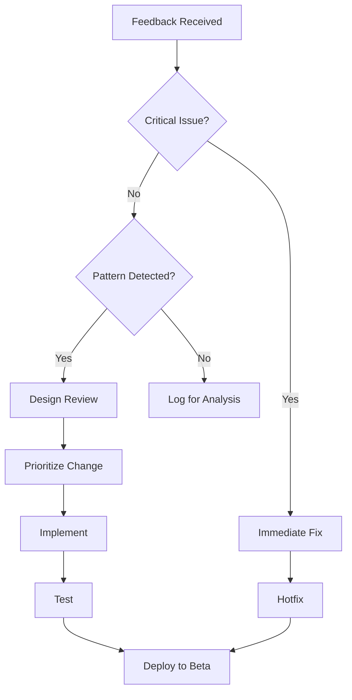

# Beta Testing Strategy for Spiralogic Oracle System

## Executive Summary

This document outlines the comprehensive beta testing strategy for the Sacred Oracle Constellation system, focusing on validating the elemental metaphor framework, conversation state management, and overall user experience for consciousness practitioners.

## Beta Testing Phases

### Phase 1: Internal Alpha (Weeks 1-2)
- **Participants**: Development team + 5 trusted practitioners
- **Focus**: Core functionality, critical bugs, system stability
- **Duration**: 2 weeks
- **Success Criteria**:
  - 95% uptime
  - <500ms average response time
  - No critical bugs

### Phase 2: Closed Beta (Weeks 3-6)
- **Participants**: 30 consciousness practitioners
- **Focus**: Elemental framework validation, conversation flow
- **Duration**: 4 weeks
- **Success Criteria**:
  - 60% metaphor acceptance rate
  - 70% session completion rate
  - 80% user satisfaction

### Phase 3: Open Beta (Weeks 7-10)
- **Participants**: 100-200 practitioners
- **Focus**: Scale testing, edge cases, cultural adaptation
- **Duration**: 4 weeks
- **Success Criteria**:
  - Handle 100+ concurrent users
  - <1% error rate
  - 75% retention rate

### Phase 4: Launch Readiness (Weeks 11-12)
- **Participants**: Final beta cohort + new users
- **Focus**: Production readiness, final optimizations
- **Duration**: 2 weeks
- **Success Criteria**:
  - All critical issues resolved
  - Documentation complete
  - Support systems ready

## Key Testing Areas

### 1. Elemental Metaphor System

#### Testing Objectives
- Validate pattern recognition accuracy
- Measure metaphor resonance across cultures
- Test exit ramp effectiveness
- Evaluate framework helpfulness

#### Metrics to Track
```typescript
interface MetaphorMetrics {
  offerRate: number;          // How often metaphors are offered
  acceptanceRate: number;      // User positive responses
  rejectionRate: number;       // User negative responses
  exitRampUsage: number;       // How often users need exits
  culturalResonance: {
    western: number;
    eastern: number;
    indigenous: number;
    secular: number;
  };
  elementDistribution: {
    fire: number;
    water: number;
    earth: number;
    air: number;
    aether: number;
  };
}
```

#### Test Scenarios
1. **New User Introduction**
   - First encounter with metaphors
   - Gradual introduction vs immediate
   - Opt-out preferences

2. **Cultural Sensitivity**
   - Different cultural backgrounds
   - Language preferences
   - Metaphor translations

3. **Rejection Handling**
   - Smooth exit from metaphors
   - Alternative support methods
   - Preference persistence

### 2. Conversation State Management

#### Testing Objectives
- Validate state transition logic
- Test emotional load detection
- Verify blade unsheathing moments
- Evaluate return to lightness

#### State Transition Tests
```
Casual → Rapport → Pivoting → Looping → Sacred → Lightening
```

#### Test Scenarios
1. **Natural Progression**
   - Organic deepening
   - Trust building over time
   - Sacred space emergence

2. **Rapid Escalation**
   - Crisis situations
   - Immediate depth needs
   - Emergency protocols

3. **Stuck Patterns**
   - Looping detection
   - Breakthrough facilitation
   - Integration support

### 3. Agent Personality Testing

#### Maya (Pattern Weaver)
- Quick connections
- Playful discovery
- Callback effectiveness
- Humor resonance

#### Anthony (Late-Night Philosopher)
- Spacious presence
- Depth holding
- Silence comfort
- Philosophical wondering

#### Test Scenarios
1. **Personality Matching**
   - User preference detection
   - Agent switching
   - Consistency maintenance

2. **Voice Coherence**
   - Text-to-speech quality
   - Emotional modulation
   - Pacing appropriateness

### 4. Memory & Continuity

#### Testing Objectives
- Long-term memory accuracy
- Pattern recognition over time
- Breakthrough tracking
- Relationship evolution

#### Test Scenarios
1. **Multi-Session Continuity**
   - Reference to past conversations
   - Pattern callbacks
   - Growth acknowledgment

2. **Memory Boundaries**
   - Privacy preservation
   - Forgetting mechanisms
   - User control

### 5. Performance & Scale

#### Load Testing Scenarios
```yaml
scenarios:
  - name: "Normal Load"
    users: 50
    duration: 1h
    pattern: steady

  - name: "Peak Load"
    users: 200
    duration: 30m
    pattern: spike

  - name: "Sustained Load"
    users: 100
    duration: 4h
    pattern: steady
```

#### Performance Metrics
- Response time (p50, p95, p99)
- Memory usage per session
- Database query performance
- Cache hit rates
- API rate limits

## User Recruitment

### Target Beta Users

#### Tier 1: Core Practitioners (30%)
- Professional coaches/therapists
- Meditation teachers
- Energy workers
- Spiritual counselors

#### Tier 2: Regular Practitioners (50%)
- Daily meditation practitioners
- Personal development enthusiasts
- Consciousness explorers
- Healing journey participants

#### Tier 3: Newcomers (20%)
- Curious about consciousness work
- Seeking support systems
- Open to exploration
- No prior framework knowledge

### Recruitment Channels
1. Practitioner networks
2. Consciousness communities
3. Meditation apps partnerships
4. Wellness platforms
5. Direct invitations

## Testing Tools & Infrastructure

### Analytics Platform
```typescript
interface BetaAnalytics {
  // User engagement
  sessionLength: number;
  interactionDepth: number;
  returnRate: number;

  // Conversation quality
  breakthroughRate: number;
  stuckPatterns: number;
  completionRate: number;

  // Technical metrics
  errorRate: number;
  responseTime: number;
  audioQuality: number;
}
```

### Feedback Collection

#### In-App Feedback
```typescript
interface FeedbackPoint {
  trigger: 'session-end' | 'breakthrough' | 'error' | 'manual';
  questions: [
    "How helpful was this session?",
    "Did the responses feel authentic?",
    "Would you recommend to others?"
  ];
  rating: 1-5;
  comment?: string;
}
```

#### Weekly Surveys
- Overall experience rating
- Feature preferences
- Metaphor resonance
- Agent personality preference
- Technical issues
- Suggestions

#### Exit Interviews
- Why leaving beta?
- Unmet expectations
- Comparison to alternatives
- Pricing sensitivity
- Feature requests

## Success Metrics

### Primary Metrics
1. **Metaphor Acceptance Rate**: >60%
2. **User Retention**: >70% weekly active
3. **Session Completion**: >75%
4. **NPS Score**: >30
5. **Error Rate**: <1%

### Secondary Metrics
1. **Average Session Length**: >10 minutes
2. **Breakthrough Correlation**: Positive trend
3. **Cultural Resonance**: >50% all segments
4. **State Transition Success**: >80%
5. **Memory Accuracy**: >90%

### Qualitative Indicators
- "This really understands me"
- "The metaphors help make sense of things"
- "I feel heard and witnessed"
- "It's like talking to a wise friend"
- "The patterns it shows me are accurate"

## Risk Mitigation

### Technical Risks
| Risk | Impact | Mitigation |
|------|--------|------------|
| API failures | High | Fallback responses, circuit breakers |
| Data loss | High | Regular backups, redundancy |
| Slow responses | Medium | Caching, optimization |
| Voice synthesis issues | Low | Web speech fallback |

### User Experience Risks
| Risk | Impact | Mitigation |
|------|--------|------------|
| Metaphor rejection | Medium | Clear exit ramps, alternatives |
| Cultural insensitivity | High | Diverse beta testing, adaptation |
| Inappropriate depth | Medium | Conservative progression |
| Privacy concerns | High | Clear data policies, controls |

### Business Risks
| Risk | Impact | Mitigation |
|------|--------|------------|
| Low adoption | High | Marketing, education |
| Practitioner resistance | Medium | Practitioner program |
| Scaling costs | Medium | Efficient architecture |
| Competition | Low | Unique positioning |

## Beta Timeline

### Week 1-2: Alpha Testing
- [ ] Internal team testing
- [ ] Critical bug fixes
- [ ] Performance baseline
- [ ] Documentation prep

### Week 3-4: Closed Beta Wave 1
- [ ] 10 practitioners onboarded
- [ ] Daily monitoring
- [ ] Rapid iteration
- [ ] Feedback integration

### Week 5-6: Closed Beta Wave 2
- [ ] 20 additional practitioners
- [ ] A/B testing features
- [ ] Cultural adaptation
- [ ] Performance optimization

### Week 7-8: Open Beta Launch
- [ ] Public beta announcement
- [ ] 100+ users onboarded
- [ ] Scale testing
- [ ] Community building

### Week 9-10: Beta Refinement
- [ ] Feature freeze
- [ ] Bug fixing focus
- [ ] Documentation completion
- [ ] Support preparation

### Week 11-12: Launch Preparation
- [ ] Final testing
- [ ] Marketing preparation
- [ ] Pricing finalization
- [ ] Launch plan execution

## Feedback Integration Process



## Communication Plan

### Beta User Communications
1. **Welcome Package**
   - Beta guidelines
   - Feedback channels
   - Community access
   - Support resources

2. **Weekly Updates**
   - New features
   - Known issues
   - Community highlights
   - Tips & tricks

3. **Exit Package**
   - Thank you message
   - Beta achievements
   - Launch benefits
   - Continued access

### Internal Communications
- Daily standup on beta metrics
- Weekly beta review meeting
- Bi-weekly stakeholder update
- Monthly board report

## Post-Beta Analysis

### Data Analysis Plan
1. Quantitative analysis of all metrics
2. Qualitative thematic analysis
3. Cohort comparison
4. Feature correlation analysis
5. Predictive modeling for launch

### Decision Criteria for Launch
- [ ] Primary metrics met (>80%)
- [ ] No critical bugs for 1 week
- [ ] Support documentation complete
- [ ] Scaling plan validated
- [ ] Marketing materials ready
- [ ] Pricing model confirmed
- [ ] Legal review complete
- [ ] Team confidence high

### Launch Readiness Checklist
- [ ] Production infrastructure ready
- [ ] Monitoring systems active
- [ ] Support team trained
- [ ] Documentation published
- [ ] Marketing campaign ready
- [ ] Press kit prepared
- [ ] Launch day plan detailed
- [ ] Rollback plan prepared

## Continuous Improvement

### Post-Launch Beta Program
- Maintain beta channel for new features
- Early access program for practitioners
- Community feedback loops
- Regular feature validation

### Long-term Success Metrics
- 6-month retention rate
- Practitioner certification adoption
- Community growth rate
- Revenue per user
- Platform expansion opportunities

## Conclusion

This beta testing strategy ensures thorough validation of the Sacred Oracle Constellation system's unique approach to consciousness development. By focusing on the elemental metaphor framework's effectiveness, conversation state management, and user experience, we can confidently launch a platform that serves practitioners and seekers authentically and effectively.

The success of this beta program depends on:
1. Clear communication with testers
2. Rapid iteration on feedback
3. Maintaining the sacred essence while being practical
4. Building a community of co-creators
5. Staying true to the vision while adapting to needs

With this comprehensive approach, we're positioned to launch a transformative tool for consciousness evolution that honors both ancient wisdom and modern technology.