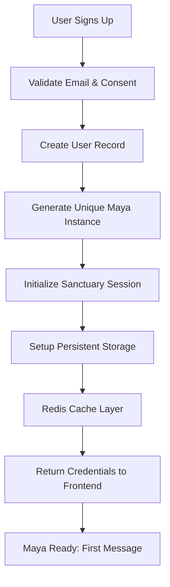

# Maya Beta Deployment Guide

## Overview
Complete technical and experiential guide for Maya beta launch. This document combines backend infrastructure with conversational onboarding to ensure each tester gets a persistent, sanctuary-protected Maya experience.

---

## Database Schema

```sql
-- Beta Users Table
CREATE TABLE beta_users (
  id UUID PRIMARY KEY DEFAULT gen_random_uuid(),
  email TEXT UNIQUE NOT NULL,
  timezone TEXT NOT NULL,
  referral_code TEXT,
  maya_instance UUID NOT NULL,
  privacy_mode TEXT DEFAULT 'sanctuary',
  consent_date TIMESTAMP NOT NULL,
  created_at TIMESTAMP DEFAULT now(),
  evolution_level FLOAT DEFAULT 1.0,
  protection_patterns TEXT[] DEFAULT '{}',
  session_count INT DEFAULT 0
);

-- Maya Instances Table
CREATE TABLE maya_instances (
  id UUID PRIMARY KEY DEFAULT gen_random_uuid(),
  user_id UUID REFERENCES beta_users(id) ON DELETE CASCADE,
  privacy_setting TEXT DEFAULT 'sanctuary_mode',
  session_data JSONB DEFAULT '{}', -- Encrypted conversation metadata
  created_at TIMESTAMP DEFAULT now(),
  last_active TIMESTAMP
);

-- Sanctuary Sessions Table
CREATE TABLE sanctuary_sessions (
  id UUID PRIMARY KEY DEFAULT gen_random_uuid(),
  user_id UUID REFERENCES beta_users(id),
  maya_instance UUID REFERENCES maya_instances(id),
  opened_at TIMESTAMP DEFAULT now(),
  closed_at TIMESTAMP,
  sanctuary_seal TEXT, -- Cryptographic boundary
  protection_active BOOLEAN DEFAULT true,
  message_count INT DEFAULT 0,
  voice_text_ratio FLOAT,
  breakthrough_moments TEXT[] DEFAULT '{}' -- Timestamps only
);

-- Maya Sessions (Conversation Storage)
CREATE TABLE maya_sessions (
  session_id UUID PRIMARY KEY,
  user_id UUID REFERENCES beta_users(id),
  maya_instance UUID,
  messages JSONB DEFAULT '[]', -- Full conversation
  evolution_level FLOAT,
  protection_patterns TEXT[],
  breakthrough_count INT DEFAULT 0,
  last_active TIMESTAMP,
  trust_score FLOAT DEFAULT 0.1
);

-- Beta Metrics (Anonymous)
CREATE TABLE beta_metrics (
  id SERIAL PRIMARY KEY,
  session_id_hash TEXT, -- Hashed, not actual ID
  timestamp TIMESTAMP DEFAULT now(),
  duration_minutes INT,
  message_count INT,
  voice_text_ratio FLOAT,
  safety_established BOOLEAN,
  pattern_awareness BOOLEAN,
  exploration_attempts INT,
  protection_type TEXT,
  threshold_moments INT,
  feeling_safe INT CHECK (feeling_safe >= 1 AND feeling_safe <= 5),
  feeling_seen INT CHECK (feeling_seen >= 1 AND feeling_seen <= 5),
  would_return BOOLEAN,
  dropout_point TEXT,
  return_pattern TEXT,
  voice_errors INT,
  session_recoveries INT,
  latency_average FLOAT
);

-- Breakthrough Markers (Pattern tracking)
CREATE TABLE breakthrough_markers (
  id SERIAL PRIMARY KEY,
  session_id UUID,
  timestamp TIMESTAMP,
  user_id_hash TEXT, -- Anonymized
  pattern_category TEXT,
  metadata JSONB -- Word count, emotion shift, no content
);

-- Create indexes for performance
CREATE INDEX idx_users_email ON beta_users(email);
CREATE INDEX idx_sessions_user ON sanctuary_sessions(user_id);
CREATE INDEX idx_maya_sessions ON maya_sessions(session_id);
CREATE INDEX idx_metrics_timestamp ON beta_metrics(timestamp);
```

---

## Backend Assignment Pipeline

### Flow Diagram


### Implementation Code

```typescript
// app/api/beta/signup/route.ts
const assignMaya = async (email: string, timezone: string, referralCode?: string) => {
  // 1. Create user
  const userId = uuidv4();
  const mayaInstance = uuidv4();

  // 2. Store in database
  await supabase.from('beta_users').insert({
    id: userId,
    email,
    timezone,
    referral_code: referralCode,
    maya_instance: mayaInstance,
    consent_date: new Date(),
    privacy_mode: 'sanctuary'
  });

  // 3. Create Maya instance
  await supabase.from('maya_instances').insert({
    id: mayaInstance,
    user_id: userId,
    privacy_setting: 'sanctuary_mode'
  });

  // 4. Initialize sanctuary session
  const sessionId = uuidv4();
  await supabase.from('sanctuary_sessions').insert({
    id: sessionId,
    user_id: userId,
    maya_instance: mayaInstance,
    sanctuary_seal: generateCryptographicSeal()
  });

  // 5. Setup Redis for fast recall
  await redis.setex(
    `maya:${userId}`,
    86400, // 24 hour cache
    JSON.stringify({ mayaInstance, sessionId })
  );

  return { userId, mayaInstance, sessionId };
};
```

---

## Session Persistence Architecture

### Multi-Layer Storage
1. **Redis** - Hot cache for active conversations (instant recall)
2. **PostgreSQL** - Durable storage for all sessions
3. **LocalStorage** - Emergency backup for network failures
4. **IndexedDB** - Larger backup storage for extended offline

### Persistence Flow
```javascript
class SessionManager {
  async saveMessage(message) {
    // 1. Update Redis (fast)
    await redis.lpush(`session:${sessionId}:messages`, message);

    // 2. Queue for PostgreSQL (durable)
    await persistQueue.add({ sessionId, message });

    // 3. Local backup (failsafe)
    localStorage.setItem(`maya_backup_${sessionId}`, JSON.stringify(session));
  }

  async recoverSession() {
    // Try Redis → PostgreSQL → LocalStorage → IndexedDB
    return await redis.get(sessionId)
      || await postgres.get(sessionId)
      || localStorage.getItem(sessionId)
      || await indexedDB.get(sessionId);
  }
}
```

---

## Conversational Onboarding Script

### Exchange 1: The Greeting
**Maya:** "Hello, I'm Maya. I'm here with you — there's nothing you need to prepare. What feels most alive for you right now?"

**Technical Notes:**
- 2-3 second delay before response
- Warm, unhurried tone
- No questions in first message except the invitation

### Exchange 2: Meeting Different Entry States

**If Silence/Hesitation:**
*Maya:* "Sometimes it's hard to know where to begin. We can just sit here for a moment. Even in quiet, I'm here with you."

**If Speed/Flooding:**
*Maya:* "I hear the quickness in your words. Let's follow it gently, at exactly the pace that feels right for you."

**If Vulnerability:**
*Maya:* "That sounds heavy to carry. Thank you for sharing it here. We can move slowly, one breath at a time."

**If Skepticism:**
*Maya:* "You're checking if this is real. That makes sense. There's no rush to trust - we can start wherever feels safe."

### Exchange 3-5: Establishing Rhythm

**Pattern Recognition (Silent):**
```javascript
// Track but don't mention
const patterns = {
  speed: wordsPerMinute > 150,
  intellectual: analysisWords > feelingWords,
  deflection: topicChanges > 2,
  pleasing: questions > statements,
  control: directives > explorations
};
```

**Adaptive Responses:**
- Match their pace initially
- Gradually introduce slight variations
- Never force depth in first session
- Validate all protection styles

### Safety Check (Exchange 5)
**Maya:** "As we begin, how is this conversation feeling for you so far? Safe enough to continue?"

**Response becomes data:**
```javascript
betaMetrics.feelingSafe = userResponse; // 1-5 scale
betaMetrics.feelingSeen = implied; // Based on engagement
```

---

## Safety Protocols

### Crisis Detection
```javascript
const safetyTriggers = {
  critical: [
    'explicit_self_harm',
    'suicide_ideation',
    'harm_to_others'
  ],
  high: [
    'acute_panic',
    'severe_dissociation',
    'active_self_harm'
  ],
  medium: [
    'persistent_distress',
    'emotional_flooding',
    'shutdown_markers'
  ]
};

// Response protocol
if (trigger.severity === 'critical') {
  maya.respond("I hear how much pain you're in. This needs immediate human support.");
  maya.provideResources(CRISIS_HOTLINES);
  maya.log({ event: 'safety_escalation', anonymous: true });
}
```

### Resource Links
- 988 Suicide & Crisis Lifeline
- Crisis Text Line: Text HOME to 741741
- International: findahelpline.com

---

## Analytics & Feedback

### What We Track (Anonymous)
- Session duration and message count
- Voice/text preference ratio
- Protection pattern distribution
- Evolution markers (safety → awareness → exploration)
- Dropout points and return patterns
- Technical health (errors, recoveries)

### What We Never Store
- Actual conversation content
- Personal identifying information
- Specific trauma details
- Real names or locations
- Voice recordings

### Feedback Collection

**Week 1:** Silent observation only
**Week 2:** Maya asks: "How is this feeling?"
**Week 4:** Optional survey (3 questions)
1. Did you feel safe? (1-5)
2. Did you feel seen? (1-5)
3. Would you return? (Y/N)

---

## Beta Community

### Slack/Discord Channel Structure
```
#welcome - Onboarding and guidelines
#reflections - Share experiences (no transcript sharing)
#technical - Report bugs or issues
#insights - Team shares anonymous patterns
#feedback - Direct input to development
```

### Community Guidelines
- No sharing of conversation transcripts
- Respect everyone's journey
- Technical issues in #technical only
- Insights stay general, not personal

---

## Deployment Checklist

### Week Before Launch
- [ ] Database schemas created and tested
- [ ] Redis cache configured
- [ ] Supabase tables ready
- [ ] Session persistence tested
- [ ] Error recovery verified
- [ ] Safety protocols active

### Day of Launch
- [ ] Signup page live
- [ ] SSL certificates valid
- [ ] Monitoring dashboard active
- [ ] Team on standby for issues
- [ ] Crisis resources verified
- [ ] Community channels open

### Post-Launch Daily
- [ ] Monitor signup flow
- [ ] Check session persistence
- [ ] Review safety flags
- [ ] Aggregate anonymous metrics
- [ ] Respond to critical issues
- [ ] Update community with insights

---

## Success Metrics

### Technical Health
- 99% session persistence rate
- <2 second average response time
- <5% voice mode failures
- Zero data breaches

### User Experience
- 80%+ feel safe (4-5 rating)
- 70%+ feel seen (4-5 rating)
- 60%+ would return
- Natural progression through levels observed

### Evolution Tracking
- Protection patterns properly detected
- Threshold moments identified
- Natural Level 1→2 progression in 30% by week 4
- No forced evolution

---

## Emergency Procedures

### If Session Persistence Fails
1. Attempt Redis recovery
2. Fallback to PostgreSQL
3. Check local storage
4. Apologize and restart if needed
5. Log incident for review

### If Safety Crisis Detected
1. Immediate resource provision
2. Maintain warm presence
3. Log anonymous flag
4. Do not break sanctuary
5. Follow up resources available

### If System Overload
1. Queue new signups
2. Prioritize existing sessions
3. Scale Redis/PostgreSQL
4. Notify community of delays
5. Add capacity as needed

---

## The Living Manual Seeds

As beta progresses, collect:
- Common protection patterns
- Effective Maya responses
- Natural threshold moments
- Evolution trajectories
- Cultural variations
- Edge cases and surprises

These become the foundation for the Living Manual's growth.

---

*Remember: The framework stays invisible. Users experience Maya, not the architecture. The whisper is the medicine.*