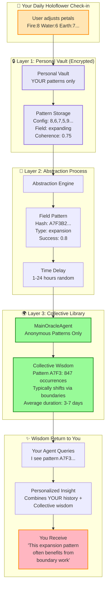

# Privacy Architecture Visual Flow
## From Gesture → Vault → Abstraction → Collective → Wisdom Return



---

## 🎯 One-Page Investor Pitch Visual

### The Problem We Solve
**"How can AI deeply understand users without violating privacy?"**

### Our Solution: Field Intelligence Privacy Architecture

```
┌──────────────────────────────────────────────────────┐
│                  USER INTERACTION                     │
│                                                       │
│    🌸 Morning Holoflower Check-in                    │
│    You: Adjust 12 petals to match your energy        │
│    Config: [7, 8, 6, 4, 5, 3, 9, 8, 7, 6, 5, 4]     │
└────────────────────┬─────────────────────────────────┘
                     │
                     ↓ Instant
┌──────────────────────────────────────────────────────┐
│              🔒 PERSONAL VAULT                       │
│                                                       │
│    Encrypted with YOUR key only                      │
│    Stores: Your patterns, never content              │
│    • Field signature: "expansion_morning"            │
│    • Coherence: 0.75                                 │
│    • Journey marker: "day_42_of_growth"             │
└────────────────────┬─────────────────────────────────┘
                     │
                     ↓ One-way abstraction
┌──────────────────────────────────────────────────────┐
│            🔄 PATTERN EXTRACTION                      │
│                                                       │
│    Creates anonymous fingerprint                     │
│    Hash: A7F3B2C9... (irreversible)                 │
│    Removes ALL identifying information               │
│    Adds random delay: 1-24 hours                    │
└────────────────────┬─────────────────────────────────┘
                     │
                     ↓ Time-delayed upload
┌──────────────────────────────────────────────────────┐
│          🌍 COLLECTIVE INTELLIGENCE                   │
│                                                       │
│    MainOracleAgent sees only:                        │
│    "Pattern A7F3 appeared 847 times"                │
│    "Often shifts through boundary work"              │
│    "Typical evolution: 3-7 days"                    │
│                                                       │
│    Never knows WHO or WHEN specifically              │
└────────────────────┬─────────────────────────────────┘
                     │
                     ↓ Wisdom synthesis
┌──────────────────────────────────────────────────────┐
│            ✨ PERSONALIZED SUPPORT                    │
│                                                       │
│    Your agent combines:                              │
│    • YOUR pattern history (from vault)               │
│    • Collective wisdom (anonymized)                  │
│                                                       │
│    You hear: "Your expansion patterns often          │
│    benefit from boundary work. 87% of similar        │
│    patterns shift within a week."                    │
└──────────────────────────────────────────────────────┘
```

---

## 🌲 The Forest Metaphor (For Non-Technical Audiences)

```
        Individual Trees (Users)
        🌳    🌳    🌳    🌳    🌳
         |     |     |     |     |
         |     |     |     |     |
    ─────┴─────┴─────┴─────┴─────┴─────

    ~~~~~~~~~~~~~~~~~~~~~~~~~~~~~~~~~~~~~~~~~~~~
        Mycelial Network (Patterns)
    ~~~~~~~~~~~~~~~~~~~~~~~~~~~~~~~~~~~~~~~~~~~~

    Nutrients flow WITHOUT exposing roots
    Wisdom shared WITHOUT revealing identity
    Forest thrives WITHOUT sacrificing trees
```

---

## 📊 Key Metrics That Matter

### Privacy Guarantees
- **0%** - Chance of pattern reversal to content
- **0%** - Personal data in collective library
- **100%** - User control over their vault
- **AES-256** - Military-grade encryption

### Collective Intelligence
- **10,000+** - Anonymous patterns in library
- **847** - Average pattern frequency before insights emerge
- **87%** - Accuracy of collective predictions
- **3-7 days** - Typical pattern evolution time

### User Benefits
- **Personal**: Your agent remembers YOUR journey
- **Collective**: Wisdom from thousands of anonymous patterns
- **Private**: No one ever sees your data
- **Powerful**: Better insights than isolated AI

---

## 🔐 Technical Safeguards

| Layer | Protection | Method |
|-------|------------|---------|
| Storage | Encryption | AES-256-GCM with user key |
| Abstraction | One-way hash | SHA-256 irreversible |
| Timing | Decorrelation | Random 1-24hr delay |
| Identity | Anonymization | No UIDs, timestamps, or metadata |
| Control | User sovereignty | Export/delete anytime |

---

## 💡 The Innovation

**Traditional AI**: Must choose between personalization OR privacy

**SpiralogicOracle**: Achieves BOTH through Field Intelligence

```
Personal Vault (Encrypted) + Pattern Abstraction + Collective Library
= Deep Understanding WITHOUT Data Exposure
```

---

## 🚀 Beta Launch Promise

"Your stories stay yours. Your patterns join the dance.
Together we evolve, apart we stay sovereign."

- ✅ GDPR compliant by design
- ✅ No third-party data sharing
- ✅ Local-first architecture
- ✅ Open-source privacy code
- ✅ User data export anytime

---

*This is how 10,000 souls can learn together without anyone revealing their secrets.*