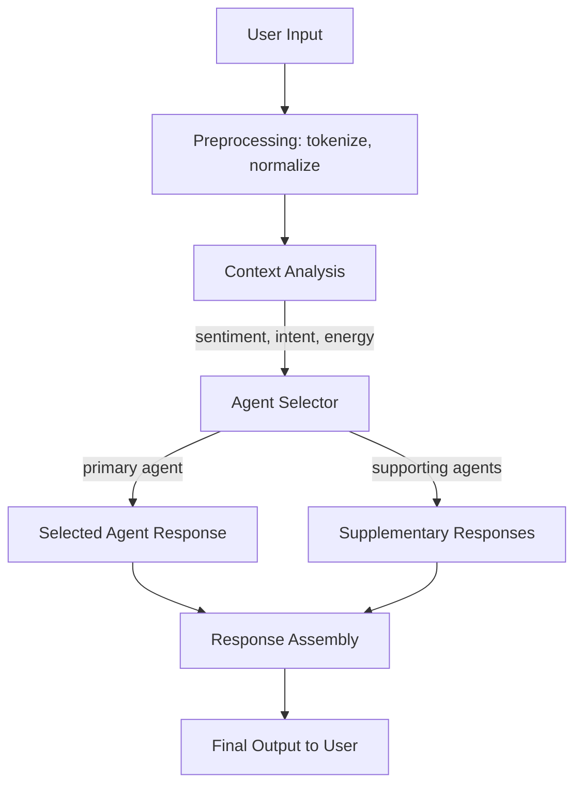

# Multi-Agent Conversation System: Technical Implementation

## Architecture Overview

The system uses dynamic agent routing to provide contextually appropriate responses through specialized AI modes. This document outlines the technical implementation details for developers and technical stakeholders.

## Multi-Agent Routing Flow



## Context Analysis Modules

### 1. Sentiment Analysis Engine
- **Purpose**: Detect emotional tone and stress indicators
- **Output Categories**: stressed, joyful, confused, neutral, overwhelmed, excited
- **Confidence Scoring**: 0.0-1.0 probability distribution
- **Technology**: Transformer-based sentiment classification with custom training data

### 2. Theme Extraction System
- **Purpose**: Identify conversation topic and intent
- **Categories**: decision-making, emotional processing, creative exploration, practical planning, philosophical reflection
- **Method**: Multi-label classification with keyword pattern matching
- **Context Window**: Last 3 conversational turns for context continuity

### 3. Energy Level Detection
- **Purpose**: Assess user engagement and interaction intensity
- **Levels**: low, medium, high
- **Indicators**: Message length, punctuation patterns, response timing, linguistic intensity
- **Application**: Influences response tone and depth

### 4. Confidence Scoring Framework
```typescript
interface ContextAnalysis {
  sentiment: {
    category: SentimentType;
    confidence: number;
    indicators: string[];
  };
  theme: {
    primary: ThemeType;
    secondary: ThemeType[];
    confidence: number;
  };
  energy: {
    level: EnergyLevel;
    confidence: number;
  };
  overallConfidence: number;
}
```

## Agent Selection Algorithm

### Routing Decision Process

**Example Input Analysis:**
```
Input: "I'm feeling overwhelmed with this decision"

Context Analysis Output:
- Sentiment → stressed (confidence: 0.78)
- Theme → decision-making (confidence: 0.84)
- Energy → low (confidence: 0.69)
- Overall Confidence → 0.77

Agent Routing Decision:
- Selected Primary → EmpatheticAgent (confidence: 0.87)
- Supporting Agents → [ReflectiveAgent, PracticalAgent]
- Response Strategy → supportive_with_structure
```

### Agent Selection Matrix

| Primary Pattern | Selected Agent | Confidence Threshold | Fallback Agent |
|----------------|----------------|-------------------|----------------|
| Emotional distress + decision-making | EmpatheticAgent | >0.75 | GeneralAgent |
| Problem-solving + high energy | AnalyticalAgent | >0.80 | PracticalAgent |
| Creative exploration + medium energy | CreativeAgent | >0.70 | ReflectiveAgent |
| Philosophical questions + reflective tone | ReflectiveAgent | >0.75 | AnalyticalAgent |
| Task planning + practical language | PracticalAgent | >0.85 | AnalyticalAgent |

## Response Generation Architecture

### Primary Agent Response
```typescript
interface AgentResponse {
  primaryResponse: string;
  confidence: number;
  responseStrategy: ResponseStrategy;
  suggestedFollowUp?: string[];
  contextPreservation: ConversationContext;
}
```

### Supporting Agent Integration
- **Purpose**: Provide additional perspective or fallback options
- **Implementation**: Parallel processing with primary agent
- **Selection**: Based on secondary themes or low primary confidence
- **Assembly**: Integrated into final response or held as alternatives

### Response Assembly Process
1. **Primary Response Generation**: Selected agent creates main response
2. **Supporting Input**: Secondary agents provide complementary perspectives
3. **Coherence Check**: Ensure response consistency and avoid contradictions
4. **Personalization Layer**: Apply user-specific communication preferences
5. **Final Assembly**: Combine elements into coherent response

## Performance Characteristics

### Target Benchmarks
- **Agent Selection Latency**: <100ms (95th percentile)
- **Context Analysis Accuracy**: >85% (measured against human annotators)
- **Response Relevance Score**: ≥4.2/5.0 (user rating average)
- **User Satisfaction Improvement**: +40% vs single-agent baselines
- **System Throughput**: 1000+ concurrent conversations with <200ms response time

### Quality Assurance Metrics
```typescript
interface QualityMetrics {
  responseRelevance: number;        // User rating 1-5
  agentSelectionAccuracy: number;   // Correct agent selection %
  conversationCoherence: number;    // Context preservation score
  userEngagementDuration: number;   // Session length increase
  taskCompletionRate: number;       // Successful conversation resolution
}
```

## Risk Mitigation Strategies

### Technical Safeguards
1. **Fallback Mechanisms**
   - Automatic fallback to GeneralAgent if routing fails
   - Graceful degradation when context analysis has low confidence
   - Human-readable error messages for system failures

2. **Bias Detection and Prevention**
   - Regular auditing of agent selection patterns across user demographics
   - Monitoring for cultural, gender, or linguistic biases in responses
   - A/B testing to validate fair treatment across user groups

3. **Privacy Protection**
   - Session-bound conversation analysis (no cross-user data leakage)
   - Anonymization of patterns used for system improvement
   - User control over data sharing and retention

4. **Response Quality Control**
   - Automated content filtering for inappropriate responses
   - Human review triggers for sensitive topics
   - Continuous monitoring of user satisfaction scores

### Operational Safety
```typescript
interface SafetyProtocols {
  biasDetection: {
    demographicFairness: MonitoringSystem;
    responseEquity: AuditingSystem;
    continuousValidation: TestingFramework;
  };

  fallbackSystems: {
    agentFailure: GeneralAgentFallback;
    contextLoss: ConversationRecovery;
    systemOverload: GracefulDegradation;
  };

  qualityAssurance: {
    responseFiltering: ContentModerationSystem;
    humanReview: EscalationProtocol;
    userFeedback: ContinuousImprovement;
  };
}
```

## Scalability Architecture

### Horizontal Scaling Design
- **Agent Pooling**: Multiple instances of each agent type for load distribution
- **Context Caching**: Redis-based conversation context storage
- **Load Balancing**: Intelligent routing based on agent availability and user affinity
- **Database Sharding**: User data partitioned across multiple database instances

### Performance Optimization
- **Response Caching**: Common response patterns cached for faster delivery
- **Predictive Loading**: Pre-load likely agents based on conversation context
- **Batch Processing**: Aggregate similar analysis requests for efficiency
- **Resource Monitoring**: Real-time tracking of system performance and automatic scaling

## Implementation Considerations

### Development Requirements
- **Machine Learning Pipeline**: Training and deployment infrastructure for context analysis models
- **Real-time Processing**: Low-latency response generation and agent coordination
- **State Management**: Conversation context persistence across sessions
- **Monitoring Systems**: Comprehensive logging and performance tracking

### Integration Points
- **Voice System Integration**: Agent selection influences voice characteristics and tone
- **User Interface Adaptation**: Visual indicators show active agent and available alternatives
- **Analytics Integration**: User interaction patterns feed back into agent selection improvements
- **External APIs**: Integration capabilities for specialized knowledge domains

## Future Development Roadmap

### Phase 1: Core Stability (Current)
- Reliable agent selection with >85% accuracy
- Sub-100ms response times under normal load
- Basic privacy controls and user customization

### Phase 2: Advanced Personalization
- Deep learning models for user preference prediction
- Dynamic agent creation for specialized topics
- Cross-session learning while maintaining privacy

### Phase 3: Collaborative Intelligence
- Multi-agent collaborative responses for complex queries
- Real-time agent coordination for nuanced conversations
- Integration with external knowledge systems and tools

### Phase 4: Adaptive Architecture
- Self-improving agent selection algorithms
- Automatic bias detection and correction
- Dynamic system optimization based on usage patterns

## Conclusion

This multi-agent architecture provides significant advantages over single-personality AI systems through contextual intelligence and specialized response generation. The technical implementation prioritizes performance, privacy, and quality while maintaining the flexibility to evolve with user needs and technological advances.

The system's combination of real-time analysis, dynamic routing, and continuous learning creates more engaging and effective conversations while preserving user agency and maintaining realistic expectations about AI capabilities.