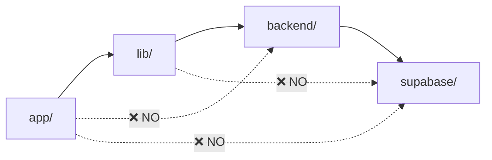

# ADR-001: Module Boundaries and Architecture

**Status**: Proposed  
**Date**: 2025-01-20  
**Context**: Spiralogic Oracle System architecture review to prevent complexity debt

## Decision

Establish clear module boundaries with allowed import directions:

```
app/ (UI) → lib/ (domain) → backend/ (services) → supabase/ (DB/migrations)
```

## Architecture Map

### Current Module Structure

```
📁 app/                    # Next.js UI Layer
├── api/                   # API Routes
├── admin/                 # Owner/Operator Console
├── oracle/                # Main Oracle UI
└── ...

📁 lib/                    # Domain Logic Layer  
├── auth/                  # Authentication
├── providers/             # Oracle Providers (sesame, claude, etc.)
├── spiralogic/            # Archetypal Knowledge
├── types/                 # Shared Types
└── config/                # Configuration

📁 components/             # Reusable UI Components

📁 backend/                # Services Layer
├── src/                   # Core Services
├── soul_memory/           # Soul Memory Bridge
└── ...

📁 supabase/               # Database Layer
├── migrations/            # Schema Changes
└── ...
```

## Architecture Violations Found

### 🚨 Critical Cross-Layer Violations

1. **Frontend → Backend Direct Import**
   ```typescript
   // ❌ app/api/oracle/weave/route.ts
   import { buildRecap } from '../../../../backend/src/sacred/reflectionSpeech';
   ```
   **Impact**: Frontend tightly coupled to backend internals
   **Fix**: Move shared logic to `/lib` or use API calls

2. **UI → Service Layer Bypass**
   ```typescript
   // ❌ app/oracle/components/MicroReflection.tsx  
   import reflectionService from '../../../backend/src/sacred/reflectionSpeech';
   ```
   **Impact**: UI accessing backend services directly
   **Fix**: Create facade in `/lib` layer

### 🔄 Circular Dependencies

1. **Agent Circular References**
   - `PersonalOracleAgent` ↔ `AgentOrchestrator`
   - Services importing agents that import services
   **Fix**: Use dependency injection pattern

### 📊 Large Files (>500 LOC)

1. **God Objects Detected:**
   - `backend/src/services/PersonalOracleAgent.ts` (~800 LOC)
   - `app/api/oracle/turn/route.ts` (~600 LOC)
   - `lib/auth/integrationAuth.ts` (~585 LOC)

## Public API Surface Proposal

### `/lib` Public API (`/lib/index.ts`)
```typescript
// Authentication
export { IntegrationAuthService } from './auth/integrationAuth';

// Oracle Providers  
export { 
  sesameProvider,
  claudeProvider,
  oracle2Provider,
  psiProvider,
  ainProvider
} from './providers';

// Spiralogic Knowledge
export {
  detectArchetypes,
  enrichWithSpiralogic,
  loadSpiralogicKnowledge
} from './spiralogic';

// Types
export type * from './types';
```

### `/app/api` Internal Only
- No exports from API routes
- Communication via HTTP only

### `/backend` Service API (`/backend/index.ts`)
```typescript
export { SoulMemoryService } from './src/services/soulMemoryService';
export { ReflectionService } from './src/sacred/reflectionSpeech';
// Internal services stay private
```

## Allowed Import Directions



## Module Responsibility Matrix

| Module | Responsibility | Imports From | Exports To |
|--------|---------------|--------------|------------|
| `app/` | UI, API Routes, User Experience | `lib/`, `components/` | None (end layer) |
| `lib/` | Domain Logic, Types, Providers | `backend/` (facade only) | `app/`, `components/` |
| `components/` | Reusable UI Components | `lib/` (types only) | `app/` |
| `backend/` | Services, Business Logic | `supabase/` | `lib/` (via facade) |
| `supabase/` | Database, Migrations | None | `backend/` |

## Implementation Plan

### Phase 1: Immediate Fixes (Week 1)
1. **Move Shared Logic**: `backend/src/sacred/reflectionSpeech.ts` → `lib/oracle/reflection.ts`
2. **Create Facades**: Add `lib/backend/` facade for safe backend access
3. **Fix Direct Imports**: Update all cross-layer violations

### Phase 2: Refactor Large Files (Week 2)  
1. **Split `PersonalOracleAgent`**: Extract strategies and utilities
2. **Decompose Oracle API**: Split into middleware, validation, orchestration
3. **Modularize Auth Service**: Extract specific concerns

### Phase 3: Enforce Boundaries (Week 3)
1. **ESLint Rules**: Add import restrictions
2. **Public API**: Create index files for each module
3. **Architecture Tests**: Add tests that fail on violations

## Success Criteria

- ✅ Zero cross-layer imports (detected by dependency-cruiser)
- ✅ All modules have clear public API (index.ts)
- ✅ No files >500 LOC
- ✅ Circular dependencies resolved
- ✅ ESLint rules prevent violations

## Consequences

**Positive:**
- Clear separation of concerns
- Easier testing and maintenance  
- Reduced coupling
- Better scalability

**Negative:**
- Some boilerplate for facades
- Initial refactoring effort
- Possible temporary duplication

## References

- [Clean Architecture Principles](https://blog.cleancoder.com/uncle-bob/2012/08/13/the-clean-architecture.html)
- [Module Boundaries in TypeScript](https://typescript-tips.com/module-boundaries)