# C4 Level 1: System Context

The highest level view showing the Spiralogic Oracle System in relation to its users and external systems.

```mermaid
flowchart TB
    User[🧑 End User<br/>Oracle seeker, file uploader]
    Admin[👨‍💼 Administrator<br/>System manager, beta coordinator]
    
    subgraph Spiralogic["🌟 Spiralogic Oracle System"]
        WebApp[Next.js Web Application<br/>Voice-first AI Oracle interface]
    end
    
    subgraph External["External Systems"]
        Supabase[(🗄️ Supabase<br/>Database & Auth)]
        OpenAI[🤖 OpenAI<br/>GPT-4, Embeddings, Whisper]
        ElevenLabs[🎙️ ElevenLabs<br/>Voice synthesis]
        Storage[(📁 Object Storage<br/>Files, audio, transcripts)]
    end
    
    %% User interactions
    User -->|Chat, voice, uploads| WebApp
    Admin -->|Monitor, configure| WebApp
    
    %% System dependencies
    WebApp -->|Store data, authenticate| Supabase
    WebApp -->|Generate responses| OpenAI
    WebApp -->|Synthesize speech| ElevenLabs
    WebApp -->|Store/retrieve files| Storage
    
    %% Data flows
    WebApp -.->|User conversations| Supabase
    WebApp -.->|Memory embeddings| OpenAI
    WebApp -.->|Audio responses| ElevenLabs
    WebApp -.->|Upload processing| Storage

    classDef userStyle fill:#e1f5fe,stroke:#01579b,stroke-width:2px
    classDef systemStyle fill:#f3e5f5,stroke:#4a148c,stroke-width:2px
    classDef externalStyle fill:#fff3e0,stroke:#e65100,stroke-width:2px
    
    class User,Admin userStyle
    class WebApp systemStyle
    class Supabase,OpenAI,ElevenLabs,Storage externalStyle
```

## Context Description

### Users
- **End Users**: Individuals seeking oracle guidance, uploading files for analysis, engaging in voice conversations
- **Administrators**: System managers overseeing user onboarding, monitoring system health, managing beta features

### Core System
- **Spiralogic Oracle System**: A voice-first AI platform providing personalized wisdom through elemental consciousness agents

### External Dependencies
- **Supabase**: Provides database storage, user authentication, and real-time subscriptions
- **OpenAI**: Powers conversation AI, document embeddings, and speech transcription via GPT-4, Embeddings API, and Whisper
- **ElevenLabs**: Generates natural voice synthesis for oracle responses
- **Object Storage**: Manages uploaded files, audio recordings, and processed transcripts

### Key Interactions
- Users engage through chat interfaces, voice commands, and file uploads
- System processes conversations through AI agents and stores insights in memory
- External APIs provide AI capabilities while the system maintains conversation context
- Administrators monitor system health and guide user experiences through beta features