# C4 Level 2: Container Diagram

Detailed view of the major runtime containers and their relationships within the Spiralogic Oracle System.

```mermaid
flowchart TB
    User[🧑 End User]
    Admin[👨‍💼 Administrator]
    
    subgraph Browser["🌐 Web Browser"]
        UI[React UI<br/>app/*, components/*]
        Storybook[📚 Storybook<br/>Design system & QA]
    end
    
    subgraph NextJS["⚡ Next.js Application"]
        Pages[📄 App Router Pages<br/>/oracle, /admin, /beta, /debug]
        API[🔌 API Routes<br/>/api/oracle, /api/uploads, /api/admin]
        Middleware[🛡️ Auth Middleware<br/>Authentication & validation]
    end
    
    subgraph Backend["🧠 Backend Core"]
        Agents[🤖 AI Agents<br/>Elemental, Oracle, Guide agents]
        Services[⚙️ Core Services<br/>Memory, Model, Integration]
        Bridges[🌉 System Bridges<br/>Soul Memory, PSI connections]
    end
    
    subgraph Infrastructure["🏗️ Infrastructure"]
        Docker[🐳 Docker Runtime<br/>Development & production containers]
        Monitoring[📊 Observability<br/>Health checks, metrics, logs]
    end
    
    subgraph Data["💾 Data Layer"]
        Supabase[(🗄️ Supabase DB<br/>Conversations, users, badges)]
        Storage[(📁 Object Storage<br/>Uploads, audio, transcripts)]
        Memory[(🧠 Soul Memory<br/>Long-term context & insights)]
    end
    
    subgraph External["🌍 External APIs"]
        OpenAI[🤖 OpenAI API<br/>GPT-4, Embeddings, Whisper]
        ElevenLabs[🎙️ ElevenLabs API<br/>Voice synthesis]
    end
    
    %% User interactions
    User --> UI
    Admin --> UI
    User --> Storybook
    
    %% Frontend to backend
    UI -->|HTTPS requests| API
    API --> Middleware
    Middleware --> Agents
    API --> Services
    
    %% Backend interactions
    Agents --> Services
    Services --> Bridges
    Agents --> Memory
    
    %% Data connections
    Services -->|supabase-js| Supabase
    Services -->|File operations| Storage
    Bridges -->|Memory operations| Memory
    
    %% External API calls
    Services -->|HTTP/REST| OpenAI
    Services -->|HTTP/REST| ElevenLabs
    
    %% Infrastructure
    Docker -.->|Contains| NextJS
    Docker -.->|Contains| Backend
    Monitoring -.->|Observes| NextJS
    Monitoring -.->|Observes| Backend

    classDef userStyle fill:#e1f5fe,stroke:#01579b,stroke-width:2px
    classDef frontendStyle fill:#e8f5e8,stroke:#2e7d32,stroke-width:2px
    classDef backendStyle fill:#f3e5f5,stroke:#4a148c,stroke-width:2px
    classDef dataStyle fill:#fff8e1,stroke:#f57f17,stroke-width:2px
    classDef externalStyle fill:#ffebee,stroke:#c62828,stroke-width:2px
    classDef infraStyle fill:#f5f5f5,stroke:#424242,stroke-width:2px
    
    class User,Admin userStyle
    class UI,Storybook,Pages,API,Middleware frontendStyle
    class Agents,Services,Bridges backendStyle
    class Supabase,Storage,Memory dataStyle
    class OpenAI,ElevenLabs externalStyle
    class Docker,Monitoring infraStyle
```

## Container Descriptions

### Web Browser
- **React UI**: Client-side interface built with Next.js App Router, handling user interactions and real-time updates
- **Storybook**: Component documentation and design system testing environment

### Next.js Application
- **App Router Pages**: Route handlers for different user interfaces (/oracle, /admin, /beta, /debug)
- **API Routes**: Server-side endpoints providing REST/JSON APIs for frontend consumption
- **Auth Middleware**: Request authentication, validation, and authorization logic

### Backend Core
- **AI Agents**: Specialized consciousness agents (Air, Earth, Water, Fire, Aether) plus Oracle and Guide agents
- **Core Services**: Business logic for memory management, model orchestration, and system integration
- **System Bridges**: Connectors to external systems like Soul Memory and PSI for enhanced capabilities

### Data Layer
- **Supabase DB**: Primary database storing user data, conversations, training metrics, and badge systems
- **Object Storage**: File storage for uploads, processed documents, audio recordings, and transcripts
- **Soul Memory**: Specialized long-term memory system for maintaining conversation context and insights

### External APIs
- **OpenAI API**: Provides GPT-4 conversation AI, embedding generation, and Whisper speech transcription
- **ElevenLabs API**: High-quality voice synthesis for oracle responses and system narration

### Infrastructure
- **Docker Runtime**: Containerized deployment for both development and production environments
- **Observability**: Monitoring, health checks, metrics collection, and error tracking systems

## Communication Protocols

- **HTTPS**: Secure communication between browser and Next.js API routes
- **supabase-js**: Type-safe database client with real-time subscriptions
- **REST/HTTP**: Standard APIs for external service integration
- **WebSocket**: Real-time updates for chat and system notifications
- **File Upload**: Multipart form data for document and audio file processing