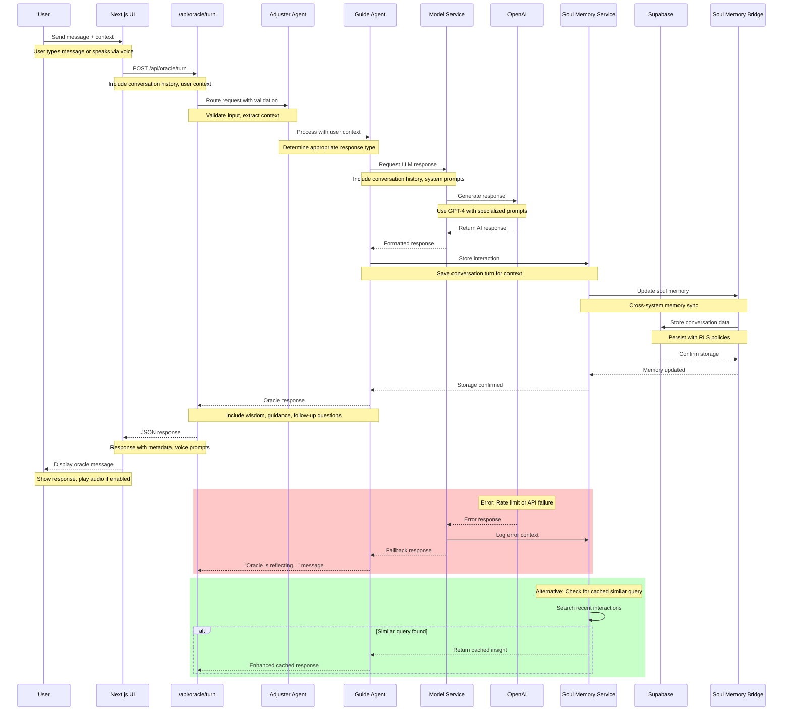

# Oracle Turn Sequence

This sequence diagram shows the complete flow of a user conversation turn through the Spiralogic Oracle System.

## Key Flow Details

### Request Processing
1. **User Input**: Message or voice input through the Next.js interface
2. **API Routing**: Request validated and routed to the appropriate agent
3. **Context Building**: Conversation history and user context assembled
4. **Agent Processing**: Adjuster → Guide agent flow for response generation

### AI Generation
1. **Model Service**: Orchestrates the LLM request with system prompts
2. **OpenAI Integration**: GPT-4 generates contextual oracle response
3. **Response Formatting**: AI output formatted for user consumption

### Memory Integration
1. **Interaction Storage**: Conversation turn saved to soul memory system
2. **Cross-System Sync**: Memory bridge updates external memory systems
3. **Database Persistence**: Supabase stores conversation with RLS security

### Error Handling
- **API Failures**: Graceful degradation with fallback responses
- **Rate Limiting**: Queue management and retry logic
- **Memory Errors**: Continue operation even if memory storage fails

### Performance Optimizations
- **Cached Responses**: Check for similar recent queries
- **Streaming Responses**: Real-time updates for long responses
- **Context Pruning**: Manage conversation history length

## Response Times
- **Typical**: 2-4 seconds end-to-end
- **With Cache Hit**: 500ms-1s
- **Error Recovery**: 1-2 seconds for fallback

## Security Notes
- All database operations use Row Level Security (RLS)
- API authentication required for all endpoints
- User context isolated per session
- No sensitive data logged in oracle responses