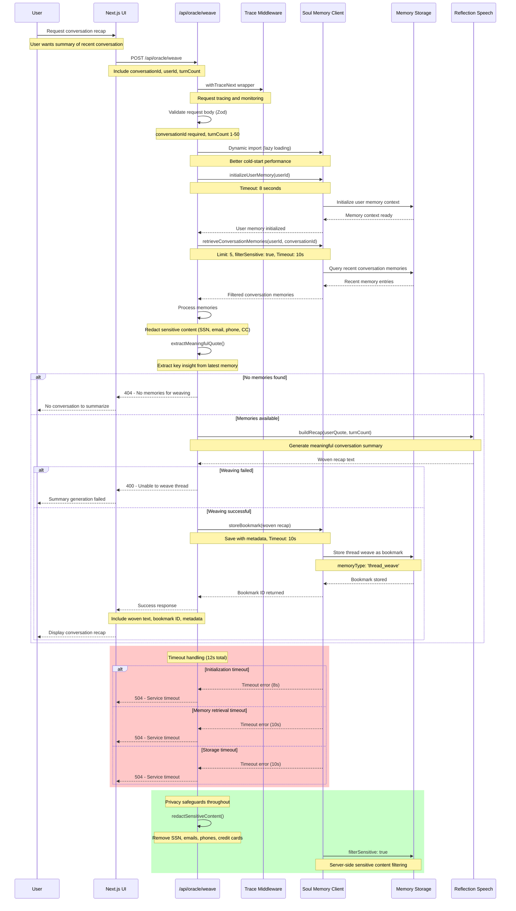

# Oracle Weave Sequence

This sequence diagram shows the conversation thread weaving process, which creates meaningful summaries and recaps from recent conversation memories.

## Weave Processing Details

### Request Validation
1. **Required Fields**: `conversationId` must be provided
2. **Optional Fields**: `userId` (defaults to 'anonymous'), `turnCount` (1-50, defaults to 3)
3. **Zod Validation**: Type-safe request parsing with detailed error messages

### Memory Retrieval
1. **User Initialization**: Ensure user memory context exists
2. **Conversation Query**: Retrieve up to 5 recent memories with sensitive content filtering
3. **Processing**: Take last 3 memories, redact any remaining sensitive content
4. **Element Context**: Include elemental context (aether, air, earth, water, fire)

### Content Processing
1. **Quote Extraction**: Find meaningful quote from latest conversation turn
2. **Recap Generation**: Use reflection speech engine to build conversational summary
3. **Privacy Protection**: Multiple layers of sensitive content redaction

### Storage & Response
1. **Bookmark Creation**: Store woven recap as searchable bookmark
2. **Metadata**: Include session context, weave count, timestamps, user quote
3. **Response**: Return woven text, storage confirmation, and metadata

## Privacy & Security Features

### Sensitive Content Redaction
- **SSN Patterns**: `000-00-0000` format detection
- **Email Addresses**: Comprehensive email pattern matching
- **Phone Numbers**: `###-###-####` format detection  
- **Credit Cards**: 13-19 digit sequences with separators

### Multi-Layer Protection
- **Client-Side**: Initial content filtering before API call
- **API-Level**: `redactSensitiveContent()` function processing
- **Storage-Level**: `filterSensitive: true` in memory queries
- **Response-Level**: Final privacy check before user display

## Performance Optimizations

### Lazy Loading
- **Dynamic Imports**: Soul Memory Client loaded only when needed
- **Cold Start**: Reduces initial bundle size and improves response times
- **Error Isolation**: Clear error messages if imports fail

### Timeout Management
- **Operation Timeouts**: Each async operation has specific timeout limits
- **Total Request**: 12-second overall request timeout with early termination
- **Cleanup**: Proper timeout cleanup prevents resource leaks

### Memory Efficiency
- **Limited Retrieval**: Query only last 5 memories, process only 3
- **Filtered Content**: Server-side filtering reduces data transfer
- **Focused Processing**: Extract only meaningful quotes for weaving

## Error Handling

### Validation Errors (400)
- Invalid request body structure
- Missing required conversationId
- turnCount outside 1-50 range

### Not Found Errors (404)  
- No conversation memories available for weaving
- User memory context not found

### Timeout Errors (504)
- Memory initialization timeout (>8s)
- Memory retrieval timeout (>10s)
- Bookmark storage timeout (>10s)

### Server Errors (500)
- Weaving engine failures
- Storage system unavailable
- Unexpected processing errors

## Usage Patterns

### Typical Flow
1. User completes meaningful conversation with oracle
2. System offers "weave thread" option to create recap
3. User requests weave → meaningful summary generated
4. Summary stored as searchable bookmark for future reference

### Integration Points
- **Oracle Chat**: Post-conversation weaving option
- **Memory Search**: Woven recaps appear in memory search results
- **Progress Tracking**: Thread weaves show conversation evolution
- **Insight Collection**: Meaningful quotes extracted for user reflection