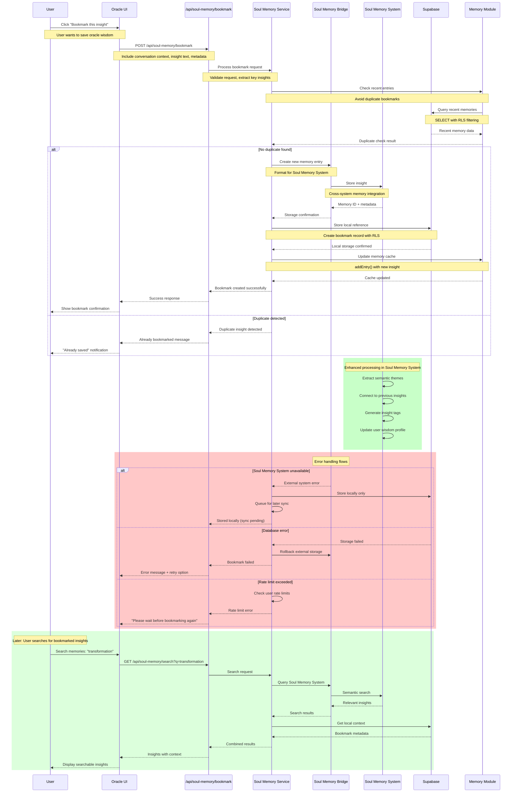

# Soul Memory Bookmark Sequence

This sequence diagram shows how meaningful conversation insights are captured and stored in the Soul Memory system.

## Bookmark Processing Details

### Request Validation
1. **Context Extraction**: Extract conversation context and insight text
2. **User Authentication**: Verify user permission to bookmark
3. **Content Validation**: Ensure insight meets minimum quality thresholds
4. **Duplicate Detection**: Check for similar recent bookmarks

### Memory Integration
1. **Bridge Processing**: Format insight for Soul Memory System storage
2. **Cross-System Storage**: Store in both local DB and external memory system
3. **Cache Update**: Update local memory cache for quick access
4. **Semantic Enhancement**: Extract themes and connections in background

### Data Storage
- **Local Storage**: Immediate storage in Supabase with RLS
- **External System**: Enhanced storage in Soul Memory System
- **Cache Layer**: In-memory cache for frequently accessed insights
- **Backup Strategy**: Multiple storage layers ensure data persistence

## Memory Enhancement Process

### Semantic Analysis
- **Theme Extraction**: Identify key concepts and wisdom themes
- **Connection Discovery**: Link to previous user insights and patterns
- **Tag Generation**: Automatic tagging for improved searchability
- **Profile Building**: Update user's evolving wisdom profile

### Intelligence Features
- **Pattern Recognition**: Identify recurring themes in user's journey
- **Growth Tracking**: Monitor evolution of user insights over time
- **Relationship Mapping**: Connect insights across different life areas
- **Wisdom Synthesis**: Generate meta-insights from collected bookmarks

## Search & Retrieval

### Query Processing
- **Semantic Search**: Vector-based similarity search
- **Contextual Results**: Include conversation context with insights
- **Temporal Ordering**: Sort by relevance and recency
- **Personal Relevance**: Weight results by user's growth pattern

### Result Enhancement
- **Related Insights**: Show connected bookmarks and themes
- **Growth Timeline**: Display insights in chronological context
- **Wisdom Trends**: Highlight patterns in user's evolving understanding
- **Action Suggestions**: Recommend next steps based on insights

## Security & Privacy

### Data Protection
- All bookmarks protected by Row Level Security (RLS)
- Cross-system encryption for external memory storage
- User consent required for enhanced processing
- Anonymized analytics for system improvement

### Access Control
- User-scoped bookmark access only
- Secure API authentication required
- Audit logging for bookmark operations
- Regular security reviews of stored insights

## Performance Characteristics

### Response Times
- **Bookmark Creation**: 200-500ms typical
- **Duplicate Detection**: <100ms with cached recent entries
- **Search Queries**: 500ms-2s depending on complexity
- **Background Enhancement**: Processed asynchronously

### Scalability
- Memory cache reduces database load
- Async enhancement processing
- Batch operations for bulk bookmark processing
- Intelligent caching strategies for frequent searches