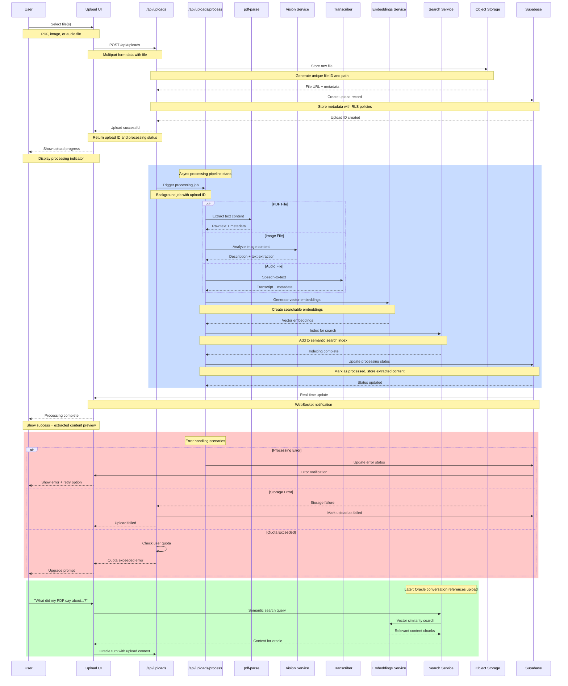

# Upload Processing Sequence

This sequence diagram shows the complete file upload and processing pipeline for documents, images, and audio files.

## Processing Pipeline Details

### File Upload
1. **Client Upload**: User selects file through drag-drop or file picker
2. **Immediate Storage**: File stored in object storage with unique ID
3. **Database Record**: Upload metadata saved with processing status
4. **User Feedback**: Upload ID returned, processing indicator shown

### Content Extraction
- **PDF Files**: Text extraction using pdf-parse library
- **Images**: Vision AI analyzes content and extracts any text (OCR)
- **Audio Files**: Speech-to-text transcription using Whisper API

### Search Integration
1. **Embedding Generation**: Create vector embeddings for semantic search
2. **Index Update**: Add processed content to searchable index
3. **Context Availability**: Content becomes available for oracle conversations

### Real-time Updates
- **WebSocket Notifications**: Real-time status updates via Supabase
- **Progress Indicators**: Visual feedback during processing
- **Error Notifications**: Immediate error reporting with retry options

## File Type Support

### Documents
- **PDF**: Full text extraction, metadata preservation
- **Images**: JPG, PNG with OCR and content analysis
- **Text**: Plain text files with encoding detection

### Audio
- **Formats**: MP3, WAV, M4A, WEBM
- **Transcription**: Whisper API for high-quality speech-to-text
- **Languages**: Multi-language support based on detection

### Size Limits
- **Free Users**: 10MB per file, 100MB total
- **Beta Users**: 50MB per file, 1GB total
- **Enterprise**: Custom limits based on subscription

## Security & Privacy

### Data Protection
- All uploads encrypted at rest
- Processing happens in isolated environments  
- User data never shared between accounts
- Automatic cleanup of temporary processing files

### Access Control
- Row Level Security (RLS) enforces user isolation
- Upload URLs are signed and time-limited
- Processing logs are anonymized
- Content embeddings are user-scoped

## Performance Characteristics

### Processing Times
- **PDFs**: 5-30 seconds depending on size and complexity
- **Images**: 2-10 seconds for analysis and OCR
- **Audio**: 1-2x real-time for transcription

### Scalability
- Async processing prevents UI blocking
- Queue-based system handles concurrent uploads
- Embedding generation batched for efficiency
- Search index updated incrementally