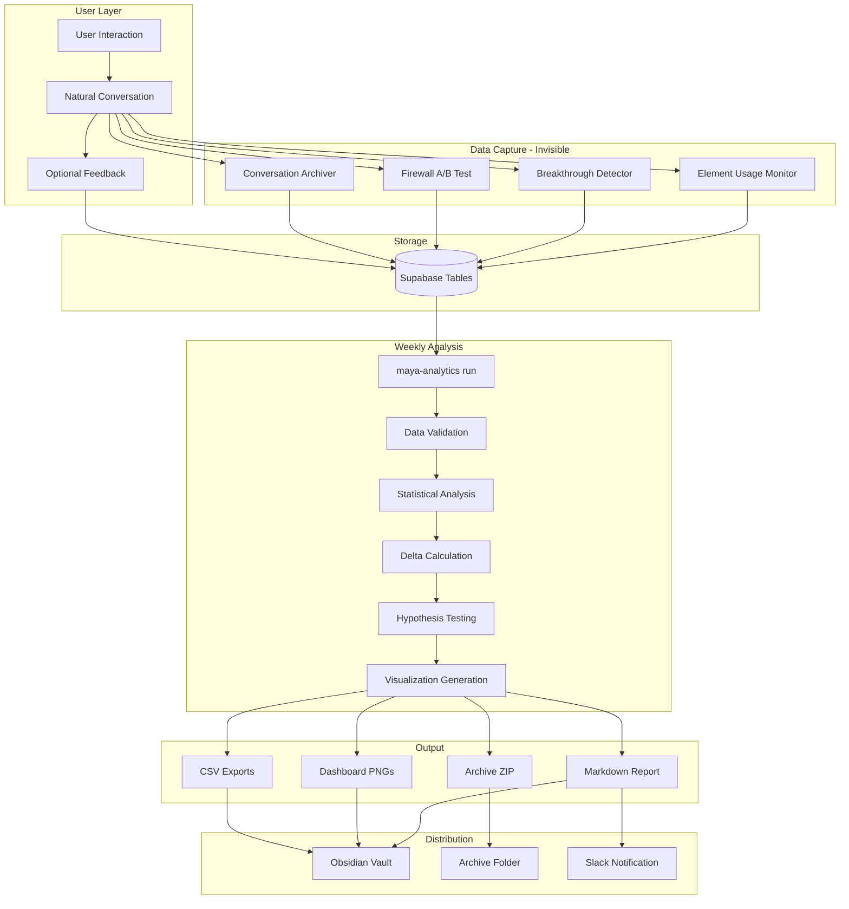

# 🌌 Maya Beta Research Handbook

*Version: 1.0 | Soullab Dev Team Vault - Internal Use Only*
*Last Updated: 2025-01-22*

---

## 🔄 Beta Pipeline Flow Diagram



---

## ⚡ Quick Commands

### Essential Operations
```bash
# Run weekly analysis (auto-detects week)
maya-analytics run

# Check data quality
maya-analytics validate

# View/lock hypotheses
maya-analytics hypotheses

# Check system status
maya-analytics status

# Emergency stop
export ENABLE_BETA_METRICS=false

# Manual rollback
./scripts/rollback.sh
```

### Advanced Commands
```bash
# Run specific week with validation
maya-analytics run --week 3

# Skip validation (use with caution)
maya-analytics run --skip-validation

# Export only (no analysis)
maya-analytics run --export-only

# Setup weekly cron
maya-analytics schedule
```

---

## 📂 Vault Structure

```
Soullab Dev Team Vault/
├── Beta Reports/
│   ├── Week 3 Report.md
│   ├── Week 3 Pentagon.png
│   ├── Week 3 Heatmap.png
│   ├── Week 3 Breakthrough Timeline.png
│   ├── Week 3 Delta Chart.png
│   ├── Week 3 Validation.md
│   └── Week 3 CSVs/
│       ├── breakthroughs.csv
│       ├── elements.csv
│       ├── firewall.csv
│       ├── engagement.csv
│       ├── feedback.csv
│       └── patterns.csv
└── Archive/
    └── week3_archive_20250122_143000.zip
        ├── README.md
        ├── metadata.json
        ├── report/week3_report.md
        ├── visuals/*.png
        ├── data/*.csv
        └── deltas/week3_vs_week2_deltas.csv
```

---

## 📊 Weekly Reports Include

### Core Sections
- **Executive Summary** - Key metrics vs targets
- **Data Quality Score** - 0-100 with validation details
- **Engagement Metrics** - Users, sessions, depth, retention
- **Consciousness Metrics** - Breakthrough rate, coherence, flow
- **Elemental Firewall** - A/B test results, integrity scores
- **Week-over-Week Delta Analysis** - Top 3 shifts + full table
- **Hypothesis Test Results** - Statistical validation
- **Visualizations** - Pentagon, heatmap, timeline charts

### Embedded Visualizations
```markdown
![[Week 3 Pentagon.png]]
![[Week 3 Heatmap.png]]
![[Week 3 Delta Chart.png]]
```

---

## 🧪 Pre-Registered Hypotheses

### Primary Hypotheses
- **H1**: Strict firewall → +15% conversation depth (t-test, α=0.05)
- **H2**: Natural breakthrough rate → 2-3% range (95% CI)

### Secondary Hypotheses
- **H3**: Water+Fire elements → >60% of interactions (binomial test)
- **H4**: User satisfaction → >60% helpful ratings (binomial test)
- **H5**: Breakthrough-depth correlation → r > 0.3 (Pearson)

### Required Sample Sizes
- H1: 128 conversations per firewall condition
- H2: 200 total conversations
- H3: 150 element selections
- H4: 100 feedback responses
- H5: 80 breakthrough events

---

## ✅ Data Quality Checklist

### Critical Requirements
- [ ] Minimum 50 conversations for basic validity
- [ ] Minimum 100 for hypothesis testing
- [ ] Firewall balance within 45-55% split
- [ ] Duplicate rate < 5%
- [ ] Data completeness > 80%
- [ ] Anomaly rate < 10%

### Quality Score Thresholds
- **80-100**: ✅ High quality - proceed with confidence
- **60-79**: ⚠️ Acceptable - note limitations
- **0-59**: ❌ Poor quality - address issues first

---

## 🛠 Troubleshooting Guide

### Common Issues

**No data showing**
```bash
# Check Supabase connection
maya-analytics status

# Verify environment variables
cat ~/.maya/config.json

# Test with debug mode
maya-analytics run --debug
```

**Wrong week detected**
```bash
# Check beta start date
cat ~/.maya/config.json | grep beta_start

# Override with manual week
maya-analytics run --week 3
```

**Validation failures**
```bash
# Run validation only
maya-analytics validate

# Review detailed report
cat ~/.maya/reports/week_N_validation.md

# Force run despite warnings
maya-analytics run --skip-validation
```

**Archive creation failed**
```bash
# Check disk space
df -h

# Verify permissions
ls -la ~/Obsidian/MayaBeta/Archive/

# Manual export
python maya_analytics_cli.py --export-only
```

---

## 🚨 Emergency Procedures

### Immediate Shutdown
```bash
# 1. Disable all metrics
export ENABLE_BETA_METRICS=false

# 2. Flush pending data
python -c "from lib.beta.metrics import flush_all; flush_all()"

# 3. Create emergency archive
maya-analytics run --emergency-export

# 4. Notify team
echo "Beta metrics disabled at $(date)" | slack-notify
```

### Full Rollback
```bash
# Run automated rollback
./scripts/rollback.sh

# Verify rollback
maya-analytics status
git status
```

### Data Recovery
```bash
# Restore from archive
unzip Archive/week3_archive_*.zip -d recovery/

# Import CSVs to new analysis
python analytics/recovery.py --from recovery/data/
```

---

## 📈 Key Metrics Targets

### Week 1 (Baseline)
- Conversations: 50-100
- Breakthrough rate: 2-3%
- User satisfaction: >60%
- Data quality: >70

### Week 2-3 (Stabilization)
- Conversations: 200-300 cumulative
- Firewall effect emerging
- Element patterns clear
- Data quality: >80

### Week 4 (Analysis Ready)
- Conversations: 400+ cumulative
- All hypotheses testable
- Power calculations met
- Ready for full study design

---

## 👥 Team Responsibilities

### Weekly Rhythm

**Monday AM**
- Automated analytics run (9am via cron)
- Review data quality score
- Check for validation warnings

**Monday PM**
- Deep dive on report insights
- Update team dashboard
- Flag any anomalies

**Tuesday**
- Team sync meeting
- Review hypothesis progress
- Adjust if needed

**Friday**
- Engagement check
- User feedback review
- Plan next week

### Role Assignments
- **Analytics Lead**: Run reports, validate data
- **Research Lead**: Monitor hypotheses, interpret results
- **Engineering**: Address technical issues, maintain pipeline
- **Product**: User feedback, engagement metrics

---

## 🔒 Security & Privacy

### Data Protection
- All user IDs hashed before storage
- No PII in analytics or exports
- Conversations anonymized in archives
- Consent tracked separately

### Access Control
- Beta monitor: Password protected
- Supabase: Row-level security
- Archives: Team vault only
- Exports: Encrypted if external

---

## 📚 Additional Resources

### Internal Docs
- [[Maya Beta Technical Specification]]
- [[Spiralogic Research Protocol]]
- [[Data Privacy Guidelines]]
- [[Statistical Analysis Methods]]

### External Tools
- [Supabase Dashboard](https://app.supabase.com)
- [Power Calculator](https://www.stat.ubc.ca/~rollin/stats/ssize/)
- [Effect Size Guide](https://rpsychologist.com/cohend/)

### Support
- Technical issues: #beta-tech channel
- Research questions: #research-design
- Emergency: Page on-call engineer

---

## 🎯 Success Criteria

The beta succeeds if we achieve:
1. **Valid baseline metrics** (natural breakthrough rate)
2. **Firewall A/B validation** (measurable difference)
3. **Element preference map** (clear patterns)
4. **Technical stability** (>95% uptime)
5. **User satisfaction** (>60% positive)
6. **Power calculations** (N for full study)

---

## 📝 Version History

- **v1.0** (2025-01-22): Initial handbook with complete pipeline
- Includes data validation, hypothesis registry, archival system

---

*This handbook is the single source of truth for Maya beta operations.*
*Keep it bookmarked and refer to it before any beta-related work.*