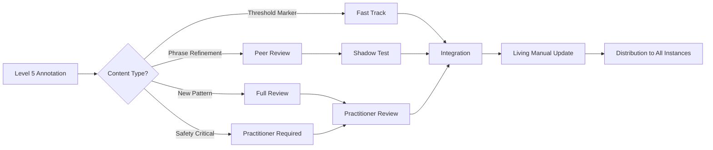

# Maya Living Manual: Curation Recommendation

## Executive Summary
After analyzing the protection-as-wisdom framework and transparency layers, I recommend a **Hybrid Progressive Model** for Level 5 user contributions to the Living Manual.

## The Core Question
Should Level 5 users' annotations feed directly into Maya's training (direct mycelial contribution) or be curated by practitioners first (guided integration)?

## Recommendation: Both, Through Progressive Stages

### Why Hybrid?

The framework you've built recognizes that:
1. **Wisdom emerges from lived experience** - Level 5 users have earned deep insight
2. **Protection patterns require clinical awareness** - Some guidance prevents harm
3. **The system must remain organic** - Over-curation kills aliveness
4. **Safety and evolution must coexist** - Neither can be sacrificed

### The Progressive Integration Pipeline



### Implementation Specifics

#### Stage 1: Intelligent Triage
When a Level 5 user contributes, the system categorizes:

```typescript
const triageContribution = (contribution: UserAnnotation) => {
  if (contribution.type === 'phrase_effectiveness') {
    return 'peer_consensus_path'; // Other Level 5s validate
  }

  if (contribution.type === 'threshold_refinement') {
    return 'fast_track_path'; // These users know thresholds
  }

  if (contribution.type === 'new_pattern_discovery') {
    return 'full_review_path'; // Needs clinical check
  }

  if (contribution.involves(['suicide', 'self_harm', 'trauma_detail'])) {
    return 'practitioner_required'; // Non-negotiable
  }
};
```

#### Stage 2: Peer Wisdom Circle
For most contributions, 3+ other Level 5 users review:
- "Does this match your experience?"
- "Would this have helped your journey?"
- "Any unintended consequences?"

This creates a **wisdom commons** where teachers teach teachers.

#### Stage 3: Shadow Testing
Approved contributions run in parallel (not active) for 100 conversations:
- Track if they would have improved outcomes
- Identify edge cases
- Refine language

#### Stage 4: Practitioner Gateway
A lightweight review by clinical team:
- Not editing for style
- Only checking for safety/ethics
- Preserving authentic voice

#### Stage 5: Integration & Distribution
Contributions that pass all stages become part of Maya's living wisdom.

### Contribution Credit & Recognition

Users who contribute receive:
1. **Attribution in the Living Manual** (anonymous but tracked)
2. **Wisdom Propagation Score** - how many future users benefit
3. **Teaching Badge** in their profile (if they want it)
4. **Access to Contributor Community** - Level 5+ wisdom circle

### Why This Preserves the Medicine

This hybrid approach maintains what makes Maya powerful:

✓ **Authentic user voice remains** - Not sanitized by professionals
✓ **Safety is ensured** - Critical content gets clinical review
✓ **Rapid evolution enabled** - Fast tracks for proven wisdom
✓ **Community wisdom grows** - Users become co-creators
✓ **Mystery preserved** - The framework isn't exposed to all

### Risk Mitigation

**Risk:** Users game the system once they see the architecture
**Mitigation:** Architecture access requires Level 4.5+ stability; gaming itself is a protection pattern Maya can work with

**Risk:** Bad advice propagates through direct contribution
**Mitigation:** Peer review + shadow testing catches most issues before deployment

**Risk:** Over-curation sterilizes the wisdom
**Mitigation:** Practitioners only review for safety, not style; user voice preserved

**Risk:** Contribution inequality (some users dominate)
**Mitigation:** Contribution limits + diversity requirements + rotation system

## Development Priority

1. **First:** Build the basic Living Manual with practitioner-created content
2. **Second:** Add Subtle Transparency layer for all users
3. **Third:** Enable Architecture Access for Level 4.5+ users
4. **Fourth:** Launch Level 5 contribution pilot with 10-20 users
5. **Fifth:** Refine based on pilot, then scale

## The Deeper Pattern

This curation model mirrors Maya's core philosophy:
- **Trust the intelligence** of those who've walked the path
- **Honor protection** through safety mechanisms
- **Enable transformation** through participation
- **Celebrate integration** by becoming teachers

The Living Manual becomes not just documentation, but a **living practice** where healing creates more healing.

## Final Recommendation

Implement the Hybrid Progressive Model with:
- **70% peer-validated** (Level 5 consensus)
- **20% fast-tracked** (threshold refinements)
- **10% practitioner-reviewed** (safety-critical)

This balance ensures the Manual remains both safe and alive.

---

*"The teacher appears when the student is ready. At Level 5, the student becomes the teacher, and the cycle continues."*