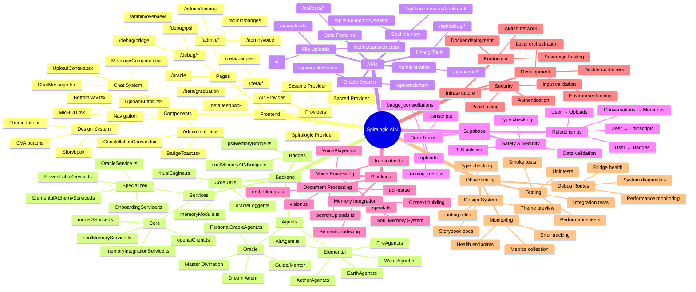

# Spiralogic AIN System Mindmap

```mermaid
mindmap
  root((Spiralogic AIN))
    Frontend
      Pages
        /oracle
        /admin/*
          /admin/overview
          /admin/badges  
          /admin/training
          /admin/voice
        /beta/*
          /beta/badges
          /beta/feedback
          /beta/graduation
        /debug/*
          /debug/bridge
          /debug/psi
      Components
        Chat System
          ChatMessage.tsx
          MessageComposer.tsx
          UploadButton.tsx
          UploadContext.tsx
        Admin Interface
          BadgeToast.tsx
          ConstellationCanvas.tsx
        Navigation
          BottomNav.tsx
          MicHUD.tsx
        Design System
          Theme tokens
          CVA buttons
          Storybook
      Providers
        Air Provider
        Sacred Provider
        Sesame Provider
        Spiralogic Provider
    Backend
      Agents
        Elemental
          AirAgent.ts
          EarthAgent.ts
          WaterAgent.ts
          FireAgent.ts
          AetherAgent.ts
        Oracle
          PersonalOracleAgent.ts
          Master Divination
          Guide/Mentor
          Dream Agent
      Bridges
        soulMemoryAINBridge.ts
        psiMemoryBridge.ts
      Services
        Core
          soulMemoryService.ts
          memoryIntegrationService.ts
          modelService.ts
          openaiClient.ts
        Specialized
          OracleService.ts
          ElevenLabsService.ts
          OnboardingService.ts
          ElementalAlchemyService.ts
      Core Utils
        memoryModule.ts
        oracleLogger.ts
        ritualEngine.ts
    APIs
      Oracle System
        /api/oracle/turn
        /api/oracle/weave
      Soul Memory
        /api/soul-memory/bookmark
        /api/soul-memory/search
      File Uploads
        /api/uploads
        /api/uploads/process
        /api/uploads/[id]
      Administration
        /api/admin/*
      Beta Features
        /api/beta/*
      Debug Tools
        /api/debug/*
    Data (Supabase)
      Core Tables
        uploads
        transcripts
        training_metrics
        badge_constellations
      Safety & Security
        RLS policies
        Data validation
        Type checking
      Relationships
        User → Uploads
        User → Transcripts
        User → Badges
        Conversations → Memories
    Pipelines
      Voice Processing
        transcriber.ts
        speak.ts
        VoicePlayer.tsx
      Document Processing
        pdf-parse
        embeddings.ts
        searchUploads.ts
        vision.ts
      Memory Integration
        Soul Memory System
        Context building
        Semantic indexing
    Infrastructure
      Development
        Docker containers
        Environment config
        Local orchestration
      Production
        Docker deployment
        Sovereign hosting
        Akash network
      Security
        Authentication
        Input validation
        Rate limiting
    Observability
      Debug Routes
        Bridge health
        System diagnostics
        Performance monitoring
      Testing
        Smoke tests
        Integration tests
        Performance tests
        Unit tests
      Design System
        Storybook docs
        Theme preview
        Linting rules
        Type checking
      Monitoring
        Health endpoints
        Metrics collection
        Error tracking
```