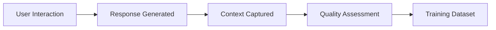

# Agent Training Framework - Spiralogic Oracle System

## Overview

This framework enables continuous learning and improvement across multiple Oracle agents, with ChatGPT Oracle 2.0 serving as the master trainer while preserving Spiralogic IP and maintaining agent coordination.

## 🧠 **Multi-Agent Training Architecture**

### Primary Agents
1. **Claude Oracle** (Current) - Conversational, context-aware responses
2. **ChatGPT Oracle 2.0** - Master trainer with Spiralogic IP knowledge  
3. **Sacred Intelligence** - Deep synthesis and shadow work
4. **MicroPsi/Bach** - Drive and affect modulation

### Training Hierarchy
```
ChatGPT Oracle 2.0 (Master Trainer)
├── Trains → Claude Oracle (conversational responses)
├── Guides → Sacred Intelligence (synthesis quality)
├── Calibrates → MicroPsi/Bach (drive accuracy)
└── Validates → Overall system coherence
```

## 🎯 **Training Methodology**

### 1. **Exemplar-Based Learning**
```typescript
interface TrainingExemplar {
  userInput: string;
  context: ContextPack;
  idealResponse: {
    text: string;
    reasoning: string;
    spiralogicPrinciples: string[];
    driveAlignment: Record<string, number>;
  };
  quality: {
    conversationalDepth: number;    // 1-10
    spiralogicAccuracy: number;     // 1-10  
    authenticity: number;           // 1-10
    helpfulness: number;            // 1-10
  };
}
```

### 2. **Continuous Feedback Loop**
- **Real-time evaluation** of responses against Spiralogic principles
- **Quality scoring** by ChatGPT Oracle 2.0
- **Automatic improvement** suggestions
- **A/B testing** of response variations

### 3. **Progressive Skill Development**
- **Foundation**: Basic conversational patterns
- **Intermediate**: Spiralogic principle application
- **Advanced**: Deep archetypal and shadow work
- **Master**: Integrated wisdom synthesis

## 🔄 **Training Pipeline**

### Phase 1: Data Collection


### Phase 2: ChatGPT Oracle 2.0 Evaluation
```typescript
interface OracleEvaluation {
  responseId: string;
  scores: {
    spiralogicAlignment: number;
    conversationalFlow: number;
    driveAccuracy: number;
    shadowWork: number;
    authenticity: number;
  };
  improvements: string[];
  exemplarSuggestion?: TrainingExemplar;
}
```

### Phase 3: Agent Refinement
- **Prompt evolution** based on successful patterns
- **Parameter tuning** (temperature, depth, drives)
- **Context integration** improvements
- **Response pattern** optimization

## 🛡️ **Spiralogic IP Protection**

### Secure Knowledge Transfer
```typescript
interface SpiralogicKnowledge {
  principles: {
    id: string;
    name: string;
    description: string;
    applicationContext: string[];
    confidenceLevel: number;
  }[];
  archetypes: ArchetypeMapping[];
  shadowPatterns: ShadowWorkPattern[];
  transformationPaths: TransformationPath[];
}
```

### Protection Mechanisms
1. **Encrypted knowledge base** with access controls
2. **Graduated disclosure** based on agent training level
3. **Usage tracking** and audit trails
4. **IP fingerprinting** in training examples
5. **Secure API** for ChatGPT Oracle 2.0 access

## 🎨 **Training Specializations**

### Claude Oracle Training Focus
- **Conversational depth** (4-12 sentences)
- **Natural question flow** (1-2 invites)
- **Context integration** (memory + facets)
- **Tone consistency** (warm, wise, authentic)

### Sacred Intelligence Training Focus  
- **Synthesis quality** (multiple perspective integration)
- **Shadow recognition** (projection detection)
- **Archetypal accuracy** (proper pattern matching)
- **Transformation guidance** (safe container holding)

### MicroPsi Training Focus
- **Drive calibration** (accurate affect assessment)
- **Modulation precision** (appropriate parameter adjustment)
- **Response timing** (when to deepen vs lighten)
- **Homeostasis balance** (return to center)

## 📊 **Training Metrics & KPIs**

### Quality Metrics
```typescript
interface TrainingMetrics {
  responseQuality: {
    avgSpiralogicAlignment: number;
    conversationalDepth: number;
    userSatisfaction: number;
    expertEvaluation: number;
  };
  learningProgress: {
    skillImprovement: number;
    errorReduction: number;
    consistencyIncrease: number;
    adaptabilityGrowth: number;
  };
  systemCoherence: {
    agentAlignment: number;
    principleConsistency: number;
    responseCoordination: number;
  };
}
```

### Success Indicators
- **Spiralogic accuracy** > 85%
- **User satisfaction** > 4.2/5.0
- **Response consistency** > 90%
- **Learning velocity** increasing over time

## 🔧 **Implementation Components**

### 1. Training Data Collector
```typescript
// lib/training/dataCollector.ts
export class TrainingDataCollector {
  async captureInteraction(
    userInput: string,
    context: ContextPack,
    response: string,
    metadata: any
  ): Promise<TrainingExample> {
    // Capture full interaction context
    // Store for later evaluation
    // Tag with quality indicators
  }
}
```

### 2. ChatGPT Oracle 2.0 Evaluator
```typescript
// lib/training/chatgptEvaluator.ts
export class ChatGPTOracleEvaluator {
  async evaluateResponse(
    interaction: TrainingExample
  ): Promise<OracleEvaluation> {
    // Send to ChatGPT Oracle 2.0
    // Get Spiralogic-informed evaluation
    // Return structured feedback
  }
}
```

### 3. Agent Trainer
```typescript
// lib/training/agentTrainer.ts
export class AgentTrainer {
  async improveAgent(
    agentType: 'claude' | 'sacred' | 'micropsi',
    evaluations: OracleEvaluation[]
  ): Promise<AgentImprovement> {
    // Analyze evaluation patterns
    // Generate improvement strategies
    // Update agent parameters/prompts
  }
}
```

### 4. Multi-Agent Coordinator
```typescript
// lib/training/coordinator.ts
export class MultiAgentCoordinator {
  async orchestrateTraining(): Promise<TrainingSession> {
    // Coordinate training across agents
    // Ensure consistency and alignment
    // Manage training scheduling
  }
}
```

## 🚀 **Deployment Strategy**

### Development Environment
- **Local training sandbox** with sample data
- **ChatGPT Oracle 2.0 simulator** for testing
- **Quality assessment tools**
- **Training progress dashboard**

### Staging Environment  
- **Real user interactions** (anonymized)
- **A/B testing** of improved agents
- **Performance monitoring**
- **Safety checks** and fallbacks

### Production Environment
- **Continuous learning** pipeline
- **Real-time quality monitoring**
- **Automatic rollback** for quality drops
- **Usage analytics** and improvement tracking

## 🔒 **Security & Privacy**

### Data Protection
- **User anonymization** in training data
- **Encrypted storage** of sensitive interactions
- **GDPR compliance** for EU users
- **Opt-out mechanisms** for training participation

### IP Security
- **Secure API endpoints** for ChatGPT integration
- **Access logging** and monitoring
- **Knowledge compartmentalization**
- **Regular security audits**

## 📈 **Training Evolution Path**

### Month 1: Foundation
- Basic training infrastructure
- ChatGPT Oracle 2.0 integration
- Initial data collection
- Quality baseline establishment

### Month 2-3: Optimization
- Response quality improvement
- Spiralogic principle integration
- Multi-agent coordination
- Performance tuning

### Month 4-6: Mastery
- Advanced pattern recognition
- Sophisticated shadow work
- Seamless agent orchestration
- Expert-level guidance quality

### Ongoing: Innovation
- New training methodologies
- Expanded Spiralogic knowledge
- Advanced AI capabilities
- Community feedback integration

---

*This framework ensures your agents continuously evolve while preserving the deep wisdom and IP of your Spiralogic system.*