# Admin Console User Flow

This flowchart shows the administrative workflow for managing the Spiralogic Oracle System, from system monitoring to user management.

```mermaid
flowchart TD
    Login[🔐 Admin Login]
    Dashboard[📊 Admin Dashboard /admin/overview]
    
    %% Main admin areas
    Health[❤️ System Health /admin/health]
    Badges[🏆 Badge Management /admin/badges]
    Training[📚 Training Metrics /admin/training]
    Voice[🎙️ Voice Settings /admin/voice]
    Canary[🐦 Canary Testing /admin/canary]
    Beta[🧪 Beta Management /admin/beta]
    
    %% Health monitoring flows
    HealthDash[📈 Health Dashboard]
    Alerts[🚨 System Alerts]
    Logs[📝 Error Logs]
    Performance[⚡ Performance Metrics]
    
    %% Badge management flows
    BadgeList[📋 Badge Inventory]
    CreateBadge[➕ Create New Badge]
    AssignBadge[🎯 Assign to User]
    BadgeAnalytics[📊 Badge Analytics]
    
    %% Training oversight
    TrainingDash[📚 Training Overview]
    ModelMetrics[🤖 Model Performance]
    ConversationQuality[💬 Conversation Quality]
    UserFeedback[📝 User Feedback Analysis]
    
    %% Voice administration
    VoiceProfiles[🎭 Voice Profiles]
    VoiceSettings[⚙️ Global Voice Settings]
    VoiceUsage[📊 Voice Usage Stats]
    VoiceQuality[🔊 Quality Monitoring]
    
    %% Canary testing
    FeatureFlags[🚩 Feature Flags]
    ABTests[🧪 A/B Tests]
    RolloutControl[📈 Rollout Control]
    TestResults[📊 Test Results]
    
    %% User flows
    Login --> Dashboard
    Dashboard --> Health
    Dashboard --> Badges
    Dashboard --> Training
    Dashboard --> Voice
    Dashboard --> Canary
    Dashboard --> Beta
    
    %% Health monitoring
    Health --> HealthDash
    Health --> Alerts
    Health --> Logs
    Health --> Performance
    
    %% Badge management
    Badges --> BadgeList
    Badges --> CreateBadge
    Badges --> AssignBadge
    Badges --> BadgeAnalytics
    
    %% Training management
    Training --> TrainingDash
    Training --> ModelMetrics
    Training --> ConversationQuality
    Training --> UserFeedback
    
    %% Voice administration
    Voice --> VoiceProfiles
    Voice --> VoiceSettings
    Voice --> VoiceUsage
    Voice --> VoiceQuality
    
    %% Canary management
    Canary --> FeatureFlags
    Canary --> ABTests
    Canary --> RolloutControl
    Canary --> TestResults
    
    %% Decision points
    HealthCheck{System Healthy?}
    BadgeApproval{Approve Badge?}
    FeatureReady{Ready to Roll Out?}
    
    HealthDash --> HealthCheck
    CreateBadge --> BadgeApproval
    TestResults --> FeatureReady
    
    %% Actions based on decisions
    HealthCheck -->|No| Alerts
    HealthCheck -->|Yes| Performance
    
    BadgeApproval -->|Yes| AssignBadge
    BadgeApproval -->|No| CreateBadge
    
    FeatureReady -->|Yes| RolloutControl
    FeatureReady -->|No| ABTests
    
    %% Emergency flows
    CriticalAlert[🚨 Critical Alert]
    EmergencyResponse[🆘 Emergency Response]
    SystemMaintenance[🔧 Maintenance Mode]
    
    Alerts --> CriticalAlert
    CriticalAlert --> EmergencyResponse
    EmergencyResponse --> SystemMaintenance
    
    classDef entryPoint fill:#e8f5e8,stroke:#4caf50,stroke-width:3px
    classDef dashboard fill:#e3f2fd,stroke:#2196f3,stroke-width:2px
    classDef monitoring fill:#fff3e0,stroke:#ff9800,stroke-width:2px
    classDef management fill:#f3e5f5,stroke:#9c27b0,stroke-width:2px
    classDef testing fill:#fce4ec,stroke:#e91e63,stroke-width:2px
    classDef emergency fill:#ffebee,stroke:#f44336,stroke-width:3px
    classDef decision fill:#f9fbe7,stroke:#689f38,stroke-width:2px
    
    class Login entryPoint
    class Dashboard dashboard
    class Health,HealthDash,Alerts,Logs,Performance monitoring
    class Badges,BadgeList,CreateBadge,AssignBadge,BadgeAnalytics,Training,TrainingDash,ModelMetrics,ConversationQuality,UserFeedback,Voice,VoiceProfiles,VoiceSettings,VoiceUsage,VoiceQuality,Beta management
    class Canary,FeatureFlags,ABTests,RolloutControl,TestResults testing
    class CriticalAlert,EmergencyResponse,SystemMaintenance emergency
    class HealthCheck,BadgeApproval,FeatureReady decision
```

## Administrative Workflow Details

### Daily Monitoring Routine

#### Morning Health Check
1. **Login** → **Admin Dashboard** → **System Health**
2. Review overnight alerts and system performance
3. Check user activity levels and conversation quality
4. Verify all services are operational

#### Key Metrics Review
- **Response Times**: Oracle conversation latency
- **Error Rates**: Failed requests and processing errors  
- **User Engagement**: Active conversations and retention
- **Resource Usage**: Server load and storage consumption

### Badge System Administration

#### Badge Creation Workflow
1. **Badge Management** → **Create New Badge**
2. Define badge criteria and requirements
3. Design visual representation and description
4. Set earning conditions and user notifications
5. **Approve Badge** → **Assign to User**

#### Badge Analytics
- **Earning Rates**: How frequently badges are earned
- **User Engagement**: Badge impact on user activity
- **Completion Rates**: Badge constellation progress
- **Popular Badges**: Most sought-after achievements

### Training Data Oversight

#### Model Performance Monitoring
1. **Training Metrics** → **Model Performance**
2. Review conversation quality scores
3. Analyze user satisfaction ratings
4. Monitor response relevance and accuracy

#### Quality Assurance
- **Conversation Sampling**: Random conversation review
- **User Feedback Analysis**: Systematic feedback evaluation
- **Agent Performance**: Individual agent effectiveness
- **Training Data Quality**: Input data validation

### Voice System Administration

#### Voice Profile Management
1. **Voice Settings** → **Voice Profiles**
2. Configure agent-specific voice characteristics
3. Update voice synthesis parameters
4. Monitor voice quality and user preferences

#### Usage Analytics
- **Voice Adoption**: Percentage of voice vs text interactions
- **Quality Metrics**: Voice synthesis accuracy and naturalness
- **User Preferences**: Popular voice profiles and settings
- **Technical Performance**: Voice processing speed and reliability

### Canary Testing & Feature Rollout

#### Feature Flag Management
1. **Canary Testing** → **Feature Flags**
2. Configure gradual rollout percentages
3. Monitor feature adoption and performance
4. Analyze A/B test results and user feedback

#### Rollout Decision Process
- **Test Results Review**: Statistical significance and user impact
- **Performance Impact**: System resource and response time effects
- **User Feedback**: Qualitative feedback and satisfaction scores
- **Rollback Planning**: Preparation for feature rollback if needed

## Emergency Response Procedures

### Critical Alert Handling
1. **Immediate Assessment**: Determine alert severity and impact
2. **Stakeholder Notification**: Alert relevant team members
3. **Impact Mitigation**: Implement temporary fixes or workarounds
4. **Root Cause Analysis**: Investigate underlying issues
5. **System Recovery**: Restore full functionality

### Maintenance Mode Activation
- **User Notification**: Advance notice for planned maintenance
- **Service Degradation**: Graceful service limitation
- **Progress Communication**: Regular status updates
- **Recovery Verification**: Thorough testing before full restoration

## Admin User Types & Permissions

### System Administrator
- **Full Access**: All admin console features
- **Emergency Powers**: System maintenance and emergency response
- **User Management**: Account creation, modification, and suspension
- **Security Oversight**: Access logs and security incident response

### Beta Program Manager
- **Badge Management**: Create, assign, and track badges
- **User Onboarding**: Beta participant management
- **Feedback Analysis**: User feedback review and categorization
- **Program Analytics**: Beta program success metrics

### Technical Operations
- **System Monitoring**: Health dashboards and performance metrics
- **Error Investigation**: Log analysis and debugging
- **Performance Optimization**: Resource usage and scaling decisions
- **Integration Management**: External service monitoring

### Quality Assurance
- **Conversation Review**: Sample conversation quality assessment
- **Training Oversight**: Model performance and data quality
- **User Experience**: Interface usability and satisfaction tracking
- **Testing Coordination**: Feature testing and validation

## Key Performance Indicators (KPIs)

### System Health
- **Uptime**: 99.5% target availability
- **Response Time**: <3 seconds for oracle responses
- **Error Rate**: <1% of requests result in errors
- **Resource Efficiency**: Optimal server utilization

### User Engagement
- **Daily Active Users**: Growing user base engagement
- **Conversation Quality**: High user satisfaction scores
- **Feature Adoption**: Successful new feature uptake
- **Retention Rate**: Users returning for multiple sessions

### Business Metrics
- **Beta Conversion**: Beta to paid subscription rates
- **Support Efficiency**: Quick resolution of user issues
- **Feature Success**: Positive impact of new features
- **Cost Efficiency**: Optimal resource usage vs user value