# Site Map - Application Navigation Structure

Visual representation of the complete Spiralogic Oracle System navigation hierarchy and user flows.

```mermaid
flowchart TD
    Root[🏠 Home /]
    
    %% Main user areas
    Oracle[🔮 Oracle Chat /oracle]
    Settings[⚙️ Settings /oracle/settings]
    
    %% Beta program
    Beta[🧪 Beta Program /beta]
    BetaBadges[🏆 Badge System /beta/badges]
    BetaFeedback[💬 Feedback /beta/feedback]
    BetaGrad[🎓 Graduation /beta/graduation]
    BetaJoin[📝 Join Beta /beta/join]
    BetaPayment[💳 Payment /beta/payment]
    
    %% Admin console
    Admin[👨‍💼 Admin Console /admin]
    AdminOverview[📊 Overview /admin/overview]
    AdminBadges[🏆 Badge Management /admin/badges]
    AdminTraining[📚 Training Metrics /admin/training]
    AdminVoice[🎙️ Voice Settings /admin/voice]
    AdminHealth[❤️ System Health /admin/health]
    AdminCanary[🐦 Canary Testing /admin/canary]
    
    %% Development tools
    Dev[🔧 Development /dev]
    DevTheme[🎨 Theme Preview /dev/theme]
    DevBadges[🏆 Badge Testing /dev/badges]
    
    %% Debug & monitoring
    Debug[🐛 Debug Tools /debug]
    DebugBridge[🌉 Bridge Status /debug/bridge]
    DebugPSI[🧠 PSI Diagnostics /debug/psi]
    
    %% Specialized dashboards
    Dashboard[📈 Analytics /dashboard]
    DashOracle[🔮 Oracle Analytics /dashboard/oracle-beta]
    DashAstro[⭐ Astrology /dashboard/astrology]
    DashElements[🌊 Taoist Elements /dashboard/taoist-elements]
    
    %% User management
    Auth[🔐 Authentication /auth]
    AuthOnboard[🎯 Onboarding /auth/onboarding]
    Onboarding[🚀 Setup /onboarding]
    Welcome[👋 Welcome /welcome]
    
    %% Specialized features
    Community[👥 Community /community]
    CommunityCheck[✅ Reality Check /community/reality-check]
    
    Holistic[🌟 Holistic Dashboard /holistic]
    
    Integration[🔗 Integration /integration/dashboard]
    
    Professional[💼 Professional /professional/dashboard]
    
    %% Navigation flows
    Root --> Oracle
    Root --> Beta
    Root --> Auth
    Root --> Dashboard
    
    Oracle --> Settings
    
    Beta --> BetaBadges
    Beta --> BetaFeedback
    Beta --> BetaGrad
    Beta --> BetaJoin
    Beta --> BetaPayment
    
    Admin --> AdminOverview
    Admin --> AdminBadges
    Admin --> AdminTraining
    Admin --> AdminVoice
    Admin --> AdminHealth
    Admin --> AdminCanary
    
    Dev --> DevTheme
    Dev --> DevBadges
    
    Debug --> DebugBridge
    Debug --> DebugPSI
    
    Dashboard --> DashOracle
    Dashboard --> DashAstro
    Dashboard --> DashElements
    
    Auth --> AuthOnboard
    Auth --> Onboarding
    Onboarding --> Welcome
    
    Community --> CommunityCheck
    
    %% Access control indicators
    classDef publicAccess fill:#e8f5e8,stroke:#4caf50,stroke-width:2px
    classDef userAccess fill:#e3f2fd,stroke:#2196f3,stroke-width:2px
    classDef betaAccess fill:#fff3e0,stroke:#ff9800,stroke-width:2px
    classDef adminAccess fill:#ffebee,stroke:#f44336,stroke-width:2px
    classDef devAccess fill:#f3e5f5,stroke:#9c27b0,stroke-width:2px
    
    class Root,Auth,Welcome publicAccess
    class Oracle,Settings,Dashboard,DashOracle,DashAstro,DashElements,Onboarding,Community,CommunityCheck,Holistic,Integration,Professional userAccess
    class Beta,BetaBadges,BetaFeedback,BetaGrad,BetaJoin,BetaPayment betaAccess
    class Admin,AdminOverview,AdminBadges,AdminTraining,AdminVoice,AdminHealth,AdminCanary adminAccess
    class Dev,DevTheme,DevBadges,Debug,DebugBridge,DebugPSI devAccess
```

## Navigation Hierarchy

### Public Access (🟢)
- **Home (/)**: Landing page with system introduction
- **Authentication (/auth)**: Login and registration flows
- **Welcome (/welcome)**: Post-authentication landing

### Authenticated Users (🔵)
- **Oracle Chat (/oracle)**: Main conversation interface with AI agents
- **Oracle Settings (/oracle/settings)**: Voice preferences, conversation history
- **Analytics Dashboard (/dashboard)**: Personal insights and growth tracking
- **Community (/community)**: Shared wisdom and reality-check features
- **Specialized Dashboards**: Astrology, elements, holistic views

### Beta Program (🟠)
- **Beta Hub (/beta)**: Beta program overview and status
- **Badge System (/beta/badges)**: Achievement tracking and constellation view
- **Feedback (/beta/feedback)**: User feedback collection and submission
- **Graduation (/beta/graduation)**: Beta completion and transition flow
- **Join Beta (/beta/join)**: Beta program enrollment
- **Payment (/beta/payment)**: Subscription and billing management

### Administrative (🔴)
- **Admin Console (/admin)**: System administration hub
- **System Overview (/admin/overview)**: Health metrics and user activity
- **Badge Management (/admin/badges)**: Badge creation and assignment
- **Training Metrics (/admin/training)**: AI training data and performance
- **Voice Administration (/admin/voice)**: Voice synthesis settings
- **Health Monitoring (/admin/health)**: System status and diagnostics
- **Canary Testing (/admin/canary)**: Feature flag and A/B testing

### Development Tools (🟣)
- **Dev Tools (/dev)**: Development utilities and testing interfaces
- **Theme Preview (/dev/theme)**: Design system token visualization
- **Badge Testing (/dev/badges)**: Badge system development tools
- **Debug Console (/debug)**: System debugging and diagnostics
- **Bridge Diagnostics (/debug/bridge)**: Soul Memory bridge testing
- **PSI Monitoring (/debug/psi)**: PSI system health and connectivity

## Key User Flows

### First-Time User Journey
1. **Home (/)** → **Auth (/auth)** → **Onboarding (/onboarding)** → **Welcome (/welcome)** → **Oracle (/oracle)**

### Daily Oracle Usage
1. **Oracle (/oracle)** → **Settings (/oracle/settings)** → **Dashboard (/dashboard)**

### Beta Participant Flow
1. **Beta Join (/beta/join)** → **Payment (/beta/payment)** → **Beta Hub (/beta)** → **Badges (/beta/badges)**

### Administrative Workflow
1. **Admin Overview (/admin/overview)** → **Health (/admin/health)** → **Training (/admin/training)** → **Badges (/admin/badges)**

## Access Control Summary

- **Public**: Landing, authentication, welcome pages
- **Authenticated**: Core oracle functionality and personal dashboards  
- **Beta Users**: Enhanced features, badge system, feedback tools
- **Administrators**: System management, user oversight, health monitoring
- **Developers**: Debug tools, development utilities, system diagnostics

## Mobile Navigation

The site uses a bottom navigation pattern for mobile users:
- **Home**: Quick access to oracle conversation
- **Dashboard**: Personal insights and analytics
- **Community**: Social features and shared wisdom
- **Settings**: User preferences and account management
- **Admin/Beta**: Contextual access based on user role

## Search & Discovery

- **Global Search**: Available from all authenticated pages
- **Contextual Help**: Role-specific guidance on each page
- **Quick Actions**: Common tasks accessible via floating action buttons
- **Breadcrumbs**: Clear navigation path indication for complex flows