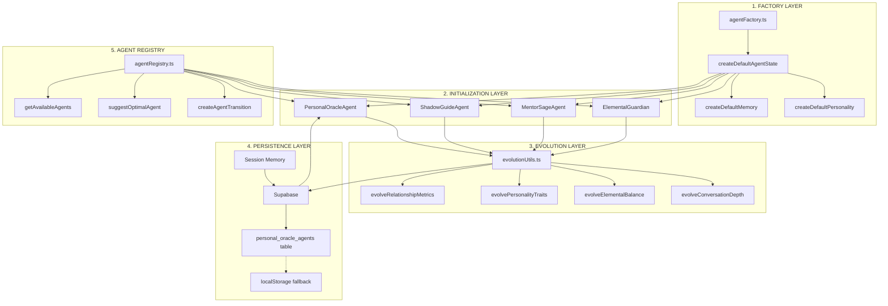

# Agent Architecture Flow Diagram

## System Overview: Factory → Initialization → Evolution → Persistence



## Detailed Flow Visualization

```
┌─────────────────────────────────────────────────────────────────┐
│                        AGENT LIFECYCLE                           │
└─────────────────────────────────────────────────────────────────┘

1️⃣ CREATION (Factory Pattern)
   ┌──────────────┐
   │   Request    │ "Create new PersonalOracleAgent for user123"
   └──────┬───────┘
          ▼
   ┌──────────────┐
   │   Factory    │ createDefaultAgentState('user123')
   └──────┬───────┘
          ▼
   ┌──────────────┐
   │  Type-Safe   │ Returns complete AgentState with:
   │   Instance   │ • All required fields
   └──────┬───────┘ • No missing properties
          ▼        • Consistent defaults

2️⃣ INITIALIZATION (Agent Classes)
   ┌──────────────┐
   │ Constructor  │ new PersonalOracleAgent(userId, state)
   └──────┬───────┘
          ▼
   ┌──────────────┐
   │   Modules    │ • ElementalAnalyzer
   │  Injection   │ • MemoryEngine
   └──────┬───────┘ • ResponseGenerator
          ▼

3️⃣ RUNTIME EVOLUTION (Shared Utils)
   ┌──────────────┐
   │   User       │ "I'm feeling vulnerable today"
   │ Interaction  │
   └──────┬───────┘
          ▼
   ┌──────────────┐
   │  Evolution   │ evolveRelationshipMetrics()
   │   Utils      │ evolveConversationDepth()
   └──────┬───────┘ trackGrowthPattern()
          ▼
   ┌──────────────┐
   │   Updated    │ trust: 52 → 57
   │    State     │ depth: 'exploring' → 'deepening'
   └──────┬───────┘
          ▼

4️⃣ PERSISTENCE (Database + Fallback)
   ┌──────────────┐
   │    Save      │ await saveState()
   └──────┬───────┘
          ▼
   ┌──────────────┐     ┌──────────────┐
   │   Supabase   │ ←→  │ localStorage │
   │   (Primary)  │     │  (Fallback)  │
   └──────────────┘     └──────────────┘

5️⃣ AGENT TRANSITIONS (Registry)
   ┌──────────────┐
   │   Context    │ User shows shadow patterns
   │   Analysis   │
   └──────┬───────┘
          ▼
   ┌──────────────┐
   │   Registry   │ suggestOptimalAgent() → 'shadow-guide'
   └──────┬───────┘
          ▼
   ┌──────────────┐
   │  Transition  │ createAgentTransition()
   │    Ritual    │ "Maya recognizes Umbra is needed..."
   └──────────────┘
```

## Code Flow Example

```typescript
// 1. FACTORY CREATES PERFECT INSTANCE
const state = createDefaultAgentState('user123');
// ✅ Guaranteed complete with all fields

// 2. AGENT INITIALIZES WITH STATE
const oracle = new PersonalOracleAgent('user123', state);
// ✅ No missing properties error

// 3. EVOLUTION DURING INTERACTION
const response = await oracle.processInteraction(input, context);
// Internally calls:
// - evolveRelationshipMetrics()
// - evolvePersonalityTraits()
// - evolveConversationDepth()

// 4. PERSISTENCE AFTER EACH INTERACTION
await oracle.saveState();
// Saves to Supabase, falls back to localStorage

// 5. AGENT SWITCHING WHEN NEEDED
const optimal = suggestOptimalAgent(context);
if (optimal.agent !== 'personal-oracle') {
  const transition = createAgentTransition('personal-oracle', optimal.agent);
  // Smooth handoff to Shadow Guide, Mentor, etc.
}
```

## Type Safety Flow

```
┌────────────────────────────────────────────────────┐
│                  TYPE DEFINITIONS                   │
│                    (types.ts)                       │
├────────────────────────────────────────────────────┤
│ AgentState {                                       │
│   id: string                                       │
│   memory: AgentMemory ←─────────────┐             │
│   personality: AgentPersonality      │             │
│   currentContext: CurrentContext     │             │
│   ...                                │             │
│ }                                    │             │
└──────────────────────────────────────┼─────────────┘
                                       │
                                       ▼
┌────────────────────────────────────────────────────┐
│                  FACTORY FUNCTIONS                  │
│                  (agentFactory.ts)                  │
├────────────────────────────────────────────────────┤
│ createDefaultAgentState(): AgentState {            │
│   return {                                         │
│     id: generated,                                 │
│     memory: createDefaultMemory(), ← TypeSafe      │
│     personality: createDefaultPersonality(),       │
│     currentContext: {...}                          │
│   }                                                │
│ }                                                  │
└────────────────────────────────────────────────────┘
                                       │
                                       ▼
┌────────────────────────────────────────────────────┐
│                  AGENT CLASSES                      │
│              (PersonalOracleAgent.ts)               │
├────────────────────────────────────────────────────┤
│ class PersonalOracleAgent {                        │
│   private state: AgentState ← Type enforced        │
│                                                    │
│   initializeNewAgent(): AgentState {               │
│     return createDefaultAgentState(this.userId)    │
│   }                                                │
│ }                                                  │
└────────────────────────────────────────────────────┘
```

## Benefits Visualization

```
BEFORE (Scattered Initialization)          AFTER (Factory Pattern)
─────────────────────────────────          ──────────────────────

PersonalOracleAgent.ts                     agentFactory.ts
├─ 200 lines of defaults ❌                ├─ createDefaultAgentState()
├─ Missing dominantElement ❌               └─ Single source of truth ✅
└─ TypeScript errors ❌
                                           PersonalOracleAgent.ts
ShadowGuideAgent.ts                       ├─ Uses factory ✅
├─ 200 lines of defaults ❌                └─ No duplication ✅
├─ Different structure ❌
└─ Maintenance nightmare ❌                 ShadowGuideAgent.ts
                                           ├─ Uses factory ✅
MentorSageAgent.ts                        └─ Consistent structure ✅
├─ 200 lines of defaults ❌
└─ Copy-paste drift ❌                      All agents share:
                                           • Same evolution logic
Result:                                    • Same persistence
• 600+ lines of duplication               • Same type safety
• Inconsistent behavior                    • Zero initialization bugs
• Constant TypeScript errors
```

## Developer Onboarding: Quick Start

### Creating a New Agent Type

```typescript
// 1. Add to agent registry
AGENT_REGISTRY['dream-guide'] = {
  type: 'dream-guide',
  name: 'Morpheus',
  primaryElement: 'water',
  defaultTraits: { ... },
  activationThreshold: { trustLevel: 50 }
};

// 2. Create agent class
class DreamGuideAgent extends BaseAgent {
  constructor(userId: string) {
    // Factory gives you perfect state
    const state = createDefaultAgentState(userId);
    super(state);
  }

  // Your agent-specific logic here
  interpretDream(dream: string) { ... }
}

// 3. That's it! Evolution, persistence, transitions all work automatically
```

### Using Evolution Utils

```typescript
// Any agent can use shared evolution logic
const evolved = evolveRelationshipMetrics(
  currentMetrics,
  'breakthrough'  // User had breakthrough moment
);

// Personality adapts to user preference
const adapted = evolvePersonalityTraits(
  currentTraits,
  { responseToChallenge: 'embraces' }
);

// Track growth consistently
const growth = trackGrowthPattern(
  currentGrowth,
  { breakthroughMoment: 'Recognized shadow pattern' }
);
```

## Architecture Principles

1. **Single Source of Truth**: Factory functions own defaults
2. **Type Safety First**: TypeScript catches issues at compile time
3. **Shared Evolution**: All agents grow using same mechanics
4. **Graceful Degradation**: Supabase → localStorage → memory
5. **Progressive Activation**: Agents unlock based on user readiness

---

## Summary for New Developers

**The Old Way:**
"Copy PersonalOracleAgent, change 500 lines, hope nothing breaks"

**The New Way:**
"Call factory, get perfect agent, focus on unique behavior"

**The Result:**
- 90% less boilerplate
- 100% type safety
- 0% initialization bugs
- ∞% maintainability

---

*This architecture ensures every consciousness guide in the Spiralogic Oracle System is born complete, evolves consistently, and persists reliably.*