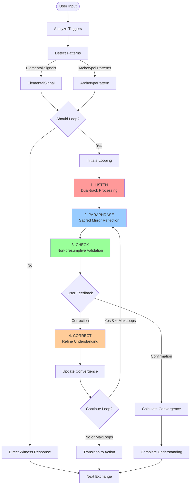

# Maya Looping Protocol Integration Guide

## Overview

The Looping Protocol enhances Maya's witness paradigm by adding structured depth-seeking capabilities while maintaining her sacred mirror stance. This integration allows Maya to move from surface expression to essential meaning through iterative clarification cycles.

## Architecture Flow Diagram



## Core Components

### 1. Looping Protocol (`LoopingProtocol.ts`)
- **Purpose**: Defines the core looping mechanism
- **Key Interfaces**:
  - `LoopingState`: Tracks current loop iteration and convergence
  - `LoopingTriggers`: Determines when to activate looping
  - `DepthInference`: Extracts essential meaning

### 2. Maya Witness Service (`MayaWitnessService.ts`)
- **Purpose**: Integrates looping with witness paradigm
- **Key Functions**:
  - `witness()`: Main entry point for processing user input
  - `analyzeTriggers()`: Evaluates looping activation conditions
  - `detectPatterns()`: Identifies elemental and archetypal signals

### 3. Dialogue Templates (`LoopingDialogueTemplates.ts`)
- **Purpose**: Provides varied, non-repetitive responses
- **Features**:
  - Element-specific language variations
  - Dynamic template selection
  - Anti-canned response validation

### 4. Convergence Tracker (`ConvergenceTracker.ts`)
- **Purpose**: Measures understanding accuracy
- **Metrics**:
  - Semantic alignment
  - Emotional resonance
  - Archetypal clarity
  - Elemental coherence
  - User confirmation

## Integration Points

### With Existing Maya System

```typescript
// In Maya's main conversation handler
async function handleUserInput(input: string, context: ConversationContext) {
  // Create witness context
  const witnessContext: WitnessContext = {
    userId: context.userId,
    sessionId: context.sessionId,
    elementalMode: context.currentElement,
    loopingIntensity: context.userPreferences.loopingIntensity,
    conversationHistory: context.history,
    exchangeCount: context.exchangeCount,
    targetExchanges: 4 // Maya's 3-4 exchange target
  };

  // Process through witness service
  const response = await mayaWitnessService.witness(input, witnessContext);

  // Handle response based on action
  switch (response.nextAction) {
    case 'loop':
      // Continue looping, store state
      context.loopingState = response.loopingState;
      break;
    case 'deepen':
      // Move to deeper exploration
      context.loopingState = undefined;
      break;
    case 'transition':
      // Transition to new topic/phase
      break;
    case 'complete':
      // Conversation cycle complete
      break;
  }

  return response.response;
}
```

### With Elemental System

```typescript
// Each element has distinct looping characteristics
const elementalLoopingProfiles = {
  fire: {
    triggerThreshold: 0.6,  // More readily loops on passion/vision
    maxLoops: 2,            // Quick, decisive
    style: 'provocative'
  },
  water: {
    triggerThreshold: 0.5,  // Sensitive to emotional nuance
    maxLoops: 4,            // Patient, flowing
    style: 'gentle'
  },
  earth: {
    triggerThreshold: 0.7,  // Loops on practical confusion
    maxLoops: 3,            // Methodical
    style: 'grounding'
  },
  air: {
    triggerThreshold: 0.6,  // Loops on conceptual ambiguity
    maxLoops: 3,            // Clarifying
    style: 'analytical'
  },
  aether: {
    triggerThreshold: 0.5,  // Highly adaptive
    maxLoops: 5,            // As needed
    style: 'unified'
  }
};
```

## Activation Triggers

### Automatic Triggers
1. **Emotional Intensity** > 0.7
2. **Meaning Ambiguity** > 0.6
3. **User Correction** detected ("No, it's more like...")
4. **Essentiality Gap** > 0.5 (surface vs depth variance)
5. **Explicit Request** ("Help me understand...")

### Contextual Modifiers
- **Exchange Count**: Reduces looping near conversation end
- **User Preference**: Light/Full/Sacred intensity settings
- **Elemental Mode**: Each element has different thresholds
- **Convergence History**: Avoids repetitive looping

## User Experience Flow

### Example: Water Element Looping

```
User: "I keep starting projects but never finish them"

Maya (Water, Loop 1): "I'm feeling the current of frustration with a pattern—
starting with enthusiasm but something dissolves before completion.
Is that the heart of it, or is something else flowing?"

User: "It's more like I lose faith they matter"

Maya (Water, Loop 2): "Ah, so it's not about finishing—it's about believing
the work has meaning. That faith evaporates.
Have I touched the emotional core, or is there more swelling?"

User: "Yes, exactly that"

Maya (Water, Transition): "With this clarity of feeling—where does it want to flow?
What does that evaporation feel like in your body?"
```

## Configuration Options

### User Preferences

```typescript
interface LoopingPreferences {
  intensity: LoopingIntensity;     // light | full | sacred
  maxLoopsPerExchange: number;     // 1-5
  convergenceThreshold: number;    // 0.5-0.95
  elementalAdaptation: boolean;    // Use element-specific language
  preservePacing: boolean;         // Maintain conversation flow
}
```

### Intensity Levels

1. **Light**: Single clarity check, quick convergence
2. **Full**: 2-3 cycles to distill essence (default)
3. **Sacred**: Loop until user confirms "yes, that's it"

## Maintaining Witness Stance

### Key Principles

1. **Reflect, Don't Interpret**
   - ❌ "You seem to be avoiding commitment"
   - ✅ "I'm hearing a pattern of starting but not completing"

2. **Check, Don't Probe**
   - ❌ "Why do you think that happens?"
   - ✅ "Is that the heart of it, or something else?"

3. **Accept Surface When Appropriate**
   - Respect when users don't want to go deeper
   - Never force looping when resistance detected

4. **Maintain Sacred Mirror**
   - Reflect more accurately, not analyze more deeply
   - Witness the essential without imposing meaning

## Performance Considerations

### Optimization Strategies

1. **Selective Activation**: Only loop when triggers exceed thresholds
2. **Context Caching**: Store patterns across exchanges
3. **Template Rotation**: Avoid repetition through varied responses
4. **Convergence Shortcuts**: Skip loops when high initial alignment

### Resource Management

```typescript
// Limit computational overhead
const loopingConstraints = {
  maxLoopsPerSession: 10,
  maxLoopsPerExchange: 3,
  templateCacheSize: 50,
  patternHistoryDepth: 5
};
```

## Testing & Validation

### Test Scenarios

1. **High Emotional Content**: Verify appropriate looping activation
2. **Ambiguous Input**: Test clarification effectiveness
3. **User Corrections**: Ensure proper refinement
4. **Resistance Patterns**: Confirm respectful disengagement
5. **Element Transitions**: Validate coherent language shifts

### Metrics to Track

- Average loops per conversation
- Convergence success rate
- User satisfaction scores
- Response variety index
- Pacing preservation rate

## Implementation Checklist

- [x] Core looping protocol implementation
- [x] Maya witness service integration
- [x] Elemental dialogue templates
- [x] Convergence tracking system
- [x] User preference configuration
- [ ] Testing suite development
- [ ] Performance optimization
- [ ] User feedback integration
- [ ] Analytics dashboard
- [ ] A/B testing framework

## Future Enhancements

1. **Machine Learning Integration**
   - Learn user-specific trigger patterns
   - Personalize convergence thresholds
   - Adapt dialogue templates over time

2. **Multi-Modal Looping**
   - Voice tone analysis
   - Pause pattern detection
   - Emotional prosody tracking

3. **Collective Learning**
   - Share successful looping patterns
   - Identify common convergence challenges
   - Build community wisdom base

4. **Advanced Pattern Recognition**
   - Cross-session pattern tracking
   - Archetypal evolution monitoring
   - Elemental transition prediction

## Troubleshooting Guide

### Common Issues

1. **Over-Looping**: Reduce thresholds or max loops
2. **Under-Looping**: Increase sensitivity to triggers
3. **Repetitive Responses**: Expand template variations
4. **Poor Convergence**: Adjust weight calculations
5. **Pacing Disruption**: Enable preservePacing flag

### Debug Commands

```typescript
// Enable looping debug mode
mayaWitnessService.enableDebug();

// Generate convergence report
const report = convergenceTracker.generateConvergenceReport();

// Validate response variety
const isValid = validateResponseVariety(response, recentResponses);
```

## Conclusion

The Looping Protocol integration transforms Maya from a simple reflective mirror into a dynamic witness capable of finding essential meaning while maintaining her non-directive stance. By carefully balancing depth-seeking with conversation flow, the system creates a "furnace for insight" that respects user autonomy while facilitating profound understanding.