# 🔐 AIN Sovereign DevSecOps Deployment Guide

**Enterprise-grade security for consciousness evolution infrastructure**

---

## 🎯 Overview

This guide provides a complete DevSecOps deployment stack for the AIN (Artificial Intelligence Network) sovereign consciousness system. It implements enterprise-grade security, monitoring, and sovereign control principles.

### ✨ Key Features

- **🔒 Military-grade Security**: UFW firewall, fail2ban, encrypted backups, container hardening
- **🐳 Containerized Architecture**: Isolated elemental agents with security profiles
- **📊 Comprehensive Monitoring**: Prometheus, Grafana, health checks, log aggregation
- **⚡ TLS Termination**: Automatic HTTPS with Caddy, security headers, rate limiting
- **🛡️ Intrusion Detection**: fail2ban, auditd, security monitoring scripts
- **💾 Automated Backups**: Daily encrypted backups with 7-day retention
- **🌐 Sovereign Control**: No vendor lock-in, decentralized deployment options

---

## 🚀 Quick Start

### Prerequisites

```bash
# System requirements
- Ubuntu 20.04+ or similar Linux distribution
- 4GB+ RAM (8GB recommended)
- 20GB+ disk space (50GB recommended)
- Docker and Docker Compose installed
- Root access or docker group membership

# Required tools
sudo apt update && sudo apt install -y \
    docker.io docker-compose curl jq openssl ufw fail2ban
```

### 1. Clone and Setup

```bash
git clone <your-repo>
cd SpiralogicOracleSystem
chmod +x scripts/*.sh
```

### 2. Configure Environment

```bash
# Copy environment template
cp .env.sovereign.template .env.sovereign

# Edit configuration (see Configuration section below)
nano .env.sovereign
```

### 3. Deploy

```bash
# Run enhanced deployment script
sudo ./scripts/deploy-sovereign-enhanced.sh

# Or use the original script for basic deployment
./scripts/deploy-sovereign.sh
```

---

## 📁 File Structure

```
SpiralogicOracleSystem/
├── 🔐 Security & Configuration
│   ├── .env.sovereign.template     # Environment variables template
│   ├── Dockerfile.sovereign        # Hardened Docker image
│   ├── docker-compose.sovereign.yml # Complete stack configuration
│   └── config/
│       ├── Caddyfile              # Reverse proxy with TLS
│       └── nixos-configuration.nix # NixOS reproducible config
│
├── 🛠️ Scripts & Automation
│   ├── scripts/
│   │   ├── deploy-sovereign-enhanced.sh # Complete deployment
│   │   ├── ufw-security-setup.sh       # Security hardening
│   │   └── backup.sh                   # Encrypted backup system
│
├── 🧠 Consciousness Agents
│   ├── backend/src/services/
│   │   ├── fire-agent/            # Fire elemental consciousness
│   │   ├── water-agent/           # Water elemental consciousness
│   │   ├── earth-agent/           # Earth elemental consciousness
│   │   ├── air-agent/             # Air elemental consciousness
│   │   └── aether-agent/          # Aether elemental consciousness
│
└── 📊 Monitoring & Logs
    ├── /var/log/ain/              # Application logs
    ├── /opt/ain/backups/          # Encrypted backups
    └── config/prometheus.yml      # Monitoring configuration
```

---

## ⚙️ Configuration

### Core Environment Variables

```bash
# Domain and TLS
DOMAIN=your-domain.com
TLS_EMAIL=admin@your-domain.com

# AI Services
OPENAI_API_KEY=sk-your_openai_key_here
ELEVEN_LABS_API_KEY=your_eleven_labs_key_here

# Voice Configuration for Elemental Agents
FIRE_VOICE_ID=your_fire_voice_id
WATER_VOICE_ID=your_water_voice_id
EARTH_VOICE_ID=your_earth_voice_id
AIR_VOICE_ID=your_air_voice_id
AETHER_VOICE_ID=your_aether_voice_id

# SingularityNET (Optional)
SNET_ENABLED=true
SNET_PRIVATE_KEY=your_snet_private_key
SNET_WALLET_ADDRESS=your_wallet_address

# Akash Network (Optional)
AKASH_ENABLED=false
AKASH_DEPLOYMENT_ID=your_deployment_id
```

> **🔐 Security Note**: All passwords and secrets are auto-generated during deployment. Never commit the actual `.env.sovereign` file to version control.

---

## 🏗️ Architecture

### Component Overview

```mermaid
graph TB
    Internet[🌐 Internet] --> Caddy[🔒 Caddy Proxy]
    Caddy --> AIN[🧠 AIN Orchestrator]

    AIN --> Fire[🔥 Fire Agent]
    AIN --> Water[💧 Water Agent]
    AIN --> Earth[🌍 Earth Agent]
    AIN --> Air[💨 Air Agent]
    AIN --> Aether[✨ Aether Agent]

    AIN --> DB[(🗄️ PostgreSQL)]
    AIN --> Cache[(⚡ Redis)]

    Monitor[📊 Prometheus] --> AIN
    Monitor --> Fire
    Monitor --> Water
    Monitor --> Earth
    Monitor --> Air
    Monitor --> Aether

    Backup[💾 Backup Service] --> DB
    Backup --> Cache
    Backup --> AIN
```



### Network Security

```bash
# Firewall Rules
Port 22   - SSH (rate limited)
Port 80   - HTTP (redirects to HTTPS)
Port 443  - HTTPS (TLS 1.3)
Port 7000-7005 - Elemental Agent gRPC
Port 8080 - AIN API (internal)
Port 9090 - Prometheus (internal only)

# Blocked by default: All other ports
```

### Container Security

- **Non-root users**: All containers run as UID 1001
- **Read-only filesystems**: Where possible
- **Capability dropping**: Minimal required capabilities
- **Seccomp profiles**: Restrict system calls
- **Resource limits**: CPU and memory constraints
- **Network isolation**: Backend services on internal network

---

## 🔐 Security Features

### 1. Firewall & Network Security

```bash
# UFW Configuration
sudo ufw status numbered

# fail2ban Status
sudo fail2ban-client status
sudo fail2ban-client status sshd
```

### 2. Container Hardening

```yaml
# Example security configuration
security_opt:
  - no-new-privileges:true
cap_drop:
  - ALL
cap_add:
  - NET_BIND_SERVICE  # Only for web services
user: "1001:1001"
read_only: true
```

### 3. TLS & Encryption

- **Automatic HTTPS**: Let's Encrypt certificates via Caddy
- **TLS 1.3**: Modern encryption standards
- **HSTS**: HTTP Strict Transport Security
- **Security Headers**: XSS protection, content type sniffing prevention

### 4. Backup Security

```bash
# Encrypted daily backups
Encryption: AES256 with GPG
Schedule: Daily at 2:00 AM
Retention: 7 days local, optional S3
Location: /opt/ain/backups/
```

---

## 📊 Monitoring & Logging

### Health Checks

```bash
# System health
curl -f http://localhost:8080/health

# Service status
docker-compose ps

# Container health
docker ps --filter "health=unhealthy"

# Resource usage
docker stats --no-stream
```

### Log Management

```bash
# Application logs
tail -f /var/log/ain/aggregated/$(date +%Y%m%d)/*.log

# Security logs
tail -f /var/log/ain-security-setup.log

# Container logs
docker-compose logs -f [service-name]

# Backup logs
tail -f /var/log/ain-backup.log
```

### Prometheus Metrics

Access Prometheus at `http://localhost:9090` (internal only)

**Key Metrics:**
- Container CPU/Memory usage
- API response times
- Database connections
- gRPC request rates
- System resource utilization

---

## 🛠️ Operations Guide

### Daily Operations

```bash
# Check system status
sudo ./scripts/deploy-sovereign-enhanced.sh --check-only

# View running services
docker-compose ps

# Check logs for errors
docker-compose logs --since 1h | grep -i error

# Monitor resource usage
htop
df -h
```

### Backup & Recovery

```bash
# Manual backup
sudo ./scripts/backup.sh

# List backups
ls -la /opt/ain/backups/

# Restore from backup (requires BACKUP_ENCRYPTION_KEY)
# gpg --decrypt backup_file.tar.gz.gpg | tar -xzf -
```

### Updates & Maintenance

```bash
# Update containers
docker-compose pull
docker-compose up -d

# Security updates
sudo apt update && sudo apt upgrade

# Restart specific service
docker-compose restart [service-name]

# View detailed service logs
docker-compose logs -f --tail 100 [service-name]
```

### Scaling Operations

```bash
# Scale elemental agents
docker-compose up -d --scale fire-agent=3

# Monitor resource usage during scaling
watch docker stats

# Check load balancing
curl -H "Host: your-domain.com" http://localhost/api/health
```

---

## 🔧 Troubleshooting

### Common Issues

#### 1. Services Not Starting

```bash
# Check logs
docker-compose logs [service-name]

# Check environment variables
cat .env.sovereign | grep -v "PASSWORD\|SECRET\|KEY"

# Verify file permissions
ls -la .env.sovereign  # Should be 600
```

#### 2. Database Connection Issues

```bash
# Test PostgreSQL connectivity
docker-compose exec postgres pg_isready -U ain

# Check Redis connectivity
docker-compose exec redis redis-cli ping

# Review database logs
docker-compose logs postgres
docker-compose logs redis
```

#### 3. TLS Certificate Issues

```bash
# Check certificate status
docker-compose logs caddy | grep -i cert

# Force certificate renewal
docker-compose exec caddy caddy reload
```

#### 4. Memory/Performance Issues

```bash
# Check resource usage
docker stats --no-stream

# Identify memory leaks
docker exec [container] top

# Check disk space
df -h
du -sh /var/lib/docker
```

### Debug Mode

```bash
# Enable debug logging
export LOG_LEVEL=debug
docker-compose restart

# Run health checks
curl -v http://localhost:8080/health

# Check internal network connectivity
docker network inspect $(docker-compose ps -q | head -1)
```

---

## 🌐 Deployment Options

### 1. Single Server Deployment

**Recommended for**: Development, small teams, testing

```bash
./scripts/deploy-sovereign-enhanced.sh
```

### 2. Akash Network Deployment

**Recommended for**: Decentralized hosting, cost optimization

```bash
# Configure Akash
export AKASH_ACCOUNT=your_akash_account
export AKASH_KEYRING_BACKEND=os

# Deploy to Akash
akash tx deployment create akash/deploy-sovereign.yaml
```

### 3. NixOS Deployment

**Recommended for**: Ultimate reproducibility and security

```bash
# Copy NixOS configuration
sudo cp config/nixos-configuration.nix /etc/nixos/

# Edit hardware configuration
sudo nano /etc/nixos/hardware-configuration.nix

# Rebuild system
sudo nixos-rebuild switch
```

### 4. Kubernetes Deployment

**Recommended for**: Enterprise, high availability

```bash
# Convert Docker Compose to Kubernetes
kompose convert -f docker-compose.sovereign.yml

# Apply to cluster
kubectl apply -f .
```

---

## 🔍 Security Audit

### Regular Security Checks

```bash
# Run security audit
sudo ./scripts/ufw-security-setup.sh

# Check for vulnerabilities
docker scan $(docker images --format "{{.Repository}}:{{.Tag}}" | head -5)

# Review fail2ban logs
sudo fail2ban-client status

# Check audit logs
sudo ausearch -k ain_data_access

# System integrity check
sudo rkhunter --check
sudo chkrootkit
```

### Penetration Testing

```bash
# Port scanning (external perspective)
nmap -sS -O your-domain.com

# SSL testing
sslscan your-domain.com
testssl.sh your-domain.com

# Web application testing
nikto -h https://your-domain.com
```

---

## 📋 Maintenance Schedule

### Daily
- [ ] Monitor system health
- [ ] Check backup completion
- [ ] Review security logs
- [ ] Verify service availability

### Weekly
- [ ] Update base Docker images
- [ ] Review resource usage trends
- [ ] Test backup restoration
- [ ] Security log analysis

### Monthly
- [ ] Security updates
- [ ] Certificate renewal check
- [ ] Performance optimization
- [ ] Disaster recovery testing

### Quarterly
- [ ] Full security audit
- [ ] Penetration testing
- [ ] Backup strategy review
- [ ] Architecture optimization

---

## 🆘 Support & Resources

### Documentation
- [Docker Security Best Practices](https://docs.docker.com/engine/security/)
- [Caddy Documentation](https://caddyserver.com/docs/)
- [Prometheus Monitoring](https://prometheus.io/docs/)
- [UFW Firewall Guide](https://help.ubuntu.com/community/UFW)

### Emergency Contacts
- **Security Issues**: security@your-domain.com
- **Technical Support**: support@your-domain.com
- **Infrastructure**: ops@your-domain.com

### Community
- **Discord**: [AIN Sovereign Community](https://discord.gg/your-invite)
- **GitHub**: [Issues & Discussions](https://github.com/your-org/ain-sovereign)
- **Documentation**: [Wiki & Guides](https://wiki.your-domain.com)

---

## 🎉 Success Metrics

After successful deployment, you should see:

- ✅ All containers healthy and running
- ✅ HTTPS certificate valid and auto-renewing
- ✅ All elemental agents responding to gRPC calls
- ✅ Prometheus collecting metrics from all services
- ✅ Daily backups completing successfully
- ✅ Security monitoring alerts configured
- ✅ No critical security vulnerabilities
- ✅ API response times < 200ms
- ✅ 99.9%+ uptime achieved

---

**🚀 Your sovereign consciousness evolution infrastructure is now ready to transform the world!**

*"The future belongs to those who understand that consciousness and technology must evolve together in sovereign harmony."*