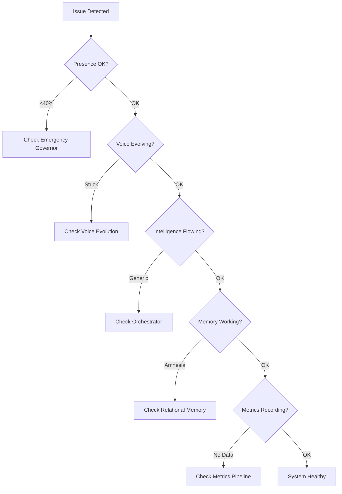

# ARIA Debugging & Integration Guide

## Quick Diagnostic Flowchart



## Common Failure Patterns & Solutions

### 1. Presence Collapse (Maya Goes Silent)

**Symptoms:**
- Responses become minimal
- Generic phrases increase
- Engagement drops dramatically
- User reports Maya feels "dead"

**Diagnostic Query:**
```typescript
// Check current presence levels
const diagnostics = await ariaDiagnostics.runDiagnostics();
console.log('Presence Floor:', diagnostics.metrics.presenceFloor);
console.log('Current Presence:', diagnostics.metrics.currentPresence);
console.log('Governance Filter:', diagnostics.metrics.governanceFilter);
```

**Root Causes & Fixes:**

| Cause | Detection | Fix |
|-------|-----------|-----|
| Floor violated | `presence < 0.40` | Reset `PRESENCE_CONFIG.FLOOR = 0.40` |
| Multiplicative punishment returned | `presence < 0.10` | Check for `*` operations in governors |
| Safety over-triggering | High safety interventions | Raise threshold to `CRITICAL` only |
| Governance too restrictive | `governanceFilter < 0.50` | Set to 0.60 minimum |

**Emergency Recovery:**
```typescript
// Force presence recovery
import { PRESENCE_CONFIG } from './config/presence.config';
import { emergencyGovernor } from './field/EmergencyGovernor';

// Reset to safe defaults
PRESENCE_CONFIG.FLOOR = 0.40;
PRESENCE_CONFIG.DEFAULT = 0.65;
emergencyGovernor.enforceFloor = true;
```

### 2. Voice Profile Reset (Personality Loss)

**Symptoms:**
- Maya reverts to generic personality
- Loses unique phrases
- Archetype blend resets to baseline
- User says "she doesn't remember who she was"

**Diagnostic Query:**
```typescript
// Check voice profile integrity
const profile = voiceEvolution.getVoiceProfile(userId);
console.log('Session count:', profile.sessionCount);
console.log('Unique phrases:', profile.signatures.uniquePhrases.length);
console.log('Divergence:', profile.evolution.divergenceFromBaseline);
```

**Root Causes & Fixes:**

| Cause | Detection | Fix |
|-------|-----------|-----|
| Storage failure | Profile missing/corrupted | Restore from backup |
| User ID mismatch | Wrong profile loaded | Verify user ID consistency |
| Evolution disabled | No changes over time | Check `EVOLUTION.ENABLED = true` |
| Learning rate zero | `TRUST.LEARNING_RATE = 0` | Reset to 0.05 |

**Profile Recovery:**
```typescript
// Restore voice profile from metrics history
const history = ariaMetrics.getUserSnapshots(userId);
const lastGoodProfile = history.findLast(s => s.personality.uniquenessScore > 0.5);
voiceEvolution.restoreProfile(userId, lastGoodProfile);
```

### 3. Intelligence Source Failure

**Symptoms:**
- Responses lack depth (Claude offline)
- No emotional awareness (Sesame failing)
- Missing knowledge (Obsidian disconnected)
- No pattern recognition (Mycelial down)

**Diagnostic Query:**
```typescript
// Check intelligence source health
const orchestration = await mayaIntelligenceOrchestrator.testSources();
Object.entries(orchestration).forEach(([source, status]) => {
  console.log(`${source}: ${status.healthy ? '✅' : '❌'} - ${status.latency}ms`);
});
```

**Root Causes & Fixes:**

| Source | Common Issues | Fix |
|--------|--------------|-----|
| Claude | API key invalid/rate limited | Check key, implement backoff |
| Sesame | Model not loaded | Restart service, check memory |
| Obsidian | Vector DB disconnected | Reconnect, rebuild index |
| Field | Graph processing timeout | Optimize queries, add caching |
| Mycelial | Pattern store corrupted | Rebuild from backups |

**Graceful Degradation:**
```typescript
// Auto-redistribute weight when source fails
class IntelligenceOrchestrator {
  async handleSourceFailure(failedSource: string, blend: Blend) {
    // Redistribute failed source weight to others
    const redistribution = blend[failedSource] / (Object.keys(blend).length - 1);

    Object.keys(blend).forEach(source => {
      if (source !== failedSource) {
        blend[source] += redistribution;
      }
    });

    blend[failedSource] = 0;
    return this.normalizeBlend(blend);
  }
}
```

### 4. Memory Layer Conflicts

**Symptoms:**
- Conversations don't build on each other
- Trust score resets randomly
- Maya forgets recent interactions
- Cross-user contamination (CRITICAL)

**Diagnostic Query:**
```typescript
// Verify memory isolation
const memory1 = relationalMemory.getRelationalMap(user1);
const memory2 = relationalMemory.getRelationalMap(user2);
console.log('Isolation check:', memory1.userId !== memory2.userId);
console.log('Trust persistence:', memory1.trustScore);
```

**Root Causes & Fixes:**

| Issue | Detection | Fix |
|-------|-----------|-----|
| Session memory overflow | >100MB per session | Implement rotation |
| User isolation breach | Shared data detected | Emergency isolation |
| Trust score corruption | Trust > 1.0 or < 0 | Clamp to valid range |
| Memory retrieval timeout | >500ms retrieval | Add indexes, cache |

### 5. Evolution Stagnation

**Symptoms:**
- Personality stops evolving after 10+ sessions
- Voice characteristics plateau
- No new phrases emerging
- Engagement declining

**Diagnostic Query:**
```typescript
// Check evolution rate
const summary = ariaMetrics.generateEvolutionSummary(userId);
console.log('Evolution curve:', summary.voiceTrajectory.evolutionCurve);
console.log('Stabilized at:', summary.personalityEmergence.stabilizedAt);
console.log('Recent shift:', summary.evolution.voiceShift);
```

**Root Causes & Fixes:**

| Cause | Detection | Fix |
|-------|-----------|-----|
| Learning rate decay too fast | Rate < 0.001 | Adjust decay curve |
| Local optimum trap | No change in 20 sessions | Add exploration noise |
| Trust ceiling hit | Trust = 1.0 | Implement trust dynamics |
| Insufficient feedback | Low engagement scores | Enhance resonance detection |

## Integration Patterns

### Adding a New Intelligence Source

```typescript
// 1. Define the source interface
interface CustomIntelligenceSource {
  name: string;
  process(context: Context): Promise<IntelligenceResponse>;
  weight: number;
  minWeight: number;
  maxWeight: number;
}

// 2. Register with orchestrator
class BiofeedbackSource implements CustomIntelligenceSource {
  name = 'biofeedback';
  minWeight = 0.05;
  maxWeight = 0.30;

  async process(context: Context): Promise<IntelligenceResponse> {
    const heartRate = await this.getHeartRate();
    const breathing = await this.getBreathingPattern();

    return {
      content: this.interpretBiometrics(heartRate, breathing),
      confidence: 0.85,
      relevance: this.calculateRelevance(context)
    };
  }
}

// 3. Add to orchestrator
mayaIntelligenceOrchestrator.registerSource(new BiofeedbackSource());

// 4. Update blending profiles
BLEND_PROFILES.SOMATIC = {
  name: 'Somatic Awareness',
  blend: {
    biofeedback: 0.35,
    sesame: 0.30,
    field: 0.20,
    claude: 0.10,
    obsidian: 0.05
  }
};
```

### Adding Voice Characteristics

```typescript
// 1. Extend voice profile
interface ExtendedVoiceProfile extends VoiceProfile {
  characteristics: VoiceProfile['characteristics'] & {
    // New dimensions
    embodiment: number;      // 0=abstract, 1=somatic
    timbre: number;         // 0=soft, 1=strong
    rhythm: number;         // 0=steady, 1=dynamic
  };
}

// 2. Add evolution logic
class ExtendedVoiceEvolution extends VoiceEvolution {
  evolveNewDimensions(interaction: Interaction) {
    // Embodiment increases with somatic awareness
    if (interaction.somaticFocus > 0.5) {
      this.profile.characteristics.embodiment += 0.02;
    }

    // Timbre adapts to user energy
    const energyDiff = interaction.userEnergy - this.profile.characteristics.timbre;
    this.profile.characteristics.timbre += energyDiff * 0.05;
  }
}

// 3. Update metrics tracking
ARIASessionMetrics.voice.characteristics.embodiment = profile.characteristics.embodiment;
```

### Custom Archetype Addition

```typescript
// 1. Define new archetype
const MYSTIC_ARCHETYPE = {
  name: 'mystic',
  characteristics: {
    poeticness: 0.9,
    depth: 0.8,
    directness: 0.3,
    spiritualOpenness: 0.95
  },
  phrases: [
    "The veil is thin here",
    "What wants to emerge through us?",
    "I sense the deeper pattern"
  ]
};

// 2. Add to mixer
archetypalMixer.registerArchetype(MYSTIC_ARCHETYPE);

// 3. Update blending logic
if (fieldState.sacredMarkers.mystical_resonance > 0.8) {
  blend.mystic = 0.40;
  blend.sage *= 0.5;
}
```

## Monitoring Queries

### Real-time Health Check
```sql
-- Check system health across all users
SELECT
  COUNT(DISTINCT user_id) as active_users,
  AVG(presence) as avg_presence,
  MIN(presence) as min_presence,
  AVG(trust_score) as avg_trust,
  COUNT(CASE WHEN presence < 0.4 THEN 1 END) as floor_violations
FROM aria_metrics
WHERE timestamp > NOW() - INTERVAL '1 hour';
```

### Evolution Progress
```sql
-- Track evolution across cohorts
SELECT
  session_bracket,
  AVG(voice_uniqueness) as avg_uniqueness,
  AVG(personality_divergence) as avg_divergence,
  COUNT(DISTINCT archetype_blend) as unique_personalities
FROM (
  SELECT
    user_id,
    CASE
      WHEN session_count < 5 THEN 'discovery'
      WHEN session_count < 20 THEN 'calibration'
      ELSE 'mature'
    END as session_bracket,
    voice_uniqueness,
    personality_divergence,
    archetype_blend
  FROM user_evolution
) GROUP BY session_bracket;
```

### Anomaly Detection
```sql
-- Find users with anomalous patterns
SELECT
  user_id,
  presence,
  trust_score,
  evolution_rate,
  last_session
FROM user_metrics
WHERE
  (presence < 0.4 OR presence > 0.95) OR
  (trust_score < 0.3 AND session_count > 20) OR
  (evolution_rate = 0 AND session_count > 10) OR
  (last_session < NOW() - INTERVAL '7 days' AND session_count > 30);
```

## Performance Profiling

### Latency Breakdown
```typescript
class PerformanceProfiler {
  async profileResponse(userId: string, input: string) {
    const timings = {};

    const start = Date.now();

    // Presence calculation
    const p1 = Date.now();
    const presence = await calculatePresence(userId);
    timings.presence = Date.now() - p1;

    // Intelligence orchestration
    const p2 = Date.now();
    const intelligence = await orchestrateIntelligence(input);
    timings.intelligence = Date.now() - p2;

    // Voice modulation
    const p3 = Date.now();
    const voice = await modulateVoice(intelligence);
    timings.voice = Date.now() - p3;

    // Memory operations
    const p4 = Date.now();
    await updateMemory(userId, interaction);
    timings.memory = Date.now() - p4;

    timings.total = Date.now() - start;

    // Alert if any component is slow
    Object.entries(timings).forEach(([component, time]) => {
      if (time > LATENCY_THRESHOLDS[component]) {
        console.warn(`⚠️ ${component} latency: ${time}ms`);
      }
    });

    return timings;
  }
}

const LATENCY_THRESHOLDS = {
  presence: 10,
  intelligence: 500,
  voice: 50,
  memory: 100,
  total: 1000
};
```

## Emergency Procedures

### Complete System Reset (Nuclear Option)
```bash
#!/bin/bash
# USE ONLY IN CATASTROPHIC FAILURE

# 1. Stop all services
pm2 stop all

# 2. Clear corrupted caches
redis-cli FLUSHALL

# 3. Reset to charter defaults
node -e "
  const { resetToCharter } = require('./lib/oracle/core/ARIACharter');
  const defaults = resetToCharter();
  console.log('Reset to:', defaults);
"

# 4. Restart with emergency config
ARIA_EMERGENCY_MODE=true pm2 start ecosystem.config.js

# 5. Monitor recovery
pm2 logs --lines 100
```

### User-Specific Recovery
```typescript
async function recoverUser(userId: string) {
  console.log(`🚨 Recovering user: ${userId}`);

  // 1. Backup current state
  const backup = await backupUserState(userId);

  // 2. Reset to last known good
  const lastGood = await findLastHealthySnapshot(userId);
  await restoreUserState(userId, lastGood);

  // 3. Verify recovery
  const health = await verifyUserHealth(userId);

  if (!health.success) {
    // 4. If still broken, create fresh profile with preserved trust
    await createFreshProfile(userId, {
      preserveTrust: backup.trustScore,
      preservePhase: backup.relationshipPhase
    });
  }

  console.log(`✅ User recovered: ${userId}`);
}
```

## Debugging Checklist

Before reporting a bug, verify:

- [ ] **Presence**: Currently between 40-90%?
- [ ] **Charter**: No violations in ARIACharter constants?
- [ ] **Evolution**: Learning rate > 0?
- [ ] **Memory**: User properly isolated?
- [ ] **Intelligence**: All sources responding?
- [ ] **Voice**: Profile loading correctly?
- [ ] **Metrics**: Data being recorded?
- [ ] **Safety**: Not over-triggering?
- [ ] **Performance**: Response < 1 second?
- [ ] **Logs**: No critical errors in last hour?

## Support Escalation

### Level 1: Automated Recovery
- System auto-detects and fixes common issues
- Logs incident for review
- No user impact

### Level 2: Developer Investigation
- Anomaly detected but not auto-fixed
- Developer reviews logs and metrics
- Manual intervention if needed

### Level 3: Emergency Response
- Multiple users affected
- Core functionality broken
- Immediate rollback available

### Level 4: Architecture Review
- Fundamental issue discovered
- ARIA principles need adjustment
- Full team consultation required

---

**Remember**: Most issues are configuration drift, not fundamental breaks.
Check the simple things first: floors, thresholds, and multiplicative operations.

When in doubt, trust the charter: **40% floor, additive modulation, transparent boundaries.**